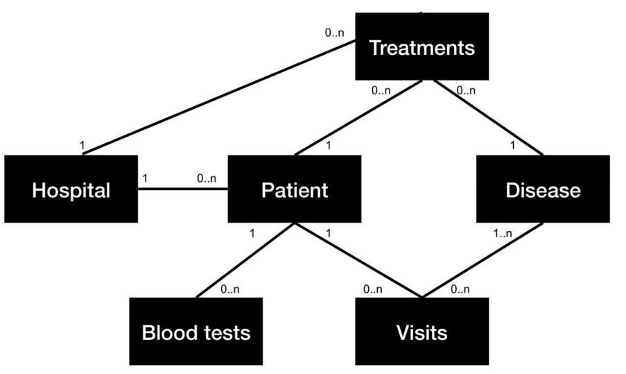
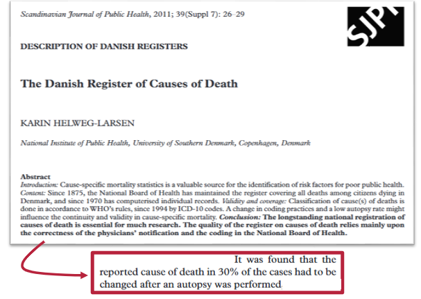

:::{.hero-banner}
# All about the data
:::

## Introduction to dynamic risk prediction

The foundation of predictive modeling is dictated by data collection and data management. Significant challenges are often encountered during these processes. These difficulties include:

- The time-consuming task of data gathering.
- Mismatched expectations regarding data quality and completeness.
- Complexities when integrating datasets that contain varying measures, naming conventions, and different levels of granularity.

In this section, these challenges will be addressed through the exploration of three main topics:

1) Data sources and potential biases.

2) Principles of effective data management.

3) Practical exercises to reinforce concepts.

## Data sources and biases

Data management does not only consist of preprocessing the data; it is also an operation consisting of finding data sources, collecting the data, and managing data biases. These concepts are also significant parts of data management and hence modeling as a whole.
In this section of the course, there will be an introduction to data collection and the potential biases with regard to:

**[Retrospective studies](https://learning.closer.ac.uk/learning-modules/introduction/types-of-longitudinal-research/prospective-vs-retrospective-studies/)**

- Data sources
- Biases and known limitations
- Coding/Classifications

**[Prospective studies](https://learning.closer.ac.uk/learning-modules/introduction/types-of-longitudinal-research/prospective-vs-retrospective-studies/)**

- FAIR data principles
- Introduction to databases and REDCap
- Data structure for collection

The difference between retrospective and prospective studies lies in their timing and methodological control. First, researchers need to understand existing data and establish effective collection methods. Then, a comprehensive framework must be implemented that enhances research design while maintaining data quality standards throughout the process.

### Data vs Metadata vs Annotations

When working with data management, one should be able to differentiate between data, metadata, and annotations. While data itself is commonly understood, metadata and annotations are also critical components required for making large datasets understandable and usable.

<div style="text-align: center;">

</div>

1 **Data:** This term refers to the raw information or measurements that are gathered as the primary subject of interest. Information can be derived from this raw data. For instance, data concerning blood pressure might include specific numerical results.

*Example of data related to blood pressure:*

| **Measurement** | **Result** |
|:------------|:-------|
| Systolic Pressure | 120 mmHg |
| Diastolic Pressure | 80 mmHg |

This data could have some additional information explaining the circumstances and gathering of the data:

2 **Metadata:** additional information, which is stored inherently in the raw data, explaining the circumstances and gathering of the data. It provides context for the raw data, such as when or how it was collected.

Example of metadata for the blood pressure data:

| Metadata |
|:----|
| Patient ID: 42421010 |
| Test Date: March 10, 2025 |
| Collection Time: 8:30 AM |
| Ordering Physician: Dr. House |
| Laboratory: Princeton-Plainsboro Teaching Hospital |

3. **Annotations:** Additional context or labels that are applied to data points are known as annotations. These labels often categorize data values or provide interpretation, which can be useful for both data management and modeling. Annotations are frequently added based on domain expertise (e.g., clinical knowledge) which makes it easier for non-experts to understand the meaning of the ranges of certain columns.

| Measurement | Result | Annotation |
|:------------|:-------|:-----------|
| Systolic Pressure | 110 mmHg | Normal range (90-120 mmHg) |
| Diastolic Pressure | 70 mmHg | Normal range (less than 80 mmHg) |

*More details about the blood pressure table can be found [here](https://www.heart.org/en/health-topics/high-blood-pressure/understanding-blood-pressure-readings)*

As can be seen, annotations are a kind of footnote to provide an overview of the meaning behind the values which are displayed in the data.

Understanding these distinctions is regardless of the types of modelling. The effective interplay between data, metadata, and annotations is required to maximize the insights from the collected information.

### Data Providers

In regard to the making of dynamic prediction models in the danish healthcare system are access to sensitive data a central element of the modelling. Data providers are the data holders of certain databases and they are typically organisations who are responsible of safeguarding the data, due to the sensitive nature of patient data. These databases represent highly valuable resources for predictive modeling. Examples of major holders of health data in Denmark include:

[**Health Data Authority**](https://english.sundhedsdatastyrelsen.dk/health-data-and-registers)

<div style="overflow: auto;">

</div>

The Danish Health Data Authority stands as one of Denmark's largest organizations for collecting, maintaining, and safeguarding comprehensive healthcare data. The Danish Health Data Authority has a wide range of registries, such as:

- Register of causes of death
- The National Patient Register (diagnoses, procedures...)
- Prescription register
- Pathology register
- MiBA database (Microbiology Database, including COVID-19 data)
- The Clinical Laboratory Information Register
- *Numerous other specialized health registers*

Similar to The Danish Health Data Authority, there are also institutions like:

[**The Danish Healthcare Quality Institute**](https://www.sundk.dk/about/)

<div style="overflow: auto;">

</div>

The Danish Healthcare Quality Institute is an organization that collaborates across the entire healthcare system in Denmark and has three professional focus areas: 1) Clinical guidelines, 2) Evaluations, and 3) Clinical quality registries. The Danish Healthcare Quality Institute provides access to a wide range of health-related databases, including **more than 40 Quality databases for cancers.**

In case additional data is needed about patients, such as their social background, education, etc., the most comprehensive and data-rich provider in Denmark is:

[**Statistics Denmark**](https://www.dst.dk/en)

<div style="overflow: auto;">

</div>

It is not strictly reserved for healthcare but revolves around society, workforce, education, culture, energy, etc. The organization has existed for [almost 200 years](https://www.dst.dk/en/OmDS/historie), which creates a significant time horizon to use, if necessary.

For dynamic risk prediction in healthcare, the following relevant registers could be utilized as additional resources:

- Civil status register
- Income register
- Social benefit register
- Education register
- *Many more*

While these sources are primary soruces, could data from alternative sources also be considered, such as:

- Your own collected data
- Local databases
- etc.

However, before deciding which data source should be used for the dynamic prediction model, potential pitfalls about the data quality in terms of biases and limitations should be addressed, which is what the next section will cover in details in the next section.

### Bias and Limitations

When developing dynamic predictive models by using sensitive health data gathered from different sources can potentially be carry biases and limitations, which have to be considered. If the developer do not address these issues, there is a chance for either **poor model performance** or **misleading results**.

1. **Source-Specific Biases**

[The Danish National Patient Registry (DNPR)](https://ncrr.au.dk/danish-registers/the-national-patient-register), is a centralized registry for patients who have been in contact with hospitals. The DNPR captures vast patient information but primarily focuses on those accessing hospital care. This results in a phenomenon called [informed presence bias](https://catalogofbias.org/biases/informed-presence-bias/). It means that people who go to the hospital may not represent the general population. In medical research based on DNPR, this creates a presence bias because there are only observations with some illness in the dataset, which gives a higher presence of illness in the data analysis for the people who encounter the hospital. For a more in-depth explanation, please consider reading [Goldstein, et al. 2016](https://pubmed.ncbi.nlm.nih.gov/27852603/).

2. **Data Quality**

**Variability in Clinician Expertise:** Another consideration regarding health data that has to be accounted for is consistency in medical expertise, as there can be a large gap in experience among the doctors doing the examination. This affects the quality as more experienced doctors have a higher probability of giving the correct diagnosis while also offering the most appropriate treatment, compared to doctors with less experience.

**Prescription and consumption considerations:** When considering the administration and consumption of medication, there is a gap between prescription, purchase, and actual consumption. There is no certainty that a patient consumes the medicine they are prescribed, and if they buy their medicine, it is difficult to know if they take it and if they are truthful about their medicine intake. Therefore, relying on prescription data to indicate a patient's health condition is challenging and has to be considered when developing a predictive model. Additionally, many drugs have off-label uses, meaning they are prescribed for conditions other than what they were originally approved for. This makes interpreting drug prescription data complex and can create noise for a model.

3. **General Types of Bias in Healthcare Research**

Beyond the biases already discussed, there is a wide range of biases to consider when conducting research. It is beyond the scope of this course to cover the full list, but here are a few important biases to be aware of:

|Type of bias | Description |
|:----|:----|
| Sampling bias | When the group chosen for a study does not accurately represent the broader population, leading to skewed results |
| Susceptibility bias | When certain groups are more prone to a particular outcome, due to some other external factors |
| Confirmation bias | Cognitive bias where researchers might unintentionally seek out or interpret data in ways that affirm their existing beliefs or hypotheses |
| Attrition bias | Systematic dropout from long-term studies which over time will create class imbalance |
| Volunteer bias | When the group of people who volunteer for a study do not represent the general population |

For more information about biases, please check out this [comprehensive list about biases in research from University of Oxford.](https://catalogofbias.org/biases/)

If the data contains signs of bias or seems strange, contact the individuals who are involved in the data collection. This could be the secretaries or clinicians, where experience is a crucial factor. Communication is the most important measure for ensuring data quality and mutual understanding, which ultimately is an important measure for the quality of the predictive model.

### Retrospective studies: coding and classification

DROPPED: I don't think it makes sense and it becomes too narrow for the course.

Given the idea of "base content around the exercises," then the coding does not live up to that in my opinion.

## Prospective Studies: FAIR Data Principles

As the amount of data produced in the world keeps increasing, there is a need to make sure data can be found, accessed, is interoperable, and can be reused. Having principles for good practice for the data, the metadata, and the infrastructure is an important matter in navigating the vast amount of data available, both when working with datasets separately and in merging data.

[In 2016, the FAIR principles were introduced in the famous journal Nature](https://www.nature.com/articles/sdata201618), and it was a well-received attempt to address the challenges of the vast amount of data. FAIR data principles provide a guide on how to navigate this data while optimizing the usage of the data.

The FAIR principles is an acronym for:

- **[Findable](https://www.go-fair.org/fair-principles/)**: Information about data and the metadata should be public and referenced
- **[Accessible](https://www.go-fair.org/fair-principles/)**: Data should be possible to access
- **[Interoperable](https://www.go-fair.org/fair-principles/)**: Use standardized data formats
- **[Reusable](https://www.go-fair.org/fair-principles/)**: Through extensive documentation make data reusable

FAIR data principles have been broadly adopted, while also being part of international, national, and local strategies for data management. Examples of initiatives utilizing FAIR data principles:

- [National strategi for data management baseret på FAIR-principper](https://www.deic.dk/da/data-management/nationalt-samarbejde/National-strategi-for-FAIR-data-management)
- [Aalborg University (AAU) FAIR strategy](https://www.aau.dk/om-aau/strategi/digitalisering/forskning/masterplan)
- [The Beacon Network](https://beacon-network.org/#/)
- [Genomic Data Commons (GDC) Data Portal](https://portal.gdc.cancer.gov/)
- [European Genome-Phenome Archive (EGA)](https://ega-archive.org/)

For more information on FAIR principles, see [GO FAIR](https://www.go-fair.org/fair-principles/).

However, while FAIR data principles have a significant impact on the quality and accessibility of data, there are some **limitations** which have to be taken into consideration. The legal aspects of data sharing are complex, and this may provide boundaries on the level of details which can be shared while also limiting the access to data further. Another significant limitation is the amount of work necessary to create the comprehensive documentation needed to live up to the FAIR data principles. Also, there might be a gap in the technical skill level of people who want to use FAIR, which can mean that some do not meet the requirements of the FAIR principles.

So there have been introduced some theoretical concepts to be aware of and principles for gathering, documenting, and making the most of the data. In the next section, some concrete tools for storing data will be introduced.

## PROSPECTIVE STUDIES: Relational Databases and REDCap

Databases are digital platforms to store the data that will be used for the model. Often when doing certain analyses, a **dataset** is used, but this dataset is probably not enough to make serious modeling. When dealing with multiple datasets, it becomes more handy to store them in one place and to draw the necessary data when needed. This is where the database comes in.

The database can hold multiple datasets, which are called **tables** in database terms. These tables can be customized, merged, filtered, etc. as the data are pulled into the software where the analysis is made. To perform these data management operations for the database, one has to use Structured Query Language (SQL), which is a way to communicate and extract the desired data.

A simple example of an SQL query would be if we wanted a table consisting of patients who are between 18 and 100 years old, which means there would be an age variable to filter on. We want all the columns of the table, so we use * and we want the table called TUMOUR_DATA. So we write the query:

```SQL
SELECT *

FROM TUMOUR_DATA

WHERE age BETWEEN 18 AND 100;
```

There are different types of databases, and the choice of database is based on the use case and preference. A popular database type is the **relational database**, which consist of multiple tables with connections among them, so every table can be connected one way or another.

<div style="overflow: auto;">

</div>

Relational databases are particularly valuable for dynamic risk prediction modeling as they allow researchers to efficiently query specific patient populations, track changes over time, and integrate diverse data sources. For instance, when developing a risk model for hospital readmission, a researcher could query patients with specific diagnoses, medication histories, and demographic characteristics all at once, rather than manually combining separate datasets.

To learn more about relational databases and other databases, please click [here](https://www.geeksforgeeks.org/types-of-databases/).

There are also different types of relational database management software solutions, where Postgres is a popular free solution, Oracle is more of a corporate software solution, and SQLite is a rather lightweight free solution, etc. These software solutions are beyond the scope of this course. To learn more about these software options, please read about them [here](https://medium.com/@longjohn1337/comparing-sql-database-technologies-mysql-mssql-postgresql-sqlite-and-oracle-sql-95699b9c805e).

### Introduction to REDCap

Data collection tools play a crucial role in clinical research as they are the foundation for the accuracy and utility of gathered information.
Of these, REDCap remains one of the preferred tools, as REDCap is custom-made to fit the unique characteristics of clinical data.
<div style="overflow: auto;">
  
</div>
The purpose of REDCap is to ease collecting and managing clinical data with standard <!-- typical?--> quality standards.
REDCap has a range of tools which ease the process of managing clinical data while also providing high security for handling the data. Some of these tools are:

- [Arms](https://help.redcap.ualberta.ca/help-and-faq/what-are-arms)
- [Longitudinal data collection](https://www.iths.org/news/redcap-tip/longitudinal-projects-in-redcap/)
- [API access for programming](https://projectredcap.org/wp-content/resources/REDCapTechnicalOverview.pdf)

These tools make it easy to work with clinical data compared to not using REDCap as:

1) REDCap has a simple interface
2) REDCap can store sensitive information
3) [REDCap is widely adopted](https://projectredcap.org/)

However, like all tools, REDCap is not without its limitations, as it does not fully embrace relational data.
This can be a limitation in clinical research, where data points often have complex relationships.

For a practical implementation of REDCap and the FAIR data principles, check out this research project about [implementing a data infrastructure for precision oncology projects leveraging REDCap](https://www.medrxiv.org/content/10.1101/2022.05.09.22274599v1.full.pdf)

In this subsection, there was a comprehensive introduction to some of the considerations needed to work with data before and after pulling the data from a source. An introduction to some of the sources and some of the biases within the data collection was provided. Now, the data is collected in its raw form and it has to be prepared for the actual modeling. This will be addressed in the next major topic of this section.

## Data Management

In this subsection of the course, there will be a practical approach to the data management aspect. This part is critical as data management has a significant influence on the modeling.

The principle that 'The quality of output is determined by the quality of input' represents a fundamental concept in data science that emphasizes the critical importance of preparing the data before it is fed into the model. This subsection will address the challenges associated with data management, including data representation methodologies, data aggregation techniques, dataset partitioning, handling of missing values, and the feature engineering processes.

### Starting Point

Returning to the example of predicting when to provide palliative SACT treatment to cancer patients, in order to most efficiently build model applications, implementing a well-established framework is recommended. An advanced example of such a framework can be found here: [Tomašev et al. (2021) Use of deep learning to develop continuous-risk models for adverse event prediction from electronic health records](https://www.nature.com/articles/s41596-021-00513-5). This is a great example of an end-to-end dynamic prediction model.

Let us consider how to design such a framework for our SACT prediction model:

| Setting | 30-day mortality example |
|:----|:----|
| A clinically relevant problem is identified | Can it be predicted which patients with advanced cancer die within 30 days? |
| It has been decided how the outcome will be evaluated | Date of death (of any cause) extracted from the CPR register |
| Inclusion and exclusion criteria are set (OBS: It needs to be generalizable to a prospective setting, criteria assessable from the point where model inference begins) | Include patients in contact with the Department of Oncology, who received SACT for cancer or were diagnosed with cancer |
| Prediction time points are defined | Every registered contact the patient has with Department of Oncology |
| Potential predictors identified | BMI, diagnoses, biomarkers, treatment data, surgery, etc. |

So now there is established a framework which is the design used for the study and which provides a solid overview of what the study tries to achieve and how the study will achieve it.

But a strategy needs to consider the potential issues with the data and how to account for that, so the next section will cover some potential issues and some countermeasures.

### Challenges with data

After data has been received and loaded into the computer of the researcher, the first thing to identify is the flaws of the dataset.

Real-world datasets are rarely cleaned and ready to be inputted in a pipeline. Therefore, it becomes crucial for data management to understand the flaws of the dataset as it is the foundation of the data management strategy to be aware of the weaknesses of the dataset.

#### Missing data

As the data collected for the predictive modeling is collected, it may be visible that some columns have more values than others, and this is the first sign that there are missing values.

Missing values (often referred to as Not-A-Number (nan)) are often present in a dataset and they frequently occur in data, and the amount of missing data often increases as the complexity of the dataset increases. This should be understood as the amount of columns, rows, registries the data is pulled from, and the data types. Missing data are often present as empty cells or as the term 'nan':

##### Blood Pressure Table with Empty Cells

| Systolic (mmHg) | Diastolic (mmHg) |
|----------------|------------------|
|                | 78               |
| 142            |                  |
| 118            | 75               |
| 128            | 82               |

##### Blood Pressure Table with "nan" Values

| Systolic (mmHg) | Diastolic (mmHg) |
|----------------|------------------|
| NaN            | 78               |
| 142            | NaN              |
| 118            | 75               |
| 128            | 82               |

Missing data should not necessarily be seen as a negative feature of the dataset. Missing data can also contain some information which can be interpreted in an analysis or model.

However, missing data cannot be ignored as multiple models need the researchers to make decisions about the missing data, as the models simply cannot accept datasets with missing data.
To handle missing data, many strategies can be used, such as:

- **Deletion**: Remove rows or columns with missing values
- **Mean/Median/Mode Imputation**: Replace missing values with the average, median, or most frequent value
- **Constant Value Imputation**: Fill missing values with a specific constant (like zero or a designated "missing" value)
- **Predictive Modeling**: Use machine learning algorithms to predict missing values based on other features
- **Multiple Imputation**: Generate multiple complete datasets with different plausible values for the missing data

More advanced strategies can also be applied:

- **Multivariate imputation by chained equations:** This is an iterative approach that models each variable with missing values as a function of the other variables and imputes the missing values based on these models.
- **Gaussian processes:** These are probabilistic models that can be used to predict missing values based on the observed data, also providing a measure of uncertainty for the imputed values.
- **Generative adversarial networks:** GANs are a type of deep learning model that can learn the underlying data distribution and generate plausible values for missing data points.

These suggestions can be found in the paper, [Tomašev et al. (2021)](https://www.nature.com/articles/s41596-021-00513-5).

#### Irregular sampling

As addressed in the motivation about dynamic modeling, the healthcare sector is a huge source of irregular sampling, as the data depends on health and people.
Health and people are two dynamic factors as sickness can develop in many ways, and people's behavior is hard to predict.

Due to all the uncertainty regarding health and people, there is no regular pattern in hospital contacts, illustrating the need for dynamic models.

These irregularities are not entirely an issue, but the distance between events may also hold valuable information.

In order to structure irregularly sampled data, different strategies can be employed like:

- Resampling the data into uniform intervals
- Aggregating the data into uniform chunks
- Using models which can handle these irregularities

The basic idea is to gather all the small pieces into fewer larger pieces which can be standardized as input for the model.

#### Data quality

When working with registry data, it is important to consider that it is most often people who write journals and fill in the values manually. In healthcare, there are different actors like doctors, secretaries, nurses, etc.
These people work at any hour of the day and they have different degrees of expertise. Additionally, as time progresses, new diagnoses are added, others are edited, treatments change, etc. With all these considerations, there is a high probability that the data quality may be influenced by these factors.

To sum up the data quality, the data analyst who wants to build a model must be aware of:

- Data entry errors
- Inconsistencies in the data
- Missing data
- Outliers (due to mistakes)
- Biases

For an analyst, it may be difficult to distinguish good and poor data quality, which makes it important to work closely with clinicians and use their expertise to understand the data.

#### Data collected for other purposes than modeling

Considering patient registries, the data was mainly collected because of administration and to journal a patient.
These registries were not created for the purpose of storing data for predictive modeling, similarly to many other data sources.
This is why the data management part is so crucial and takes up so much time.

This also means that relevant predictors may be missing and potential hidden biases can cause trouble for the modeling.

It can be concluded that there are a lot of pitfalls when working with data, and some of these issues have been presented in this course. This leads to the natural question of **what to do about it?**

#### Check your data

To make sure we get a good output from the model, there needs to be good input. This can be achieved by taking several measures:

#### Talk to personnel

Talking to the experts and the people at the front is significant for the preprocessing of the data. To understand how the clinicians collect the data,
the dilemmas regarding the data collection, understand potential flaws or why some data seem unusual.

#### Make summary statistics

Making summary statistics can offer a lot of information regarding the dataset we are working with. As analysts, there are some expectations for the data and the shape of the data.
When looking at the summary, it becomes easy to compare the expectation with the reality of the data.

Some of the things that become apparent when looking at the data is the degree of:

- Missing data
- Outliers
- Unexpectedly recurring values
- etc.

When there is an overview of these flaws, the next step is to make a data management strategy which takes these considerations into account.

#### Pattern or random missing?

Missing data is a tricky problem, and before any imputation, removal, or similar is considered, the missing values should be studied for patterns.
Does missing data occur in the same intervals?

Often when addressing missing values, three categories are used:

##### Missing completely at random:
The data is missing completely at random, meaning there is no relationship between the missing data and any other values related to the data set.

##### Missing at random:
The data is missing due to an underlying systematic structure of the data, that is it is missing because of an observed variable.
An example could be that a registry about depression may have surveys where a lot of the surveys have missing data.
However, if the surveys are conditioned on gender, it can be seen that there is a pattern of males not completing the survey compared to females.

##### Missing not at random:
There is a pattern of the missing data connected to some unobserved data.
Let us return to the registry over depression and look at those who have severe depression; those people have a high probability of not completing a survey.

These three categories of missing data were briefly introduced in this course.
For more information or details about the example case of the registry for depression, please read more [here](https://www.ncbi.nlm.nih.gov/books/NBK493614/)

#### Is the recording of the outcome good enough?

An analyst should be critical when picking a data source, as the quality of these sources can vary and can make incorrect input, hence wrong predictions.

An example of such a problem is the Danish register of causes of death. A study showed that a significant amount of the causes of death were wrong:

<div style="overflow: auto;">
  
</div>

What the researchers found was that there has been a rather unstructured approach to determining the causes of death, which ultimately meant that 30% of the cases had the wrong cause of death after an autopsy was performed.

The lesson here is that an analyst may be cautious about choosing the Danish register of causes of death for an analysis and also to be critical of even well-established data sources.

For more information about the case used as an example in this subsection, please read the full paper on [The Danish Register of Causes of Death](https://journals.sagepub.com/doi/10.1177/1403494811399958?url_ver=Z39.88-2003&rfr_id=ori:rid:crossref.org&rfr_dat=cr_pub%20%200pubmed)

### Data representation

To work with dynamic risk prediction and with the unstructured healthcare data that arrives in irregular intervals, **time discretization is an effective solution.**

As patients come at varying timepoints and they go through different parts of the healthcare system during the day, an analyst may consider transforming the data into something with a structured data format, which helps the prediction model process the data efficiently.

Choosing a standard range where data can be discretized would help structure the random data. It depends on the amount of data, but some ranges could be to look at hourly data, daily, weekly, etc. It all depends on the frequency of data. If there are plenty of data points every hour, the data should be in hourly format.

To increase the performance of the prediction model, it is better to have the data granularity to be as low as possible, to be able to present as many details as possible for the model, which makes the output more detailed as well. The choice of the discretization bundling depends on the amount of data, the frequencies, and the preprocessing of the data.

<div style="overflow: auto;">
  
</div>

However, once a time chunk has been established, some patients may have multiple values within a parameter in the given time bundle. Let us pretend a patient is being followed during a day of hospitalization where the blood pressure is measured multiple times.
If the time is in 12-hour bundles, then the blood pressure values need to be aggregated somehow. A good solution may be to take the average of these values. Another good solution may be to take the most recent measurement.

<div style="overflow: auto;">
  
</div>

A strategy to work with historical data, as for the case with dynamic prediction models, is to consider having a lookback window for each prediction.
<div style="text-align: center;">
  
</div>

It can be helpful for multiple models to only look back a short period of time for each prediction for some variables, while other variables need a window that goes further back in time.
It is a question of subject, like blood measurement which does not need to look as far back as a diagnosis. The reason is some subjects are more 'predictable' and can be explained with many simple interactions between feature variables. A more complex topic such as predicting a diagnosis needs more factors to consider with more data in longer time horizons, to offer the best prediction possible, still with a lot of uncertainty.
Some models like Recurrent Neural Networks are better built for long sequences, while linear models are better off with shorter sequences.

When working with lookback windows and some values need aggregation as described already, the options of aggregation depend on the data type.
Some aggregation options:

- For continuous values: count, median, mean, standard deviation, max/min/average difference between subsequent entries
- For categorical values: binary variable for present or not during lookback window

**More information can be found in a paper, which has yet to be found**

To make a decision regarding the aggregation of repeating values, the data analyst should get an overview of the statistical techniques to do this operation and base the decision on collaboration with relevant experts.

Another concept to be aware of is the possibility of **Data Leakage**, which is when some information in the test data can be found in the training data.
When building a prediction model, one would have a fraction of the dataset to train the model and a fraction of the data to test the model's performance. The model is trained on data it can see and it is tested on data it cannot see.
The problem with data leakage is when some information of the unseen data is present in the seen data. An example of this could be a patient who gets sick and then goes to the hospital, where the person is registered.
This means that there can be a gap of hours to days between when a person gets sick until it is registered. A solution here is to choose a time bundle which accounts for this difference.

**More information can be found in a paper, which has yet to be found**

### Splitting data - Holdout method

To get the best performing model, it needs to be a model which can be trained on some data and tested on some unseen data, without any significant difference in performance.
This means that a data analyst cannot make a model on some data and set the model in production, as the model is better at predicting what it was trained on, but most likely not on any unseen data.

<div style="text-align: center;">
  
</div>

The splitting of the data varies, depending on the task. The most basic approach is to have a training set and a test set.
The ratio between train and test is often 80/20 percent of the data. This ratio can vary and there can be instances depending on the amount of data and the choice of the author.

The validation set is a pre-test set as it is used for optimization of hyperparameters. Many models have a range of hyperparameters to adjust when training the model to increase the performance.
As models become more complex, hyperparameter tuning becomes more important for the model. To properly evaluate the hyperparameters, the validation set is used to optimize the hyperparameters until some stopping criteria are met.
When the best performing hyperparameters are found within the given stopping criteria, the model is then evaluated on the test set.
To sum up the process, the model is trained with the training data, optimized with the validation set, and evaluated on the test set.

In other words, a held-out set will provide an unbiased estimate of how the model will perform in production. Multiple splits (multiple scenarios) will help to test the generalization of the model.
These splits are also known as "*folds*" and the method used for testing these different splits of the data is known as **K-fold cross validation**. In practice, k=5 is enough, but some suggest k=10.
<div style="overflow: auto;">
  
</div>

However, even if k-fold cross validation is a powerful technique, it can still lead to overfitting. As the model is repeatedly trained on the data, it starts to recognize patterns of the training data. To overcome this challenge of potential overfitting, another measure can be used, which is [**nested Cross-validation**](https://machinelearningmastery.com/nested-cross-validation-for-machine-learning-with-python/).
The basic idea is that there is an additional loop in the cross validation where there is an outer loop which is the same approach as ordinary k-fold cross validation. But this time an inner loop is added to the individual folds, where there is an additional k-fold cross validation for each k of the outer loop. The inner cross validation is used to find the best model in that particular part of the outer split, which will be tested on the testing set of the outer loop. Graphically it looks like this:

<div style="overflow: auto;">
  
</div>

As only a subset of the dataset, one fold at a time, is evaluated with an additional k-fold cross validation, the risk of the models overfitting the data is greatly reduced.

### Feature engineering

Feature engineering is a crucial step in the data management process, where features can be selected, transformed into the best possible input, and where additional features based on the existing features can be created to support the model's understanding of feature scales or interactions.

One of the first things to do when the data for the prediction model is secured is to **identify useful features**.
The most efficient way to measure the importance of the features is to discuss with the clinicians, as they are better suited to provide insight into what they think is important for the specific case. This means that another important factor for choosing features is the **Data quality** of the features. Some features with low quality would be better to remove if there is not an expected gain from keeping the feature.

After sorting through features and deciding which ones to keep, you may need to create additional features based on existing ones. This step is often necessary because some models require data in specific formats, while other models can achieve better performance with 'helper' features that provide supplementary information. For example, you might transform continuous variables into binary or categorical values to indicate whether a measurement falls into low, normal, or high ranges — as commonly done with blood pressure readings:

| BLOOD PRESSURE CATEGORY | SYSTOLIC mm Hg (upper number) | and/or | DIASTOLIC mm Hg (lower number) |
|:---|:---|:---|:---|
| NORMAL | LESS THAN 120 | and | LESS THAN 80 |
| ELEVATED | 120 - 129 | and | LESS THAN 80 |
| HIGH BLOOD PRESSURE STAGE 1 | 130 - 139 | or | 80 - 89 |
| HIGH BLOOD PRESSURE STAGE 2 | 140 OR HIGHER | or | 90 OR HIGHER |
| HYPERTENSIVE CRISIS (consult your doctor immediately) | HIGHER THAN 180 | and/or | HIGHER THAN 120 |

More about the table can be found [here](https://www.heart.org/en/health-topics/high-blood-pressure/understanding-blood-pressure-readings).

Adding these annotations can help the model better understand the implications of the ranges of a continuous variable.

Categorical variables can also cause problems, as there can be some categories with few observations.
These few observations can make it hard for the model to find any meaningful relations while also causing the model to overfit on these cases, so the model could observe unrelated random patterns as there is not enough information to confirm a relation.
Furthermore, there can be some privacy issues as health data is sensitive data and the model should not reveal anything about certain individuals. This is why it can be beneficial to collapse some of the categories into fewer and larger ones. An example could be some types of symptoms:

##### Original Dataset: Patient Primary Symptoms

| Primary Symptom | Patient Count |
|:---|:---|
| Headache | 450 |
| Dry Cough | 280 |
| Fever | 150 |
| **Skin rash** | 15 |
| **Body ache** | 2 |

##### After Collapsing Infrequent Values

| Primary Symptom | Patient Count |
|:---|:---|
| Headache | 450 |
| Dry Cough | 280 |
| Fever | 150 |
| **Other Symptoms** | 17 |

The two tables are fictional and used to show how rarely occurring events can be collapsed together.

Another approach to handle categorical values is to transform them into binary variables which represent each category in a variable.
This provides the model with additional information and is a way for linear models to handle non-binary categorical variables, which they are normally unable to.
One-hot encoding also helps in terms of the distance in nominal variables.
A model may interpret a nominal value to have some type of ordering among the variables, but by splitting the categories into separate binary features, the model can handle the categories more efficiently. An example could be a gender variable:

#### Before One-Hot Encoding
| Gender |
|:---|
| Male   |
| Female |
| Male   |
| Female |
| Male   |

#### After One-Hot Encoding
| Male | Female |
|:--- |:--- |
| 1    | 0  |
| 0    | 1  |
| 1    | 0  |
| 0    | 1  |
| 1    | 0  |

Note that including all variables leads to linear dependence, so one variable should be omitted when dealing with models not built to handle this, but for models with regularization it is important to include all variables, as the optimization problem changes depending on the removed variable. https://stats.stackexchange.com/q/329281

**Devnote: Fix this reference**

However, there are some considerations about how the dimensions of a dataset can grow rapidly and lead to consequences like the [Curse of dimensionality](https://www.geeksforgeeks.org/curse-of-dimensionality-in-machine-learning/). Despite this consideration, One-Hot encoding remains a popular and effective tool in the feature engineering toolbox.

**Outliers** are something which also calls for feature engineering. Some outliers are legitimate, but other outliers can be there by mistake. It could be a BMI of 200 or an age of 150, which could be due to a typo when a clinician had to journal a patient. Some outliers may be real, but it can be convenient to leave them out of the model if they deviate significantly. This is a case-by-case consideration. To find outliers, it can be helpful to look at upper percentiles in the summary statistics and see if there is an unexpected distance from the mean to upper percentiles and if the values seem to be a product of a mistake, the model would be better with the upper percentile cut.

**Feature scaling:** The scaling of feature values is crucial for model performance. Scaling the features can make them contribute to the model more proportionally, as features can come in all sorts of unit sizes. Variables with larger ranges will have a heavier influence on the models. Scaling also improves the convergence speed as the optimization space becomes smoother compared to unscaled inputs. Some of the common scaling methods are:

- **[Standardization:](https://www.geeksforgeeks.org/what-is-standardization-in-machine-learning/)** Transform the data by subtracting the datapoint from the mean of the data and dividing it by the standard deviation
$$X_{new} = \frac{x_i - \mu}{\sigma}$$
- **[Min-max scaling:](https://medium.com/@iamkamleshrangi/how-min-max-scaler-works-9fbebb9347da)** Rescales features to a range between 0 and 1, based on the minimum and maximum values of the dataset
$$X_{new} = \frac{X - X_{min}}{X_{max} - X_{min}}$$

The choice between the scaling methods depends on the distribution of the data. If the data is **normally distributed**, pick standardization, and if the data is **not normally distributed**, go with Min-max scaling.

#### Summary
This segment of the course has provided comprehensive insight into the process of gathering data, retrospective and prospective studies. A comprehensive overview of data management has been provided. The aim of this section was to provide an understanding of data and how to process the data before the actual modeling. In the next section, models will be described and a wide range of methods to choose from.

But before continuing to the next section, please check the exercise below and try to solve it.

When the exercise is solved, the next section "Modeling" can be found in the top bar or by pressing this button:


&nbsp;

 <p align="center">
  <a href="http://localhost:7276/lectures/modelling.html" style="background-color: #4266A1; color: #FFFFFF; padding: 30px 20px; text-decoration: none; border-radius: 5px;">
    Continue to
    Modeling
  </a>
</p>

# Exercise

## Data management
In this exercise you will prepare data for training and testing a dynamic prediction model. The data we will consider is described in [PAD-introduction.html]() and the data files (baseline_date.csv, diag_data.csv, dict_data.csv, blood_data.csv, quest_data.csv, treat_data.csv, event.csv and vist_date.csv) – all found under Day 1/Workshop 1 on PhD Moodle.

This workshop focuses on preparing data for non-recurrent models, i.e. the goal is a dataset with one row per prediction time point with patient history aggregated into separate features. As your binary outcome you can for example choose 1-year mortality, but your are welcome to choose another outcome based on the events data set.

Go through the following steps:

1)	Load all the datasets and get acquainted with them, including reading the data description, making simple checks on the possible predictors (e.g., check for proportion of missing values). Consider translating diagnosis codes in diag_data to a more descriptive diagnosis code using the key in dict_data.
2)	Join the feature datasets variables (blood_data, diag_data, quest_data, and treat_data) and the visits data set (visit_date) on patient id and date to obtain a dataset with one row per unique date; as you only will have one observation per day this corresponds to bundling in 1-day time steps. Order data by patient id and date.
3)	Add baseline variables (in baseline_data) to the dataset (join by patient id).
4)	Determine which patients goes into the training, validation, calibration, and test split (using, e.g., 80% training, 5% validation, 5% calibration, and 10% test). You can either add a variable indicating which split each observation belongs to or split your data into the four pieces.
5)	Perform feature engineering, for example:
    a.	Do we want to remove some predictors? (e.g., due to missingness or weird values)
    b.	One-hot encoding of categorical predictors
    c.	Construct feature for age at each time point
    d.	How to handle missing values? Imputation*, presence variables, …?
    e.	Cap and normalise numerical predictors**
    f.	Summary variables (aggregating historical information)
6)	Filter your data to only keep rows related to prediction time points (=time of a visit) and use the dataset events to define your outcome for each time point and add to the dataset you just created.

*If you use the mean or regression to impute variables, you should base this on the training set only
**The values you cap and the values you use to normalise should be based on the training set only

Please find your notebook and code here:

 &nbsp;

 <p align="center">
  <a href="https://phd.moodle.aau.dk/" style="background-color: #4266A1; color: #FFFFFF; padding: 30px 20px; text-decoration: none; border-radius: 5px;">
    Exercises
  </a>
</p>

&nbsp;

Solutions to the exercises can be found here:

 &nbsp;

 <p align="center">
  <a href="https://phd.moodle.aau.dk/" style="background-color: #4266A1; color: #FFFFFF; padding: 30px 20px; text-decoration: none; border-radius: 5px;">
    Solutions
  </a>
</p>

&nbsp;