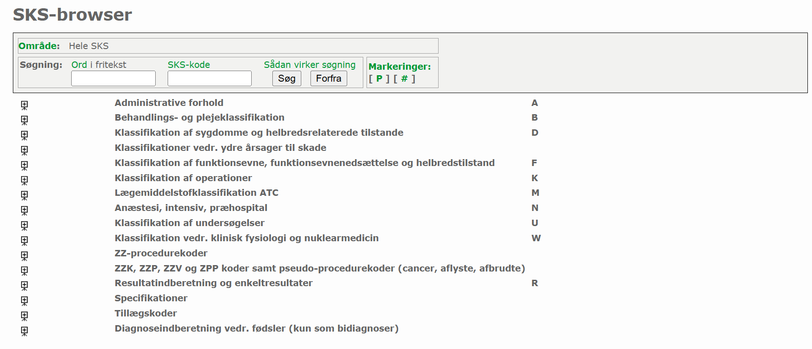

:::{.hero-banner}
# Data Sources and Data Acquisition
:::


Data are the foundation of predictive modelling. Before a predictive model can be built, relevant data need to be collected and examined. Significant challenges are often encountered during these processes, such as:

- Time-consuming data gathering
- Legal barriers and permissions to use data
- Potential mismatches between expectations and the actual quality or completeness of the data
- Complexities when integrating datasets that contain varying measures, naming conventions, and different levels of granularity

The topics in this module provide insight into what data is and how to collect it from official data providers.


Throughout this module, the following topics will be covered:


- Data and Metadata
- Coding and Classification Systems
- Health Data Providers in Denmark
- **Exercises**

## Data, Metadata, and Annotations

When working with data, it is useful to differentiate between **data** and **metadata**. Data are the raw facts and measurements collected (e.g. patient blood pressure, lab test results, or imaging data), while metadata is “data about the data” (e.g. units or measurement methods). That is, metadata provides additional context and interpretation. For example, if a table containing information about blood pressure measurements (e.g., type of measures and measurement values) is data, then metadata would consist of descriptive information about that table. This metadata might specify that ‘Measurement values’ is a numerical value and ‘Measurement’ is text. The descriptive details in the metadata are frequently within the data structure itself. However, it can be presented as a separate table providing details about each column of the data table. A basic example of this can be seen in the illustration below:

*Example of raw blood pressure data:*

<div style="overflow: auto; text-align: center;">
  
</div>

*Example of metadata for the blood pressure data:*

<div style="overflow: auto; text-align: center;">
  
</div>

### Description of the data

A critical requirement for performing any kind of modelling involving data is to have a deep understanding of the data. To be able to provide a detailed description of the data is an efficient approach to understand the background, implications, and meaning of the data. Knowing who collected the data at which time can provide some insight of the standards at the given time. Understanding the meaning of the columns, what the values represent, the population in the data, and the data distribution is the foundation for conducting meaningful modelling of the data.

## Coding and Classification Systems

To manage and analyse large amounts of health data, standardised coding and classification systems are essential. These systems simplify complex medical information, such as diagnoses, procedures, and lab results and is widely implemented across health registries.


A central Danish health data classification system is the Sundhedsvæsenets Klassifikationssystem (SKS), which is managed by [The Danish Health Data Authority](https://english.sundhedsdatastyrelsen.dk/health-data-and-registers/classifications). SKS is the national standard used throughout the Danish healthcare system.

The SKS uses the [World Health Organisation's International Classification of Diseases](https://www.who.int/standards/classifications/classification-of-diseases), 10th Revision (ICD-10) for diagnostic data, thereby ensuring that Danish data is aligned with international standards.

All Danish diagnostic SKS code data can be searched through an open database, to either find a diagnosis by code or a code by diagnosis, as illustrated in Figure 1.

<div style="overflow: auto;">
  
</div>
Figure 1: SKS browser for code description. Screenshot from [medinfo.dk](https://medinfo.dk/)

&nbsp;

For specific types of data, such as clinical laboratory data, more specialised terminologies are required. This type of data also has a widely adopted standard called Nomenclature for Properties and Units (NPU) terminology. The NPU provides unique identification codes for each type of laboratory analysis, e.g. blood tests, and are adopted in laboratory databases in Denmark, such as [LABKA](https://www.dovepress.com/the-danish-lymphoid-cancer-research-daly-care-data-resource-the-basis--peer-reviewed-fulltext-article-CLEP).


SNOMED CT (Systematised Nomenclature of Medicine Clinical Terms) is the most comprehensive multilingual clinical terminology in the world. The core purpose is to serve as an ontology (a  “Model of Meaning”) for clinical information. Enabling a common language to exchange information about diagnosis, procedures, medicine, and much more.  SNOMED CT is a terminology designed to be logical, by having nested structures for all the information. It is designed to be flexible, as different variations of SNOMED CT for specific applications exist. Examples of such is the Danish pathology database Patobank, which adds letters to the SNOMED CT code to provide additional coding axes, such as structure, location, and cause, for the cancer data. See more on [Patobank.dk](https://www.patobank.dk/wp-content/uploads/2019/10/A._Introduktion_og_vejledning_til_SNOMED-2.pdf). Having standardised code for medical information is one of the main components of being able to have functional interoperability between units which share medical information.

For further information, please see this book: [Benson, Tim, and Grahame Grieve. (2021) "Principles of health interoperability.”](https://link.springer.com/book/10.1007/978-3-030-56883-2)


## Health Data Providers in Denmark


Denmark has a unique system of [nationwide health registries](https://dsfe.dk/danish-registries/) that collect data on diseases, treatment, and outcomes. These comprehensive databases form a valuable foundation for developing predictive models and research in general. The registries are administered by major public organisations in Denmark, which act as the official data controllers responsible for safeguarding information due to its person-sensitive nature.
Below follows two of the major data controllers of healthcare data in Denmark.


[**The Danish Health Data Authority**](https://english.sundhedsdatastyrelsen.dk/health-data-and-registers) is one of the country's primary entities for managing and providing access to extensive healthcare data. It maintains a wide array of national health registers, such as:

- The Danish Register of Causes of Death
- The Danish National Patient Register
- The Danish National Prescription Registry
- The Danish Pathology Register
- The Clinical Laboratory Information System Register

[**The Danish Healthcare Quality Institute**](https://www.sundk.dk/about/) is an organization that collaborates across the Danish healthcare sector, often focusing on areas such as clinical guidelines, evaluations, and clinical quality registries. This institute facilitates access to numerous health-related databases, including over 40 clinical quality databases, such as:

- Danish Head and Neck Cancer Database
- Danish Prostate Cancer database
- Danish Diabetic Database
- Danish Heart registry
- Danish Lymphoma Database

# Exercise

Based on the module regarding Danish health registries and data acquisition, please choose the correct option for the following questions:

```{=html}
<style>
  .quiz-container { font-family: sans-serif; max-width: 850px; margin: 20px 0; }
  .q-card {
    background: #ffffff;
    border: 1px solid #e1e4e8;
    border-radius: 8px;
    padding: 20px;
    margin-bottom: 25px;
    box-shadow: 0 2px 4px rgba(0,0,0,0.05);
    display: block;
  }
  .q-header { font-weight: bold; font-size: 1.1em; color: #2c3e50; margin-bottom: 15px; display: block; }
  .opt-list { display: flex; flex-direction: column; gap: 10px; }
  .opt-btn {
    padding: 12px 15px;
    border: 1px solid #d1d5da;
    border-radius: 6px;
    cursor: pointer;
    background: #fff;
    transition: all 0.2s ease;
    text-align: left;
  }
  .opt-btn:hover { background: #f6f8fa; border-color: #4266A1; }

  /* Success/Error States */
  .ans-correct { background-color: #d4edda !important; border-color: #28a745 !important; color: #155724; }
  .ans-wrong { background-color: #f8d7da !important; border-color: #dc3545 !important; color: #721c24; }

  .feedback-text { margin-top: 12px; font-size: 0.9em; display: none; padding: 8px; border-radius: 4px; }
  .feedback-visible { display: block; background: #f0f4f8; border-left: 3px solid #4266A1; }
</style>

<div class="quiz-container">

<div class="q-card" id="q-registry-bias">
<span class="q-header">1) When using Danish registry data for research, which statement best reflects a potential source of bias?
</span>
<div class="opt-list">
<div class="opt-btn" onclick="check(this, false, 'q-registry-bias', 'Incorrect.')">a. All patients are always captured, so no bias is possible.
</div>
<div class="opt-btn" onclick="check(this, true, 'q-registry-bias', 'Correct!')">b. Patients who are sicker may have more frequent healthcare contacts, leading to overrepresentation in the data.
</div>
<div class="opt-btn" onclick="check(this, false, 'q-registry-bias', 'Incorrect.')">c. Registry data automatically eliminates all errors in diagnosis coding.
</div>
</div>
<div class="feedback-text" id="fb-q-registry-bias">
</div>
</div>

<div class="q-card" id="q-dnpr-identification">
<span class="q-header">2) You want to study patients with type 2 diabetes using the Danish National Patient Registry (DNPR). Can you reliably identify all patients with type 2 diabetes using DNPR alone?
</span>
<div class="opt-list">
<div class="opt-btn" onclick="check(this, false, 'q-dnpr-identification', 'Incorrect.')">a. Yes, DNPR captures all type 2 diabetes diagnoses.
</div>
<div class="opt-btn" onclick="check(this, true, 'q-dnpr-identification', 'Correct!')">b. No, because type 2 diabetes is usually managed in general practice; only hospital-related cases appear in DNPR.</div>
<div class="opt-btn" onclick="check(this, false, 'q-dnpr-identification', 'Incorrect.')">c. Yes, but only if you include emergency admissions.
</div>
</div>
<div class="feedback-text" id="fb-q-dnpr-identification">
</div>
</div>

<div class="q-card" id="q-prescription-identification">
<span class="q-header">3) Can the Danish National Prescription Registry be used to identify patients with type 2 diabetes?
</span>
<div class="opt-list">
<div class="opt-btn" onclick="check(this, true, 'q-prescription-identification', 'Correct!')">a. Yes, but you must consider that some medications may be prescribed for other conditions.
</div>
<div class="opt-btn" onclick="check(this, false, 'q-prescription-identification', 'Incorrect.')">b. No, prescriptions are not linked to diagnoses.
</div>
<div class="opt-btn" onclick="check(this, false, 'q-prescription-identification', 'Incorrect.')">c. Yes, prescriptions perfectly identify type 2 diabetes without exceptions.
</div>
</div>
<div class="feedback-text" id="fb-q-prescription-identification">
</div>
</div>

</div>

<script>
  function check(el, isCorrect, qId, msg) {
    const parent = document.getElementById(qId);
    const opts = parent.querySelectorAll('.opt-btn');
    const fb = document.getElementById('fb-' + qId);

    opts.forEach(o => o.classList.remove('ans-correct', 'ans-wrong'));

    if (isCorrect) {
      el.classList.add('ans-correct');
    } else {
      el.classList.add('ans-wrong');
    }

    fb.innerHTML = msg;
    fb.classList.add('feedback-visible');
  }
</script>

To proceed to the next section of the course, please click the button below.

&nbsp;

 <p align="center">
  <a href="data_preprocessing.html" style="background-color: #4266A1; color: #FFFFFF; padding: 30px 20px; text-decoration: none; border-radius: 5px;">
    Continue to
    Preprocessing
  </a>
</p>

&nbsp;