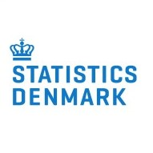

:::{.hero-banner}
# Data Sources and Data Acquisition
:::

<!-- The structure of the this module have been changed so health data providers come before the coding and classification systems. The coding and classification section needs a lot of love and. -->

Predictive modeling is preceded by data collection and data management. Significant challenges are often encountered during these processes. These difficulties include:

- Time-consuming data gathering.
- Potential mismatches between expectations and the actual quality or completeness of the data.
- Complexities when integrating datasets that contain varying measures, naming conventions, and different levels of granularity.

The topics in this module provides insight on how to collect, clean, and transform data into a form suitable for modeling. Data management serves as the foundation for all types of modeling, in particular for dynamic risk prediction.

Throughout this module, the following topics will be covered:

- Introduction to Study Design
- Data, Metadata, and Annotations
- Coding and Classification Systems
- Bias in Data
- Introduction to REDCap
- Health Data Providers in Denmark
- **Exercises**

## Data and Metadata

A clear differentiation between data and metadata is crucial when data are managed. While core information is represented by data itself, additional context and interpretation are provided by metadata, which increases the usability of large datasets. For example, if a table containing employee personal information (e.g., employee ID, name) is considered to be data, then metadata would consist of descriptive information about that table. This metadata might specify that 'employee ID' is a unique numerical identifier and 'name' is text. To facilitate proper utilization of these data, additional information is needed. A separate table providing details about each column of the data table can be added. Data types, column definitions, and coding schemes, for example, are explained by this metadata. A basic example of this can be seen in the [illustration below](https://dataedo.com/kb/data-glossary/what-is-metadata).

 

*Example of raw blood pressure data:*

| Measurement        | Measurements |
|:-------------------|:-------------|
| Systolic Pressure  | 110          |
| Diastolic Pressure | 70           |

**Metadata** provides descriptive information *about* the data. It offers context regarding the circumstances of data collection, such as when, where, how, or by whom the data was generated. This information is often stored alongside or linked to the raw data.

*Example of metadata for the blood pressure data:*

| Metadata    | Clinician | Location                               | Description             | Data Types |
|:------------|:----------|:---------------------------------------|:------------------------|:-----------|
| Measurement | Dr. House | Princeton-Plainsboro Teaching Hospital | Names of the measurement| Text       |
| Measure     | Dr. House | Princeton-Plainsboro Teaching Hospital | Measurement is in mmHg  | Int        |

Effectively leveraging the interplay between data and metadata is central to deriving the most insights from the collected information.

## Health Data Providers in Denmark

Developing dynamic prediction models within the Danish healthcare system requires access to sensitive patient data. This data is typically held by specific organizations, which are the official data providers, responsible for safeguarding information due to its confidential nature. These comprehensive databases are essential resources for research and predictive modeling. Examples of major holders of health data in Denmark include:

 

[**The Danish Health Data Authority**](https://english.sundhedsdatastyrelsen.dk/health-data-and-registers) is one of the country's primary entities for collecting, managing, and providing access to extensive healthcare data. It maintains a wide array of national health registers, such as:

-   The Danish Register of Causes of Death
-   The Danish National Patient Register
-   The Danish National Prescription Registry
-   The Danish Pathology Register
-   The Danish Microbiology Database (MiBa)
-   The Clinical Laboratory Information System Register
-   *Numerous other specialized health registers*

[**The Danish Healthcare Quality Institute**](https://www.sundk.dk/about/) is a organization which collaborates across the Danish healthcare sector, often focusing on areas such as clinical guidelines, evaluations, and clinical quality registries. These initiatives facilitate access to numerous health-related databases, notably including over 40 clinical quality databases, many focused on specific conditions like cancer.

 

For broader societal context potentially relevant to health outcomes (e.g., socioeconomic factors, education, etc.), [**Statistics Denmark:**](https://www.dst.dk/en) is the most comprehensive data provider in Denmark. While not exclusively focused on healthcare, it contains registers about demographics, the workforce, education, income, social benefits, energy, and more. The organization's long history, spanning [nearly 200 years](https://www.dst.dk/en/OmDS/historie), provides significant historical depth for longitudinal analysis if required. The following are some of the Statistics Denmark registers that could be interesting for prediction in healthcare:

-   Civil registration data (marital status, household composition)
-   Income and wealth registers
-   Social benefit registers
-   Education and employment registers

These national bodies represent primary data sources, information from alternative sources might also be considered, such as:

-   Data collected specifically for a research project.
-   Local or regional clinical databases held within hospitals or other relevant organisations.

While these are some of the major Danish data holders, there are still plenty of other data holders in Denmark, in the EU, and internationally. However, the process of gaining access to sensitive health data is complicated, and it can take months before access is granted, while also being a costly affair.

## Coding and Classification Systems

To manage and analyze large amounts of health data, standardized coding and classification systems are necessary. These systems simplify complex medical information, such as diagnoses, procedures, and lab results, by converting them into streamlined codes. Having a standardized form is a powerful tool for clinicians, administrators, and researchers to work with this data efficiently, which is why it is widely adopted. In Denmark, national and international systems are used across different registers, as introduced in the previous section.

A central health data classification system is the Sundhedsvæsenet Klassifikations System (SKS), which is managed by [The Danish Health Data Authority](https://english.sundhedsdatastyrelsen.dk/health-data-and-registers/classifications). SKS is the national standard used throughout the Danish healthcare system. Notably, registers such as the [DNPR](https://sundhedsdatastyrelsen.dk/indberetning/klassifikationer/sks-klassifikationer) and some of the [clinical quality databases (RKKP) also rely on SKS codes](https://www.dovepress.com/the-danish-lymphoid-cancer-research-daly-care-data-resource-the-basis--peer-reviewed-fulltext-article-CLEP).

The SKS incorporates the World Health Organization's International Classification of Diseases, 10th Revision (ICD-10) for diagnostic data. By doing so, Danish data aligns with international standards.

However, accessing these data sources, merging data, and considering inherent data biases present complex tasks. Common biases related to predictive modeling with health data will be introduced in the following section.

  

*For more information, please visit [medinfo.dk](medinfo.dk).*

For specific types of data, such as clinical laboratory data, more specialized terminologies are required. This type of data also has a widely adopted standard called Nomenclature for Properties and Units (NPU) terminology. The NPU provides unique identification codes for each type of laboratory analysis, such as blood tests. These codes are adopted in laboratory databases in Denmark, such as [The clinical laboratory information system (LABKA) and The Danish Microbiology Database (MiBa)](https://www.dovepress.com/the-danish-lymphoid-cancer-research-daly-care-data-resource-the-basis--peer-reviewed-fulltext-article-CLEP). LABKA is one of the largest research databases in Denmark and contains information about laboratory tests, while MiBa is a national database for real-time access to all microbiology tests, also as part of a patient's electronic health record (EHR).

More advanced codes allow for seamless data exchange, which has driven the implementation of interoperability coding standards, such as Systematized Nomenclature of Medicine Clinical Terms (SNOMED CT) and Fast Healthcare Interoperability Resources (FHIR).

SNOMED CT is a systematically organized collection of medical terms designed for computer processing. It's designed to capture and represent complex clinical information in EHRs. SNOMED CT differs from classification systems by using terminologies that a computer can easily process. [There can be multiple terms for the same medical concepts, which would be difficult for computers to process, but by having a streamlined terminology, it becomes more efficient, especially when exchanging data](https://www.nlm.nih.gov/healthit/snomedct/snomed_overview.html).

FHIR is a framework that provides a modern standard for exchanging healthcare information electronically. It ensures data has a standardized form, which allows for a seamless exchange of health data across computer systems. FHIR will be explained further in the implementation module of this course.

The next topic, **Data Preprocessing**, can be found by clicking the blue button below. Alternatively, you can select the "Data Preprocessing" text in the top bar.

&nbsp;

 

  <a href="http://localhost:7276/lectures/data_preprocessing.html" style="background-color: #4266A1; color: #FFFFFF; padding: 30px 20px; text-decoration: none; border-radius: 5px;">
    Continue to
    Data Preprocessing
  </a>

# Exercise

Tba
