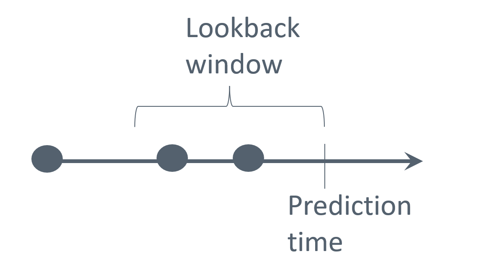
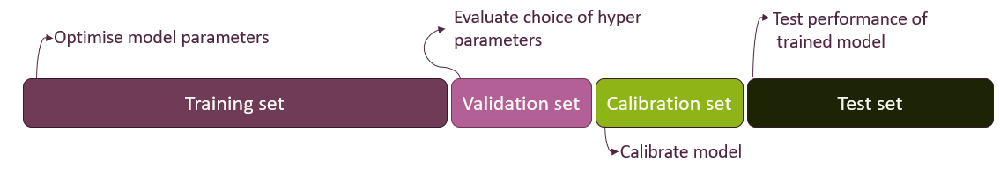

:::{.hero-banner}
# Data Preprocessing
:::

&nbsp;

This section aims to prepare participants for the necessary considerations encountered during data preparation for dynamic risk prediction modelling.

Throughout this module, the following topics will be covered:

- Establishing the Data Analysis Protocol
- Challenges in Data Preprocessing
- Data Representation Techniques
- Splitting Data for Model Evaluation
- Feature Engineering
- **Exercises**

## Establishing the Data Analysis Protocol

Before starting any data preprocessing and data analysis, one should establish a data analysis protocol, which functions as a "recipe" for the upcoming data preprocessing and analysis. This is an important step to get an overview of the necessary steps in establishing a dynamic prediction model and to avoid manipulating data until one gets the desired output.

The protocol can contain the following elements:

1. Description of the clinical problem
2. Inclusion/exclusion criteria of patients
3. Description of data
4. Definition of predictive variables and outcomes
5. Strategies for investigating and improving data quality
6. Feature engineering
7. Data splitting into training, validation, calibration, and test sets
8. Choice of prediction models
9. Choice of evaluation metrics for the predictive performance
10. Formulation and communication of results

## Challenges in Data Preprocessing

Having established a clinically relevant problem, identified the patient population, and defined outcomes and predictive variables (item 1 to 4 in the protocol), as well as acquired access to data, the next step is to prepare data for building a dynamic risk prediction model. This process involves several steps, the first of which is to become familiar with the data in order to identify potential challenges and develop appropriate mitigation strategies.

#### Talk to Domain Experts

Close collaboration with the healthcare personnel collecting the data becomes essential, as their expertise is vital for the correct interpretation, correction, and understanding of the data.
The following topics are examples of beneficial information:

- How data are collected
- Dilemmas or constraints associated with the data collection process
- Potential systemic flaws or sources of error
- Any updates to the coding standards or practices during data collection
- Reasons behind missing values or unusual data

#### Is the recording of the outcome (and predictive variables) of good quality?

The quality of data sources can vary significantly, and poor-quality data can lead to inaccurate predictions. A critical assessment of data sources is necessary to ensure that the recorded data is reliable and representative. This requires an awareness of potential biases and data collection inaccuracies.

For example, the **Danish National Patient Register** is a centralised registry containing information routinely collected at hospital contacts, such as discharge diagnoses, surgical-, and medical procedures. Because the registry only includes information about individuals that have been in contact with a hospital, its data can suffer from [informed presence bias](https://pubmed.ncbi.nlm.nih.gov/27852603/). This bias can lead to a higher observed prevalence of illness than in the general population. Further, [Schmidt et al. (2015)](https://pubmed.ncbi.nlm.nih.gov/26604824/) have shown that the recording of diseases and treatments may be poor with positive predictive value varying between <15% and 100%.

Another example of a potential reliability issue is found in the **Danish Register of Causes of Death**. In one study, by [Helweg-Larsen, K. (2011)](https://pubmed.ncbi.nlm.nih.gov/21775346/), focusing on this register, it was shown that a significant proportion of the recorded causes of death were inaccurate.

These examples illustrate that even long-standing administrative registers, originally designed for operational use, may have limitations in data validity when repurposed for research. Thus, there is a need for critical evaluation of all data sources to ensure accuracy and reliability. It is recommended to review existing literature on the validity and limitations of the selected data sources.

#### Make summary statistics

Using summary statistics is a key step in exploring the data’s distribution and quality, helping to detect:

- Missing data
- Outliers
- Unexpectedly recurring values

After obtaining an overview of these issues, the next step is to ensure that they are appropriately accounted for in the data analysis protocol.

#### Missing data

The initial step in addressing missing data involves a thorough investigation of the underlying pattern of missingness. This assessment is crucial before imputation or removal methods are considered, as the nature of missingness can significantly impact the validity of analyses. For instance, it should be determined whether missing data consistently occurs within specific intervals or under particular conditions.

Missing values are typically categorised into three distinct types:

- **Missing completely at random (MCAR)**: Missingness occurs entirely at random, meaning there are no systematic differences between individuals with missing data and those with complete data with respect to either measured or unmeasured characteristics.

- **Missing at random (MAR)**: Missingness depends only on observed data, not on the missing values themselves. In other words, any systematic differences between individuals with and without missing data can be fully explained by variables that have been measured.

- **Missing not at random (MNAR)**: Missingness depends on the unobserved values themselves, even after accounting for observed variables. That is, systematic differences remain between individuals with and without missing data, related to the missing values that were not observed.

Missingness in the data can, for example, be addressed by:

- **Deletion**: Remove individuals or predictive variables with missing values. Removing all individuals with missing in any of the variables of interest is also referred to as complete case analysis
- **Mean/Median/Mode Imputation**: Replace missing values with the average, median, or most frequent value
- **Constant Value Imputation**: Fill missing values with a specific constant (e.g., zeroes or a designated "missing" value)
- **Carry forward**: For longitudinal data, fill missing values with the last observed value.
- **Predictive Modeling**: Use machine learning algorithms to predict missing values based on other features

The choice of a strategy for handling missing data in a variable depends on the type of missingness and whether the variable is independent of the outcome or not. For MCAR data, complete case analysis provides unbiased results, but doing so may result in an insufficient sample size. This also applies to MAR and MNAR data, provided the missingness is independent of the outcome being studied. If this is not the case, it is however challenging to achieve truly unbiased results for MNAR data as the missingness depends on unobserved data, while unbiased results for MAR data often can be employed by using multiple imputation. Simple methods imputing with a single value such as the sample mean may introduce bias, even for MCAR data. To read more about the different types of missingness and strategies for handling them see e.g. [here](https://www.ncbi.nlm.nih.gov/books/NBK493611/pdf/Bookshelf_NBK493611.pdf).

Before employing strategies to handle missing data, the dataset used for dynamic risk prediction must first be restructured as described in the next section *Data Representation Techniques*. Only after this restructuring should imputation be performed.

## Data Representation Techniques

In health care, data are typically collected at irregular time intervals, reflecting when patients seek care and when clinicians record information. Following the data preparation protocol proposed by [Tomašev et al. (2021)](https://www.nature.com/articles/s41596-021-00513-5) for dynamic risk prediction, an initial step involves structuring the data into fixed time intervals and aggregating the available information within each interval. This process transforms the original continuously recorded patient data into discrete time segments, such as hours or days.

Selection of a suitable discretization interval is required to structure the irregularly timed data. For instance, if data points are recorded frequently within hourly periods, an hourly interval might be considered appropriate.

Several predictor values may be available within the same time interval, and these must be aggregated into a single representative value, for example by taking the mean. Figure 1 illustrates bundling measurements of albumin levels into 6-hour time intervals (for a single patient), where multiple measurements in a time interval is aggregated by the mean, and where predictions are regularly triggered every 6 hours.

  

Figure 1: Bundling data into 6-hour intervals, where predictions are regularly triggered every 6 hours.

&nbsp;

When structuring data into fixed time intervals, care must be taken to prevent information from future events from influencing prediction at the current time point. Special attention is for example needed if a predictor value is recorded with a coarser time stamp than the one chosen for bundling data. Suppose information on a given surgical procedure is recorded only by date, while other predictors are timestamped more precisely and bundled into 6-hour time intervals. In that case, information about the surgical procedure should be assigned to the first 6-hour interval on the day following the recorded date to avoid incorporating information from the future.

Now that data has been structured into discrete time intervals a *current value* for each predictor at the specific prediction time has been obtained. By aggregating all available information within each interval, we create a snapshot of the patient’s most recent clinical status that can be used for prediction.

In addition to the current values discussed above, it is often valuable to include *historical predictors* that summarise trends or patterns in a patient’s data over a defined lookback window prior to the prediction time, see Figure 2. By limiting the window to recent observations, we focus on data that are most relevant for prediction, while excluding older measurements that may no longer carry predictive value. The optimal length of the lookback window varies by variable: for example, short for physiological data and longer for prior diagnoses.

  

Figure 2: Illustration of a lookback window for prediction.

&nbsp;

Different summaries of data within the lookback window can be used, for example:

- For continuous values: count, median, mean, standard deviation, maximum/minimum values, average difference between subsequent entries within the window, etc.
- For categorical values: a count or a binary indicator of occurrence within the window (e.g. specific diagnosis presence)

## Splitting Data for Model Evaluation
To ensure a predictive model can be applied in a real-world setting, it must perform well not only on the data it was trained on but also on new, unseen data. This ability is called generalisation.

To assess a model's ability to generalise, the dataset is typically divided into at least two distinct subsets: a training and a test set. The training set is used to train the prediction model, while the test set, which the model has never seen before, is used to evaluate its performance.

Data splitting strategies can become more extensive depending on the model class. When a model involves *hyperparameters* (see [Modelling](modelling.qmd)), a typical approach is to consider a validation set alongside the training and test sets. The validation set is used to compare different hyperparameter configurations and select the best-performing one before evaluating the model on the test set. This helps prevent overfitting to the test set during hyperparameter tuning. Lastly, if a model requires *calibration* (see [Modelling](modelling.qmd)), a separate calibration set might also be used.

Typical splitting ratios allocate a larger portion of the data for training, such as 80% for training and 20% for testing, in a simple setup. However, the ratio can be adjusted based on factors like the total volume of available data and the task requirements. When using multiple splits, the ratios are adapted. A train/validation/test split might use a 70/10/20 ratio, while a train/validation/calibration/test split could use a 60/10/10/20 ratio, as illustrated in Figure 3.

Note that the training, validation, calibration, and test sets should be independent, with no overlapping records. In dynamic risk prediction, where some patients have multiple prediction time points, all records for a given patient should remain within the same split to maintain independence. This prevents any leakage of information at the patient-level.

Figure 3: Training, validation, calibration, and test sets data splitting.

Ref: [James et al. (2014):202-212](https://www.statlearning.com/)

## Feature engineering

Feature engineering involves transforming raw variables into a set of features that better capture relevant information for a prediction model, through selection or creation of features from existing data to enhance model performance.

### Feature selection

Insights from clinicians’ expertise can help identify features that are particularly relevant for the specific clinical case. Data quality is another important factor in feature selection, and features with unreliable or inconsistent measurements may be removed.

### Feature creation

After feature selection, it may be necessary to create new features from existing ones. This can be required by certain modelling algorithms that expect data in specific formats, for example, transforming categorical variables into binary variables. It can also be done because model performance may be improved by derived features that provide useful context. For example, continuous variables can be transformed into clinically meaningful categories based on reference value, such as classifying blood pressure as low, normal, or high. Categorising continuous variables in this way can help the model interpret the clinical meaning of their ranges.

Categorical variables can cause problems when some categories have very few observations. With limited data, the model may struggle to learn meaningful patterns and risk overfitting to these rare cases. This can lead the model to interpret random noise as a significant relationship. An example with patient symptoms is shown in Table 1 and 2, where the symptoms skin rash and body ache are rare and thus collapsed into an 'Other symptoms' category.

Before and after collapsing infrequent values of a table showing the count of patients who experience primary symptoms.

Below, we outline typical methods for creating and transforming features, including encoding, handling outliers, and scaling.

**One-Hot Encoding**

One-Hot Encoding is a common method used to represent categorical values in a format suitable for machine learning models. Each category of the categorical variable is transformed into a separate binary (0 or 1) feature, where a value of 1 indicates the presence of that category and 0 its absence. For example, a variable describing biological sex with categories “Female” and “Male” can be transformed into two features. This transformation allows categorical data to be used as input for models, such as linear models, which typically cannot process non-numeric or non-binary categorical features directly.

A simple table with one column of sex. Before and after One-Hot Encoding.

Including binary variables for all categories introduces linear dependence among these features. For some models (like logistic regressions), this causes computational issues and one of the binary variables is typically left out to remove this dependence. The left-out category then becomes the baseline or reference level.

Using one-hot encoding can significantly increase number of features, especially when the original categorical variables have many categories. This can lead to sparser data, higher computational costs, and a greater risk of overfitting. Rare categories can be combined or alternative encoding methods, like embeddings, can be used to mitigate these issues.

**Outliers**

Outliers are extreme values that deviate markedly from the rest of the data and can distort model training. They may arise from measurement error, data entry mistakes, or true rare events. One way to identify outliers is by examining how far values deviate from the bulk of the data, using measures like percentiles and interquartile range. Visual tools such as boxplots or histograms can also help locate extreme values. If extreme values seem to be a product of a mistake, a common approach is to cap them at a chosen percentile. However, it is generally not recommended to remove valid outliers.

**Presence features**

Presence features, also known as missingness indicators, are binary variables that record whether a value for a given feature is missing or observed. Including these indicators in a prediction model can be valuable because the fact that data are missing may itself carry predictive information. For example, in clinical data, a missing lab test might reflect a clinician’s judgment that the test was unnecessary, indirectly signalling a lower level of concern. By explicitly modelling missingness, presence features can help the model capture such informative patterns and improve predictive performance.

Ref: [Ozdemir, S. (2022)](https://www.manning.com/books/feature-engineering-bookcamp)

**Feature scaling**

Adjusting the scale of features, known as feature scaling, is often an important step for improving model performance. Features used in a model can have vastly different natural ranges or units. Without scaling, features with larger values or wider ranges can exert a disproportionate influence on the learning process of certain algorithms. Scaling may also contribute to the convergence speed, depending on the algorithm.

Common methods used for feature scaling:

- **Standardization:** Rescales features to have (approximately) a mean of 0 and a standard deviation of 1. This is done by taking the feature value $x$, subtracting the feature’s mean $\mu_{train}$, and dividing by the standard deviation $\sigma_{train}$, both computed from the training data:
$$x_{scaled} = \frac{x - \mu_{train}}{\sigma_{train}}$$

- **Min-max scaling:** Rescales features using the minimum ($min_{train}$) and maximum ($max_{train}$) values from the training data, so that it lies within a range between 0 and 1. This is done by taking the feature value $x$, subtracting the minimum value and dividing by the range of the feature:

$$x_{scaled} = \frac{x \; – \; min_{train}}{max_{train} \; – \; min_{train}}$$

To prevent data leakage, the mean, standard deviation, minimum and maximum are computed exclusively from the training set and used for scaling across all data sets. This prevents information from the validation and test sets to influence the training process. The selection between scaling methods should be informed by the specific machine learning algorithm being used and the characteristics of the data itself.

Ref: [Géron, A. (2019):65-67](https://www.oreilly.com/library/view/hands-on-machine-learning/9781492032632/)

## Final Step

Now we have:

1. Restructured data according to fixed time intervals, giving at most one row per time interval with both current and historical features
2. Split data into training, validation, calibration, and test set as needed
3. Performed feature engineering, constructing relevant predictors
4. Imputed missing values

All in all, a dataset ready for training a predictive model has been constructed. For most models, only time intervals related to a prediction time point are kept for the modelling. In that case a final step in the data preprocessing is to remove all rows not related to a prediction time point as illustrated in Figure 4.

Figure 4. A dataset prepared for modelling. Rows highlighted in green represent prediction time points, which typically serve as the model’s input.

&nbsp;

To reinforce what you have learned from this lesson, try the exercise below before proceeding to the next course section on modelling. After concluding the exercise, the next section can be accessed by pressing the button located below.

# Exercise

In this exercise, you will prepare data for training and testing a dynamic risk prediction model. The data is described in [PAD-introduction.html](../exercise_data/PAD-introduction.html) and the data files (baseline_date.csv, diag_data.csv, dict_data.csv, blood_data.csv, quest_data.csv, treat_data.csv, event.csv and vist_date.csv) are all found [here](https://github.com/hds-sandbox/Dyn_Risk_Pred_Course/tree/webpage-quarto/exercise_data/raw_data)

This course focuses on preparing data for dynamic risk prediction models, i.e., the goal is a dataset with one row per prediction time point with patient history aggregated into separate features. As event of interest, we consider events of type “major”, “minor” and “death” from the ‘event’ dataset. The binary outcome is whether the event happens within the next year from the prediction time point.

Go through the following steps:

1.	Load all the datasets and get acquainted with them, including reading the data description, making simple checks on the possible. Translate diagnosis codes in diag_data to a more descriptive diagnosis code using the key in dict_data.

2.	Join the feature datasets variables (blood_data, diag_data, quest_data, and treat_data) and the visits data set (visit_date) on patient id and date to obtain a dataset with one row per unique date. As you only will have one observation per day this corresponds to bundling in 1-day time steps. Order data by patient id and then date.

3.	Add baseline variables (in baseline_data) to the dataset you just created (join by patient id).

4.	Determine which patients goes into the training, validation, calibration, and test sets (using 70% training, 10% validation, 10% calibration, and 10% test). Add a variable indicating which set each observation belongs to.

5.	Perform feature engineering. We suggest the following steps (for easy comparison with the provided prepared data):
    a)	Remove features with >20% missing on a patient-level
    b)	Construct feature with age at each visit
    c)	Make one-hot encoding of sex, smoking, and diagnoses
    d)	Use a carry-forward approach for imputing diagnoses, blood, treatment, and questionnaire data. If the initial record is missing, impute with mean value (from training data)
    e)	Cap and min-max normalise non-categorical features

You may further create summary variables (aggregating historical information), add presence features, or construct other derived features.

6.	Filter your data to only keep rows related to prediction time points (=time of a visit) and use the dataset “events” to define your outcome for each time point and add to the dataset you just created

**Note**: Packages like tidymodels in R can automate several of these data preprocessing steps. In particular, during cross-validation, they make sure that e.g., imputing missing values or scaling variables are based only on the training data within each fold, and then applied to the validation data. This is important to avoid data leakage. Here, we perform these steps manually to better understand what is happening behind the scenes.

To proceed to the next section of the course, please click the button below.

&nbsp;

 

  <a href="./modelling.qmd" style="background-color: #4266A1; color: #FFFFFF; padding: 30px 20px; text-decoration: none; border-radius: 5px;">
    Continue to
    Modelling
  </a>

&nbsp;
