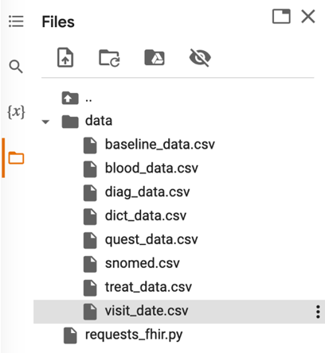

:::{.hero-banner}
# Implementation

:::

# Hosting and access to data
# FHIR
# Prospective validation
# Exercise
## FHIR
In this workshop you will experiment with a simulated FHIR server to retrieve patient data. The goal is to use these data in the predictive model developed in Workshop 2 to make predictions.
Getting started
1.	Go to https://colab.research.google.com/ (you’ll need a Google account)
2.	Upload the necessary file, it should look like that. The files can be found on Moodle.

  

3.	Copy-paste the code below in the first cell and run it.
import json
import requests_fhir as requests
import pandas as pd
import matplotlib.pyplot as plt

BASE_URL = 'https://test/fhir/'
json_headers = {'Content-type': 'application/json', 'Accept': 'text/plain'}

To-do
Go through the following steps:
1)	List patients using the get method from requests_fhir
2)	Look at the snomed.csv file inside the data folder to see which code to use to access the data
3)	Get measurements of cholesterol for a patient and plot it over time
4)	Obtain the necessary information for your model using requests_fhir
5)	Feed these data into your trained model and make predictions
