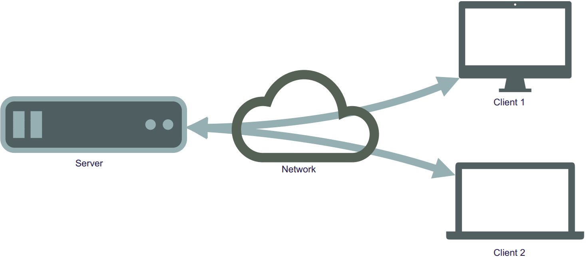
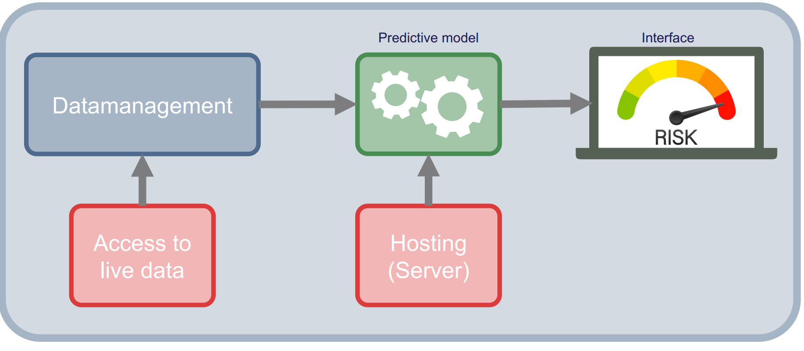
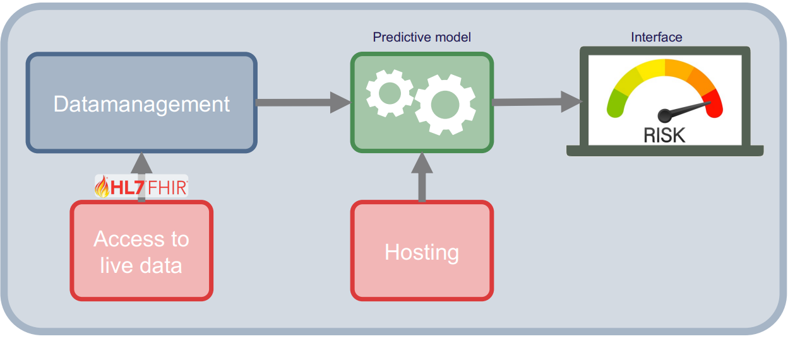

:::{.hero-banner}
# Implementation

:::

Up to this point, we have focused on how to develop a dynamic risk prediction model, yet this is only half the challenge. The real impact happens when these models are seamlessly integrated into clinical workflows, connected to real-world data sources, and delivered to clinicians in real time.

This section introduces the practical side of deploying prediction models in health care, which is
made possible by established data exchange standards such as FHIR [Fast Healthcare Interoperability Resources (FHIR)](https://www.healthit.gov/topic/standards-technology/standards/fhir). This standard streamlines the interaction with healthcare data globally. FHIR was briefly introduced under [Data Sources and Data Acquisition](data_management.qmd) and will be further elaborated here.

This section will cover:

- Hosting and access to data
- FHIR
- Validation
- **Exercises**

# Hosting and access to data
Healthcare professionals generate and record much of the data in healthcare. However, the personnel cannot manage this data on their own. It must be stored digitally in an infrastructure that is easily accessible, secure, and allows for the storage of all data from every health care professional at a regional, national, or even international level.

Through this infrastructure, information about patients, such as diagnoses and treatments, can be transferred, stored, and reused by researchers. The infrastructure also provides services support of decision-making processes.

Sharing of services are enabled through a network of servers. The term server refers to the computers providing the services. Network types are classified from local, such as Bluetooth or Wi-Fi, to wider area networks, including hospital systems or the internet. Resources, such as database servers with information about Danish residents, are primarily accessed through these broader networks.

These networks are connected by physical devices, such as routers or access points, which enable data retrieval and transmission to the intended locations within the networks. Through these mechanisms, the sharing of resources is facilitated, and the distribution of information is secured.

Servers typically operate within a client-server architecture, a fundamental model of network interaction. The client-to-server architecture is illustrated in Figure 1:

  

Figure 1: Illustration of the interaction of servers and clients through networks.

&nbsp;

There exist different types of servers, such as those for websites, search engines, email services, and databases. A database server is a type of server through which information is managed for easy access, management, and updating of databases. A database is composed of physical storage and software that enable the insertion, retrieval, and management of data from storage.

To generate a new risk prediction from a trained model, the required raw input data must be retrieved, possibly preprocessed, and then made available to the model. This data will be placed in a database hosted on a database server.

The database server can be linked to other servers where the predictive models are hosted. Easy and secure interaction between data, models, and the user interface, which displays predicted risk and auxiliary information to the user, is facilitated by this network of servers.

This process is illustrated in Figure 2.

  

Figure 2: Network infrastructure of a risk assessment tool for clinicians. It shows how data is accessed directly at the data sources and how they are processed in the data management component, then feed into the predictive model which is hosted on a server. The result of the model is then displayed on an interface on a local computer.

&nbsp;

Figure 2 shows the structure and the components necessary to build a basic predictive modelling system.  The two main component is the data management component, which is what handle the [data acquisition](data_management.qmd) and [preprocessing](data_preprocessing.qmd).  The other component is the predictive modelling component, which calculates the risk score. The two main components are supported with access to live data and hosting of the system.
Access to data is typically not direct, it goes via an *Application Programming Interface (API)*, which acts as a bridge between the user and the databases.
This approach is effective because it allows for the establishment of automated tasks using a *cron job*, which is a scheduled task that is executed at a predetermined time or interval.
For example, such jobs could involve updating the database for all the blood tests collected throughout the day at midnight for display on an app or webpage. The display on the app or webpage would be through an API communicating with the database and reading the appropriate data for the given tasks.

For each API, a set of rules and techniques is established that outlines how the API should be implemented and used.
These rules, known as the API protocol, specify the applicable data formats, commands and overall behavior of the API.
Many different API protocols exist, but the Representational State Transfer (REST) protocol is particularly relevant here.
REST is considered versatile, as no single message format is enforced by the style itself for the messages that can be handled.
For REST interactions, a Uniform Resource Locator (URL) is used as the endpoint, and HyperText Transfer Protocol (HTTP) verbs (GET, POST, PATCH, PUT, and DELETE) are employed to perform operations such as resource creation, reading, updating, and deletion (CRUD). The relevance of this protocol is established by its facilitation of interactions that enable data exchange between servers and clients. An API that follows this protocol is referred to as a RESTful API.

The API can be seen as a function which facilitates the request. The client makes a request through the API for specific data. The data is pulled from a server and provided to the client. With the RESTful API, the request is made as a specific URL address and an action.

An example of using a RESTful API could be to get data on a certain patient from a database. In this case, there must be a server address, the server needs to have a patient list, and the patients need to have some identifiers, like an ID number. If the server requirements are satisfied, the GET action can be employed:

`GET(https://server.com/Patient/123)`

This call would return a structured output, such as JSON or XML of the available patient data for the patient with ID 123. This output could look like the following:

` { "id": "123", "name": "Hans Hansen", "age": "56", "Gender": “Male” } `

An example of a standard that leverages the principles of the RESTful API and is widely utilized in the healthcare sector is FHIR.

For further information about API and API design, see this book: [Lauret, A. (2025)](https://www.manning.com/books/the-design-of-web-apis-second-edition)

# FHIR

FHIR is a global healthcare standard published by [HL7]( Health Level Seven International - Homepage | HL7 International) that facilitates the exchange of health data. Built on a RESTful architecture, FHIR allows for standardized data access, which is beneficial for interoperability between different systems.

To improve usability, FHIR resources are made available in both human-readable and machine-readable formats. This dual-format structure enables the development of applications that can access and process real-time data, which is especially beneficial for research.

[In Denmark, FHIR has already been implemented in electronic patient record systems at hospitals and municipalities, such as Columna CIS and Columna Cura](https://hl7.dk/FHIR-implementations-1.0.0.html). The number of implemented systems is expected to increase as more projects adopt FHIR to enhance data sharing.

FHIR is used to access real-time data from various sources, which can then inform prediction models. FHIR reduces the time and effort needed for data collection and preparation, facilitating clinical implementation. The pipeline in Figure 2 is updated with FHIR implementation in Figure 3:

  

Figure 3: Network architecture of a risk assessment tool including FHIR interaction.

&nbsp;

The FHIR [administration module](https://www.hl7.org/fhir/administration-module.html) covers most of the basic live data relevant to medical research, and the remaining info can be obtained using various other FHIR modules.

Considering the example of predicting 30-day mortality in lung cancer from the introduction of the course, relevant live data in a FHIR format looks as follows:

1) Patient: the baseline information about the person (e.g., sex and age), along with something unique to identify them by (e.g., CPR number in Denmark).
2) EpisodeOfCare: Information about long-term care episodes, along with diagnoses and a time frame of when they were in care. Such as cancer diagnosis, comorbidities, and contacts.

3) Observation: Anything measured, such as weight, the results of biochemical tests (Albumin, LDH), and BMI.
4) Procedure: Drug administrations, surgeries.

The first two points are from the administration module, the third point is from the [diagnostic module](https://www.hl7.org/fhir/diagnostics-module.html), and the final point is from the [clinical module](https://www.hl7.org/fhir/clinicalsummary-module.html).

# Technical validation of the implementation

Technical validation of the implementation is a process of ensuring the functionality and the quality of the software infrastructure surrounding the dynamic risk prediction model in production. In this context, the ‘system’ is defined as the complete technical infrastructure, including the servers, data pipeline, and API connections.

In terms of technical validation of the implementation, there are [three main types](https://www.learngxp.com/good-validation-practices/the-difference-between-prospective-concurrent-and-retrospective-validation/): prospective, concurrent, and retrospective.

The prospective technical validation is an important validation type, as it validates that the system performs as intended, based on its protocols, after the system is used in practice. There is an emphasis on verifying that the technical implementation functions, separate from the clinical validation of the prediction model [as discussed in earlier in the course](modelling.qmd).

The validation process typically follows a systematic approach, starting with the process design, then going through the installation, operational, and performance qualifications.
It is typically required that the system pass the validation checks before it is deployed.

Next is the concurrent validation, which is relevant when the system has been implemented and used.
It serves to check whether the system is still in control and compliance.
This type of validation is typically used when something related to the system is changed, such as the introduction of new data (e.g., another hospital's data is made available and is used in the model) or a change of equipment.
As it is concurrent, any deviations found can be corrected on an ongoing basis.

Finally, the retrospective validation, which uses historical data and records to validate the system.
The main reason to use this type of validation is if no prospective validation was made before launching, and thus, no evidence for the system's efficiency exists.

For further information, please see this book: [Benson, Tim, and Grahame, Grieve. (2021).](Principles of Health Interoperability: FHIR, HL7 and SNOMED CT | SpringerLink)

# Exercises

### Before You Begin: Environment Setup

In a real-world scenario, you would connect to a remote hospital server via the internet using HTTP protocols. To save you the hassle of setting up API authentication, VPNs, and security clearances for this exercise, there are provided a simulated 'mock server (the `requests_fhir` scripts) for both R and Python.

You will construct URLs and pass them to this script exactly as if you were communicating with a real web server, but it will process the data locally on your machine.

#### File Setup:

Because the mock server acts as a stand-in for a real database, it needs to follow a exact folder structure. the folder structure should look as follows:
1. Create a main folder for this exercise on your computer.
2. Download the mock server script [(`requests_fhir.py` or `request_fhir.R`)](https://github.com/hds-sandbox/Dyn_Risk_Pred_Course/tree/webpage-quarto/Code) and place it in this main folder.
3. Create a subfolder named exactly `data` inside your main folder.
4. Download the [raw exercise data](https://github.com/hds-sandbox/Dyn_Risk_Pred_Course/tree/webpage-quarto/exercise_data/raw_data) and place all the CSV files into this `data` subfolder.

Please note, that when a single patient is requested from a FHIR server, it returns a single "Patient" object. However, when you query a list of patients or multiple observations, FHIR groups them into a `Bundle`. When the JSON response is received your, there is a extra step of navigating into the Bundle (usually under a key called `entry` or `resource`) to extract the individual records.

### Exercise 1: List patients using the GET method

This exercise’s goal is to fetch a list of all the patients from the mock FHIR server and display their information. This is a hands-on simulation of querying a secure database to pull a cohort of patients.

The steps are as follows:

1. Define the base URL for the mock server: `https://test/fhir`
    - Python hint: Import the `requests_fhir.py` script as `request` and the `json` library.
    - R hint: Source the `request_fhir.R` script.
2. Construct the full URL to access the patient resource. Following RESTful principles, this is achieved by appending `/Patient` to the base URL.
    - Python hint: Use an f-string to create the URL: `patients_url = f'{BASE_URL}/Patient'`
    - R hint: Construct the URL by using `paste0()`.
3. Make the request using the provided `get()` method (`get_r()` in R) with your URL.
    - Python hint: The response content is located in `response._content`.
    - R hint: Retrieve the content using `patient_url$content`.
4. Parse the JSON object to extract the list of patient entries.
    - Python hint: Use `json.loads()` to parse the object. It is highly recommended to print your JSON object (e.g., `print(json.dumps(parsed_data, indent=2))`) to visually inspect the nested Bundle structure.
    - R hint: Use `jsonlite::fromJSON()` to parse the data.
5. Extract the variables and build a dataframe.
    - Iterate through the nested entries to pull out the relevant patient data and organize it into a structured dataframe.

Python hints:
- The patient data is nested in the JSON structure under `['entry']`. Iterate through this list to access the `['resource']` for each patient.
- Create an empty list, append the extracted patient dictionaries to it, and then convert the list into a Pandas DataFrame.

R hints:
- The parsed data is a list containing the Bundle. The patient information is nested inside `parsed_data$entry$resource`.
- You can use `dplyr::bind_rows()` or functions from the `purrr` package to flatten this nested structure into a clean dataframe.

### Exercise 2: Find the code for a specific observation

In medical databases, clinical concepts are standardized using coding systems (like SNOMED CT). To extract information about a patient's cholesterol, you first need to know the correct system code.

Task: Look into the `snomed.csv` file (located in your `data` folder) and search for labels like 'ldl' or 'chol' to find the standardized code for cholesterol. Keep this code handy for the next exercise.

### Exercise 3: Get measurements of cholesterol for a patient and plot them over time

This exercise will combine the two previous exercises by fetching a single individual's data and plotting their cholesterol level over time.

Query Parameters: To filter data in a REST API, there is a "query parameters" at the end of your URL. You start the filter with a question mark `?`, assign a value with `=`, and chain multiple filters together using an ampersand `&`.

The steps are as follows:

1. Select a patient: Choose a specific `patient_id` from the dataframe you created in Exercise 1.
2. Select the code: Use the cholesterol code you found in Exercise 2.
3. Construct the URL: Query the Observation resource and filter by your patient and code. The format of the URL will be: `.../Observation?patient={patient_id}&code={chol_code}`
4. Make the request: Send a GET request to the mock server using this newly constructed URL.
5. Parse and Extract: Parse the JSON Bundle. Extract the cholesterol values and their corresponding dates (recorded under `effectiveDateTime`).
6. Visualize: Plot the extracted cholesterol values over time.

Coding hints:
- The extraction steps are similar to the code you wrote in Exercise 1.
- When iterating through the `['entry']` list in Python, the value is nested inside `['resource']['valueQuantity']['value']`, and the date is in `['resource']['effectiveDateTime']`.
- In R, the equivalent syntax within your extracted dataframe will look something like `resource$effectiveDateTime` and `resource$valueQuantity$value`.