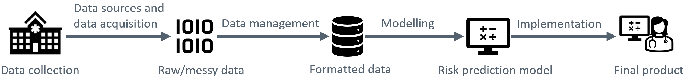
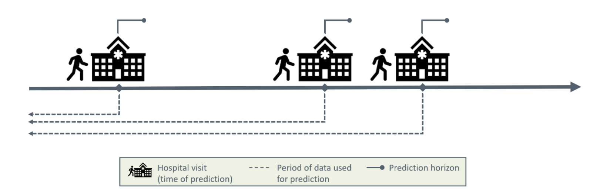
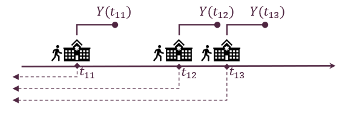

:::{.hero-banner}
# Development and implementation of machine learning models for dynamic risk prediction in health care applications
:::

:::{.callout-warning title="Required preparation"}
The participants are expected to have basic knowledge on regression analysis as well as programming experience in a statistical software tool, such as R or Python.

:::

## Access Sandbox resources

Our first choice is to provide all the **training materials, tutorials, and tools as interactive apps on UCloud**, the supercomputer located at the University of Southern Denmark. Anyone using these resources needs the following:

 1. **UCLOUD:** a Danish university ID so you can sign on to UCloud via WAYF^[Other institutions (e.g. hospitals, libraries, ...) can log on through WAYF. See all institutions [here](https://www.wayf.dk/da/institutioner-i-wayf)].

&nbsp;

 

  <a href="https://cloud.sdu.dk" style="background-color: #4266A1; color: #FFFFFF; padding: 30px 20px; text-decoration: none; border-radius: 5px;">
    For UCloud access
    click here
  </a>

&nbsp;

 2. **REQUIREMENTS:** Basic ability to navigate in Linux/RStudio/Jupyter. **You don't need to be an expert**, but it is beyond our ambitions (and course material) to teach you how to code from zero and how to run analyses simultaneously. We recommend a basic R or Python course before diving in.

 3. **FOR WORKSHOP PARTICIPANTS:** Use our invite link to the correct UCloud workspace that will be shared on the day of the workshop. This way, we can provide you with compute resources for the active sessions of the workshop^[To use Sandbox materials outside of the workshop: remember that each new user has hundreds of hours of free computing credit and around 50GB of free storage, which can be used to run any uCloud software. If you run out of credit (which takes a long time) you'll need to check with the [local DeiC office at your university](https://www.deic.dk/en/Front-Office) about how to request compute hours on UCloud. Contact us at the Sandbox if you need help or want more information.] Click the link below after your first uCloud access and accept the invite that shows.

 &nbsp;

 

  <a href="https://cloud.sdu.dk/app/projects/invite/3a8e1744-7382-4621-8c4b-f15358a9a5a8" style="background-color: #4266A1; color: #FFFFFF; padding: 30px 20px; text-decoration: none; border-radius: 5px;">
    Invite link to
    uCloud workspace
  </a>

&nbsp;

4. **CODE:** Notebooks and scripts can be downloaded here:

 &nbsp;

 

  <a href="https://phd.moodle.aau.dk/" style="background-color: #4266A1; color: #FFFFFF; padding: 30px 20px; text-decoration: none; border-radius: 5px;">
    Download code
  </a>

&nbsp;

5. **SLIDES:** Course slides can be downloaded here:

 &nbsp;

 

  <a href="https://phd.moodle.aau.dk/" style="background-color: #4266A1; color: #FFFFFF; padding: 30px 20px; text-decoration: none; border-radius: 5px;">
    Download course slides
  </a>

&nbsp;

6. **COURSE EVALUATION SURVEY:**  The Novo Nordisk Foundation funds the Sandbox project and is interested in the outcomes of our training activities, so we really appreciate your responses!

 &nbsp;

  <a href="https://forms.office.com/e/Hapv2e03aM" 
  style="background-color: #4266A1; color: #FFFFFF; padding: 30px 20px; text-decoration: none; border-radius: 5px;">
    Evaluation survey link
  </a>

&nbsp;

# Course Agenda

### Part 1 - Introduction

| Subjects |
|:----|
|Introduction the course |

### Part 2 - Data management

| Subjects |
|:----|
| Introduction to dynamic risk prediction	|
| Data sources and biases	|
| Data management	|
| Exercises	|

### Part 3 - Modelling

| Subjects |
|:----|
| Machine learning models	|
| Model training	|
| Utility and explainability	|
| Exercises	|

### Part 4 - Implementation

| Subjects |
|:----|
| Hosting and access to data	|
| FHIR	|
| Prospective validation	|
| Exercises	|

# Description

Traditional risk prediction generates a risk estimate at a defined timepoint in a patient’s disease trajectory, for example the risk of death within 30 days following a surgical procedure. In contrast, dynamic risk prediction enables prediction of risk at any time point. This allows to continuously monitor a patient’s risk profile and forms the basis for intervention if the predicted risk increases. In this course, we will explore methodological and technical solutions, as well as corresponding challenges, for developing and implementing such solutions in health care. The course includes the following topics:

## The journey from raw data to implementation

Traditional risk prediction generates a risk estimate at a defined timepoint in a patient’s disease trajectory, for example the risk of death within 30 days following a surgical procedure. In contrast, dynamic risk prediction enables prediction of risk at any time point. This allows to continuously monitor a patient’s risk profile and forms the basis for intervention if the predicted risk increases. In this course, we will explore methodological and technical solutions, as well as corresponding challenges, for developing and implementing such solutions in health care. The course includes the following topics:

- 1) Data management: This part of the course considers the challenges of preparing heterogenous longitudinal health data for prediction. We will cover the various steps involved in this process, including data formatting, feature engineering, and splitting strategies for model validation. This will include discussion about how to handle irregularly sampled health data, data leakage, class imbalance, temporal robustness, normalization, and other potential biases.

- 2) Modelling: In this part of the course, participants will be led through the process of building such models. We will introduce both basic and more advanced dynamic machine learning prediction algorithms, such as gradient tree boosting, random forest, and LSTM and discuss issues related to performance metrics and hyperparameter optimization, for example Bayesian optimization.

- 3) Implementation: In the last part of the course, we will consider the challenges associated with the implementation of predictive tools in the clinic. This includes technical aspects about hosting, user interface, and access to live data, including an introduction to the FHIR standard. Regulatory and organizational issues will also be discussed. During the project the participants will get hands on experience covering realistic scenarios related to the subjects discussed. This will include data management of representative data sets, training models and hands on introduction to the FHIR set-up.

&nbsp;

  
  

    **Illustration of a journey from raw data to implementation**: A simplified illustration of the process of making raw data into a product, by formatting the data and build a model which takes the data as input.
  

&nbsp;

# Dynamic risk prediction in a nutshell

**AIM:** Providing risk estimates of specifiv event and update these over time

  
  

    **Example of setup**: Illustration of the complex decision-making process clinicians navigate during patient interactions, with focus on the critical questions they must address and how these considerations evolve throughout the patient's care timeline.
  

## What do we need in the setup of dynamic risk

- Cohort of patients: A group of individuals being monitored over time for clinical outcomes or disease progression.
- Prediction time points $t_{ij}$ for patient $i$ and $j_{th}$ time point: The specific moments when predictions are made for patient i at their jth time point.
- Binary outcome $Y(t_{ij})$ for each prediction time: clinical outcome measures as "yes/no" (like disease, hospitalization, or recovery) at each prediction time point.

  
  

    **Regularly or irregularly triggered?:** As the clinical measurements and prediction points can occur either at fixed, regular intervals (like every third months or once a year) or at irregular intervals based on patient visits or clinical events.
  

- Predictors
  - Baseline/static data $X_i$ for patient $i$: These are characteristics that do not change over time for each patient, such as biological sex, date of birth, or genetic factors.
  - Time dependent data $Z_i(t)$ for patient $i$: These are measurements that change over time, like weight, lab values, or prescriptions of medicine and amount collected at various time points.

Note: $t \neq t_{ij}$: The time when predictive data is collected (t) may differ from the prediction time points ($t{_ij}$), reflecting real-world clinical practice where measurements are not always synchronized with prediction needs

  
  

    **Add explanation:** This illustration is showing multiple prediction of a patient which arrives in irregular intervals.
  

## Why predict in health care applications?

Estimating risk can help us:

- Detect disease on early stage
- Prevent disease
- Target treatment
- Optimise use of health care ressources, e.g. in screening programs
- Etc.

Predictive analytics in healthcare applications offers value by providing proactive rather than reactive care. Using patient data and clinical patterns, these tools can identify individuals at risk before symptoms worsen or happen, allowing for earlier interventions when treatments are typically more effective and less costly. Predictive models help healthcare systems allocate limited resources more efficiently, emphasizing the patient who needs intensive care. Predictive models can significantly improve patient outcomes while potentially preventing costly emergency interventions and hospitalizations in the healthcare system.

## Why use dynamic risk prediction in health care?

Risk of event seldomly stationary, it is **dynamic**

- Risk of adverse event can e.g. increase the longer the patient has suffered from the disease
- Risk of dying within the next year can depend on how long the patient has survived so far with the disease and the patient’s current health

&rarr; a one-time prediction is not always precise enough

Traditional risk models provide only a snapshot at a single point in time, while disease progression continuously and changes the risk profiles.

The reasons why a dynamic prediction model is better suited for healthcare application rather then static prediction models is:

- The treatment have a influence on the patients risk profile
- Comorbidities develop or worsen with age and the disease duration
- Patients differ a lot in terms of risk and treatment
- Short-term decision support
- Long-term decision support

Continuous monitoring combined with a dynamic prediction model creates flexibility in healthcare delivery, making it a more reliable tool for clinicians.

As these tools are not a replacement for clinicians, it can provide as a decision tool to help the clinicians making informed decisions and to raise the lower bar of the quality in healthcare.

# Summary

In this introduction, an overview was provided on how to access all the resources of this course.
The structure for the entire course was presented, including all segments and their content.
There was a brief introduction to the concept of dynamic risk prediction and how it differs from traditional risk prediction in healthcare.
A high-level overview of the implementation of such a system was provided, where the main topics were introduced:

- Data management
- Modelling
- Implementation

A setup for dynamic risk assessment was presented along with an overview of the necessary materials to build dynamic risk models.
A short description of the reasoning behind risk and dynamic models was provided.

For continuing to next section of this course, please click on the the button:

&nbsp;

 

  <a href="http://localhost:4707/lectures/data_management.html" style="background-color: #4266A1; color: #FFFFFF; padding: 30px 20px; text-decoration: none; border-radius: 5px;">
    Continue to
    Data management
  </a>

&nbsp;

**Dev note: Change the link to the button when the actual webpage is launched**

<!-- 
<b>Please answer these [5 questions](https://forms.office.com/e/e6e3AA1u0D?origin=lprLink) for us before you head out for the day ^[*link activated on day one of the workshop*.].</b>
-->

&nbsp;

:::{.callout-note  appearance="simple" icon=false} 
<h4 align=center>Nice meeting you and we hope to see you again!</h4> 
::: 
