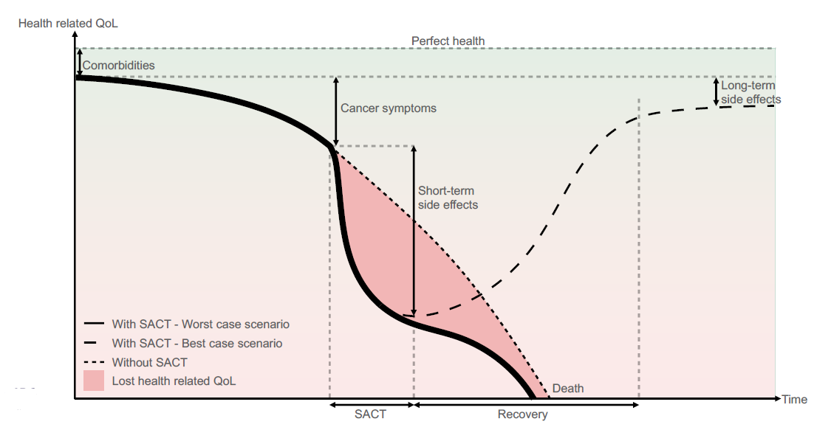
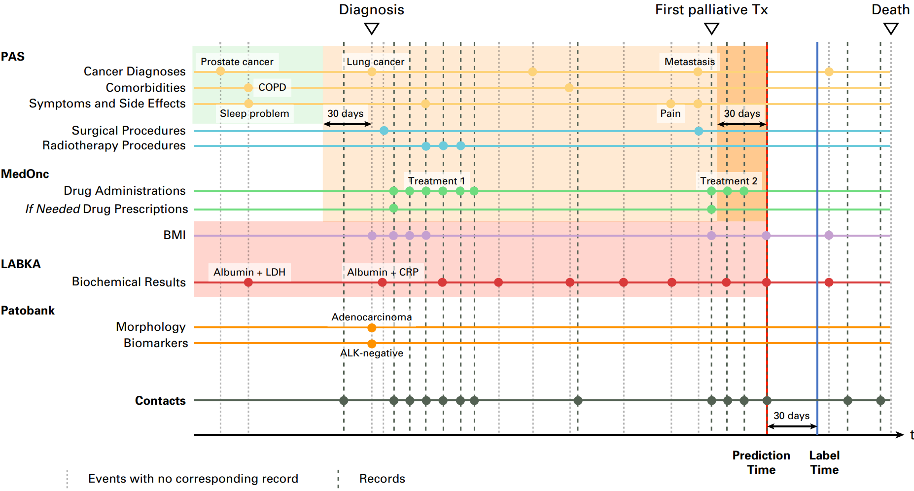

:::{.hero-banner}
# Development and implementation of machine learning models for dynamic risk prediction in health care applications
:::

:::{.callout-warning title="Required preparation"}
The participants are expected to have basic knowledge on regression analysis as well as programming experience in a statistical software tool, such as R or Python.

:::

## Access Sandbox resources

Our first choice is to provide all the **training materials, tutorials, and tools as interactive apps on UCloud**, the supercomputer located at the University of Southern Denmark. Anyone using these resources needs the following:

 1. **UCLOUD:** a Danish university ID so you can sign on to UCloud via WAYF^[Other institutions (e.g. hospitals, libraries, ...) can log on through WAYF. See all institutions [here](https://www.wayf.dk/da/institutioner-i-wayf)].

&nbsp;

 

  <a href="https://cloud.sdu.dk" style="background-color: #4266A1; color: #FFFFFF; padding: 30px 20px; text-decoration: none; border-radius: 5px;">
    For UCloud access
    click here
  </a>

&nbsp;

 2. **REQUIREMENTS:** Basic ability to navigate in Linux/RStudio/Jupyter. **You don't need to be an expert**, but it is beyond our ambitions (and course material) to teach you how to code from zero and how to run analyses simultaneously. We recommend a basic R or Python course before diving in.

 3. **FOR WORKSHOP PARTICIPANTS:** Use our invite link to the correct UCloud workspace that will be shared on the day of the workshop. This way, we can provide you with compute resources for the active sessions of the workshop^[To use Sandbox materials outside of the workshop: remember that each new user has hundreds of hours of free computing credit and around 50GB of free storage, which can be used to run any uCloud software. If you run out of credit (which takes a long time) you'll need to check with the [local DeiC office at your university](https://www.deic.dk/en/Front-Office) about how to request compute hours on UCloud. Contact us at the Sandbox if you need help or want more information.] Click the link below after your first uCloud access and accept the invite that shows.

 &nbsp;

 

  <a href="https://cloud.sdu.dk/app/projects/invite/3a8e1744-7382-4621-8c4b-f15358a9a5a8" style="background-color: #4266A1; color: #FFFFFF; padding: 30px 20px; text-decoration: none; border-radius: 5px;">
    Invite link to
    uCloud workspace
  </a>

&nbsp;

4. **CODE:** Notebooks and scripts can be downloaded here:

 &nbsp;

 

  <a href="https://phd.moodle.aau.dk/" style="background-color: #4266A1; color: #FFFFFF; padding: 30px 20px; text-decoration: none; border-radius: 5px;">
    Download code
  </a>

&nbsp;

5. **SLIDES:** Course slides can be downloaded here:

 &nbsp;

 

  <a href="https://phd.moodle.aau.dk/" style="background-color: #4266A1; color: #FFFFFF; padding: 30px 20px; text-decoration: none; border-radius: 5px;">
    Download course slides
  </a>

&nbsp;

6. **COURSE EVALUATION SURVEY:**  The Novo Nordisk Foundation funds the Sandbox project and is interested in the outcomes of our training activities, so we really appreciate your responses!

 &nbsp;

  <a href="https://forms.office.com/e/Hapv2e03aM" 
  style="background-color: #4266A1; color: #FFFFFF; padding: 30px 20px; text-decoration: none; border-radius: 5px;">
    Evaluation survey link
  </a>

&nbsp;

# Course Agenda

### Part 1 - Introduction

| Subjects |
|:----|
| Introduction to the course |
| Introduction to dynamic risk prediction	|

### Part 2 - Data management

| Subjects |
|:----|
| Data sources and biases	|
| Data management	|
| Exercises	|

### Part 3 - Modelling

| Subjects |
|:----|
| Machine learning models	|
| Model training	|
| Utility and explainability	|
| Exercises	|

### Part 4 - Implementation

| Subjects |
|:----|
| Hosting and access to data	|
| FHIR	|
| Prospective validation	|
| Exercises	|

## About Dynamic Risk Prediction

Predictive analytics provides tools for proactive healthcare. An important application is **risk prediction**, which aims to identify patients at risk before symptoms worsen. Identifying risk early allows for earlier interventions when treatments are most effective, helps prevent illness progression, and enables treatments to be targeted more efficiently.

Traditional risk prediction generates a risk estimate at a defined time point in a patient’s disease trajectory, for example the risk of death within 30 days following a surgical procedure. In contrast, dynamic risk prediction enables risk to be predicted at multiple or continuous time points throughout the disease trajectory.
Risk is dynamic, not static. It changes with disease duration and patient health status. Traditional single-snapshot models fail to capture this evolution. Dynamic prediction models are effective because they can:

- Continuously monitor changes in patient risk over time.
- Inform timely interventions to help prevent disease progression by providing insights that assist clinicians in making treatment decisions appropriate to the patient's risk level.
- Contribute to more efficient allocation of healthcare resources.

**Dynamic risk prediction** models support clinicians' decision-making. They allow for the continuous monitoring of a patient’s risk, which forms the basis for intervention if the predicted risk increases. This course will present the methodological and technical approaches for developing and implementing dynamic risk prediction models in healthcare, along with the associated challenges.

The following figure illustrates the complex decision-making process clinicians navigate during patient interactions, with a focus on the critical questions they must address and how these considerations evolve throughout the patient's care timeline.

  

## Course Overview

&nbsp;
The figure below illustrates the course content, covering the journey from data acquisition to the implementation of the final product.

  

&nbsp;

The course is divided into three main modules, covering the key stages shown above:

1) Data management: This part of the course considers the challenges of preparing heterogeneous longitudinal health data for prediction. These steps include data formatting, feature engineering, and splitting strategies for model validation. This includes discussing how to handle:
    - Irregularly sampled health data.
    - Data leakage.
    - Class imbalance.
    - Temporal robustness.
    - Normalization.
    - Other potential biases.

2) Modelling: In this part of the course, participants will be led through the process of building models. An introduction will be provided to the basic and more advanced dynamic machine learning prediction algorithms, such as gradient boosting, decision trees, and Recurrent Neural Networks. Topics include performance metrics and hyperparameter optimization, such as Bayesian optimization.

3) Implementation: In the final part of the course considers challenges associated with implementing predictive tools in the clinic. This includes technical aspects about hosting, user interface, and access to live data, including an introduction to the Fast Healthcare Interoperability Resources standard. Regulatory and organizational issues will also be discussed. During the project, the participants will get hands on experience with realistic scenarios related to these topics. This includes managing representative datasets, training models, and receiving a hands-on introduction to a FHIR setup.

## Setup Requirements for Dynamic Risk Prediction

To enable the set up of dynamic risk prediction, the following notation is introduced:

- **Cohort of patients:** A group of individuals monitored over time for clinical outcomes or disease progression.
- **Prediction time points $t_{ij}$:** for the patient $i$ and the $j$'th time point: The specific moments at which predictions are made.
- **Binary outcome $Y(t_{ij})$** for each prediction time: clinical outcome measured as "yes/no" (e.g., disease, hospitalization, or recovery, etc) corresponding to each prediction time point $t_{ij}$.
- **Baseline data $X_i$ for the $i$'th patient:** These are characteristics that do not change over time for each patient, such as biological sex, date of birth, or genetic factors.
- **Time dependent data $Z_i(t)$ for patient $i$:** Measurements associated with patient $i$ that vary over time. Examples include weight, laboratory values, or medication prescriptions, recorded at various time points $t$.

The concept of multiple, irregularly prediction times for a single patient is shown in the following illustration.

  

## Motivating example
The administration of Systemic Anti-Cancer Treatment (SACT) to patients with cancer presents complex challenges involving dynamic risks, highlighting a significant need for predictive modeling. Ensuring that SACT is administered appropriately at the right time is crucial, as this can potentially lead to optimized survival rates and maximized quality of remaining life.

The intended outcomes of SACT can have a positive outcome, but may also be fatal. In the best-case scenario, particularly within palliative care, the highest possible quality of life for the patient is achieved alongside optimal treatment effects. However, SACT administration can also result in increased suffering during a patient's remaining lifetime. This can lead to the worst-case scenario, wwhere the patient's overall outcome might be less favorable with SACT than without it, potentially involving increased suffering and even a shorter lifespan compared to supportive care alone.

Given this potential variance in outcomes, difficult decisions must often be made by clinicians. Therefore, the development of dynamic predictive models is proposed as an important tool. Such models could support clinicians in making better-informed decisions regarding the optimal timing for SACT administration, or in assessing whether SACT is likely to cause more harm than benefit in a specific patient's case.

The possible scenarios relevant to short-term survival prediction, which are central to this challenge, are illustrated below. This illustration has been adapted from [Vesteghem, 2022](https://vbn.aau.dk/ws/portalfiles/portal/549539126/phd_CPEV_e_pdf.pdf)[^1].

  

## Health Data for Prediction Models

For prediction models to effectively recognize patterns and generate accurate forecasts based on historical trends, large amounts of high-quality, sequential data are required. This type of detailed information is typically stored within restricted health databases. Multiple stakeholders are involved in the data collection process, and access to systems such as PAS (Patient Administration System), MedOnc (Medical Oncology), LABKA (Lab Information System), and Patobank (Pathology Registry) must be secured. Essential patient information, crucial for developing reliable predictive models, is provided by these sources.

Once access to the necessary databases has been obtained, a crucial step involves the identification of relevant variables. These selected variables must then be integrated into a unified framework suitable for analysis. For example, the prediction of 30-day mortality requires the use of certain temporal markers such as the date of:
- Diagnosis
- The date palliative treatment was initiated
- The recorded time of death
- Other pertinent clinical indicators.

**Example of records for a patient:** This figure shows patient survival predictions made at various time points, where each dot represents a data point, with markers for clinical factors including Cancer diagnoses, Side Effects, Comorbidities, Treatments, Biomarkers, etc. The figure stems from [Vesteghem, et al., 2022](https://ascopubs.org/doi/pdfdirect/10.1200/CCI.22.00054)[^2].

  

# Summary

In this introduction, an overview was provided on how to access all the resources of this course.
The structure for the entire course was presented, including all segments and their content.
There was a brief introduction to the concept of dynamic risk prediction and how it differs from traditional risk prediction in healthcare.
A high-level overview of the implementation of such a system was provided, where the main topics were introduced:

- Data management
- Modelling
- Implementation

A setup for dynamic risk assessment was presented along with an overview of the necessary materials to build dynamic risk models.
A short description of the reasoning behind risk and dynamic models was provided.

For continuing to next section of this course, please click on the the button:

&nbsp;

 

  <a href="http://localhost:4707/lectures/data_management.html" style="background-color: #4266A1; color: #FFFFFF; padding: 30px 20px; text-decoration: none; border-radius: 5px;">
    Continue to
    Data management
  </a>

&nbsp;

**Dev note: Change the link to the button when the actual webpage is launched**

<!-- 
<b>Please answer these [5 questions](https://forms.office.com/e/e6e3AA1u0D?origin=lprLink) for us before you head out for the day ^[*link activated on day one of the workshop*.].</b>
-->

[^1]: Vesteghem, C. P. E. (2022). 30-day mortality of patients with advanced cancer: monitoring and machine learning models using extensive health data. Aalborg Universitetsforlag. https://doi.org/10.54337/aau468602374
[^2]: Charles Vesteghem et al. Dynamic Risk Prediction of 30-Day Mortality in Patients With Advanced Lung Cancer: Comparing Five Machine Learning Approaches. JCO Clin Cancer Inform 6, e2200054(2022).
DOI:10.1200/CCI.22.00054
