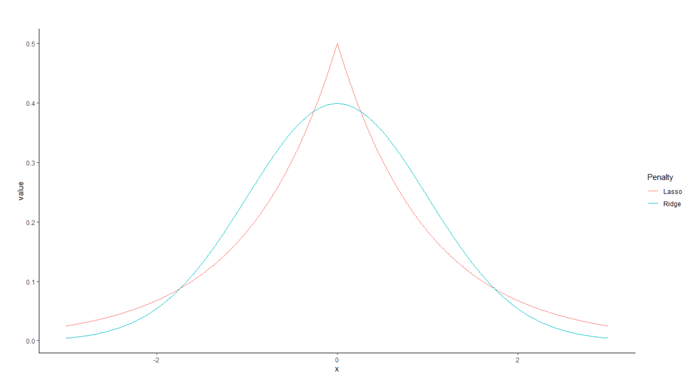
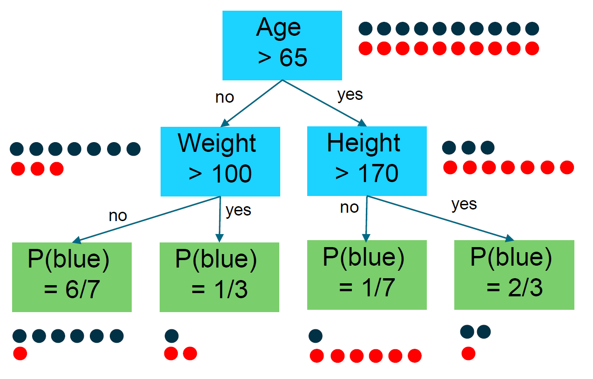

:::{.hero-banner}
# Modelling

:::


# Machine learning models

In the first part of the modeling section, a range of machine learning models from simple to complex will be presented. A comprehensive introduction to modeling topics will be provided, beginning with supervised learning, followed by an examination of a simple statistical model.

## Regression vs. Classification
This section covers `supervised learning` which are one of two primary approaches in Machine Learning, where the other is `unsupervised learning`. Supervised leaning is when there is some data with labels, then a model is trained to recognizing the characteristics (or features) belonging to these labels. Then data without labels are presented to the model and it is the models task to provide the correct labels to the data. Recall the last section where training a test sets of the data was introduced. In supervised learning are training data the data with the labels and the test set is the data without labels, where the model have to predict the labels. Machine learning models does have two primary problems, which is either regarding the prediction of continuous values, called `regression` or the `classification` of discrete outcomes.

```{python}
#| fig-align: center
#| fig-width: 8


# code stems from: https://dev.to/petercour/machine-learning-classification-vs-regression-1gn
import matplotlib.pyplot as plt
import numpy as np
from sklearn.datasets import make_blobs, make_regression
from sklearn.svm import LinearSVC, LinearSVR
import warnings
warnings.filterwarnings("ignore")

title_size = 16
axis_label_size = 12
params = {'legend.fontsize': 7,
          'figure.figsize': (7, 3),
          'axes.labelsize': 8,
          'axes.titlesize': 9,
          'xtick.labelsize': 10,
          'ytick.labelsize': 10}
plt.rcParams.update(params)

def make_classification_example(axis, random_state):
    X, y = make_blobs(n_samples=100, n_features=2, centers=2, cluster_std=2.7, random_state=random_state)
    axis.scatter(X[y == 0, 0], X[y == 0, 1], color="red", s=10, label="Disease")
    axis.scatter(X[y == 1, 0], X[y == 1, 1], color="blue", s=10, label="Healthy")

    clf = LinearSVC().fit(X, y)

    # get the separating hyperplane
    w = clf.coef_[0]
    a = -w[0] / w[1]
    xx = np.linspace(-5, 7)
    yy = a * xx - (clf.intercept_[0]) / w[1]

    # plot the line, the points, and the nearest vectors to the plane
    axis.plot(xx, yy, 'k-', color="black", label="Model")
    ax1.tick_params(labelbottom='off', labelleft='off')
    ax1.set_xlabel("Gene 1")
    ax1.set_ylabel("Gene 2")
    ax1.legend()

def make_regression_example(axis, random_state):
    X, y = make_regression(n_samples=100, n_features=1, noise=30.0, random_state=random_state)
    axis.scatter(X[:, 0], y, color="blue", s=10, label="Patients")

    clf = LinearSVR().fit(X, y)
    axis.plot(X[:, 0], clf.predict(X), color="black", label="Model")
    ax2.tick_params(labelbottom='off', labelleft='off')
    ax2.set_xlabel("Gene 1")
    ax2.set_ylabel("Survived (years)")
    ax2.legend()

random_state = np.random.RandomState(42)
f, (ax1, ax2) = plt.subplots(ncols=2)
ax1.set_title("Classification")
make_classification_example(ax1, random_state)
ax2.set_title("Regression")
make_regression_example(ax2, random_state)
plt.show()
```

**Devnote: Make a option where people can look at both R code and Python code**

Regression is concerned with predicting a continuous outcome. Regression is a task where some feature variables is used to train a model to predict some target variable. It could be anything from prediction of house priced based on some relevant features, to prediction of blood pressure on some features. Classification is about predicting which feature variable fits best to some target variable categorise. This also means that it is a discrete value which will be predicted. It can be binary categorise or multiclass categorise. Essentially, this task involves assigning a probability value to each class. Examples of these binary events are most often positive/negative – or true/negative. These scenarios can be anything from getting approved for a loan to a medical diagnosis (Hastie et al. 2001:9-11). In terms of healthcare application is the idea that, a model have been trained with a lot a of clean high quality data and this model can be feed some information (features) about a patient, which can be used for some prediction (providing a label). So if a patient have some different values rising, like blood pressure, body temperature, etc. The model might suggest that it is a sign of some illness coming up. Another example is from the **motivational example** from the introduction of the this course regarding the decision of providing SACT for palliative patients. Such a model could assist the clinicians in making the decision of providing SACT or not. The doctor would provide the models with relevant values of the patients and the model would provide a risk score, which is a significant consideration to include in the decision process.

## Logistic regression 
Different models can be used for classification, but a popular model for classification is the logistic regression model. Logistic regression is a supervised linear model that is used in scenarios with categorical outcomes. One of the strengths of logistic regression is the strong explainability, which means that the results can be understood and interpreted to a high degree compared to other models and it is a good candidate for a baseline model, if benchmarking multiple models to find the best risk prediction model.

Logistic regression is a linear model which outputs a probability score instead of a direct linear combination. To express this mathematically:

$$\hat{p} = \sigma(\theta^T \cdot \mathbf{x})$$

In general, linear models aim to find the parameters $\theta$ (also called beta or weights) that optimize the model. The probability function shown in the formula, $\sigma$, transforms the linear combination into a probability between 0 and 1. Mathematically the Sigmoid function is defined as:

$$\sigma(t) = \frac{1}{1 + \exp(-t)}$$

As $t$ approaches positive infinity, the sigmoid function approaches 1, and as $t$ approaches negative infinity, the Sigmoid function approaches 0.

To transform linear combinations into probabilities, the logarithm of the odds ratio is used. This converts the output of a linear model into a probability value between 0 and 1 by applying the logistic function. The logarithm of the odds ratio can be expressed as:

$$ \log \left( \frac{p(x)}{1-p(x)} \right) = \beta_0 + \beta_1 x $$

Where:

- $p(x)$ is the probability of the outcome
- $\log \left( \frac{p(x)}{1-p(x)} \right)$ is the logarithm of odds function (logit)
- $\beta_0$ is the bias parameter
- $\beta_1$ is the weight parameter
- $x$ is the feature variable

The sigmoid function creates an S-shaped curve that pushes the data points toward either 0 or 1, which facilitates binary classification. The *linear* part of the model creates the decision boundary, which serves as the threshold determining whether a data point belongs to class 0 or class 1.

 The sigmoid function creates the S-shaped curve, which pushes the data points to the top of the bottom bar, which makes the binary outcome where the *linear* part is the decision boundary which is the threshold for data being part of class 0 or class 1. The sigmoid function and the dynamic between threshold and decision boundary looks as follow:

<div style="text-align: center;">
  
</div>
The visualization stems from this [mini course](https://ds100.org/course-notes-su23/logistic_regression_2/logistic_reg_2.html)

Another detail is the threshold on the range for the probabilities. Normally it is a 50/50 percentages range on which class to predict, but it can be changed, according to the task and if there is a emphasis on either [type 1 - or type 2 errors.](https://en.wikipedia.org/wiki/Type_I_and_type_II_errors) Examples of making this consideration cases where balancing type 1 - or type 2 error could be for **medical diagnosis** where minimizing false negatives is preferred so patient who are critical ill or about to be critical ill will not be missed in a screening. Or email spam filter, where minimizing false positives is preferred as people would not miss any important emails. More example can be found of type 1 - and type 2 errors can be found [here.](https://baotramduong.medium.com/binary-classification-error-type-i-vs-error-type-ii-6a444fb22676)

Logistic regression is trained with optimization, which essentially means that the optimal parameters are found through 'trail-and-error' where the models change parameters, tries to fit and repeats until the optimal parameters is found. The optimization can be a basic Gradient descent optimization or more sophisticated implementation. Learn more about optimization algorithms for finding the optimal parameters in logistic regression [here](https://medium.com/@arnavr/scikit-learn-solvers-explained-780a17bc322d). To measure the progression of the performance of the changing parameters, a evaluation function have to be applied. This is what known as a *loss function* (or cost function) which is measuring the error the models make. There are many different types of loss function, but for the logistic regression, a well known loss function is **The log loss** (which is also known as Cross Entropy loss). Mathematically are this function expressed like:

$$
\min_{\beta} \sum_{i|y_i=1} \log(1-p(x_i)) + \sum_{i|y_i=0} \log(p(x_i))
$$
The general idea of this loss function is that it measures the distance between the prediction and the true label. The magnitude of this distance directly impacts the loss. Predictions that are both incorrect and made with high confidence are penalized more severely compared to incorrect predictions made with lower confidence. The min terms of the notation $\min_{\beta}$ means that the loss function is computed with respect to the parameters of the model, which will be adjusted until the loss do not longer improve.

When trying to predict an outcome with a multitude of predictor variables, there becomes a significant challenge if the number of these potential predictors surpasses the number of actual observations or data points in the dataset. In other words, this is when the predictors (represented by 'p') exceed the observations (denoted by 'n'). Regularization is essential to manage this imbalance effectively,as it can be used for making a sparse model, which means to remove features with almost no influence and only keep a few important features (Hastie et al. 2001:649-664).  Regularization is not only needed when p > n but also to reduce the overfitting of a model. Overfitting is more frequently occurring in more complex models. In training, the model learns to fit the data points perfectly but fit real data terribly because the curve was too customized to the training data. Then, some bias is introduced to the model to predict unseen data better. This is what is known as the “bias-variance-tradeoff”. One of the most well-known and used regularization techniques is Ridge regression (L2):
$$
\sum_{j=1}^{p} \beta_{j}^{2}
$$
The idea is to penalize the weights of the model and in the case of ridge, it would be with the sum of the squared coefficients, times a tuning parameter $\lambda$ to decide the strength of the regularization. The quality of Ridge regression is that it pushes the weights towards zero, relative to the size. This means that large weights are heavily penalized and small weights rarely hits zero.

It is also possible to penalize the weight after the absolute value instead of the squared sum, this would mean that alle weight are treated equally. The is called the least absolute shrinkage and selection operator (LASSO) or L1. Lasso is similar to Ridge when considered mathematically:
$$
\sum_{j=1}^{p} |\beta_j|
$$
This type of regularization is especially powerful in terms of regularizing the model, but also to do feature selection. As the weight are penalized with a absolute rate, the weights are able to shrink to zero. This means that small weights which may course more noise than accuracy, can be removed from the model.
These regularization techniques are also important in terms of reducing overfitting, which is when the model learns to fit the data perfectly in the training set, but then does not perform well in fitting the test data.

The effects of LASSO and Ridge can be visualized as follow:
<div style="text-align: center;">
  
</div>

Where it can be seen that Ridge is wider compared to LASSO and LASSO is taller compared to Ridge. The visualization is a illustration of the ridge regression ability to reduce large weights at a large rate, where LASSO have to ability to reduce weights to zero. **Provide a better explanation**

In some cases it can be an advantage to combine the power of Ridge and Lasso, while being able to customize the weighting of the two methods. To provide a flexible approach to balance between Ridge - and Lasso regression can a method called **Elastic net** be applied, which have a hyperparameter for having most emphasis on LASSO or Ridge. Elastic net can mathematically be expressed like:
$$
\min_{\beta} \frac{1}{N} \sum_{i=1}^{N} l(y_i, \beta, x_i) + \lambda \sum_{j=1}^{p} (\alpha\beta_j^2 + (1 - \alpha)|\beta_j|)
$$

Where $\lambda$ still is the strength hyperparameter and $\alpha$ is the mixture parameter. Alpha goes between 0.0 and 1.0, where the weight is going from Ridge to LASSO.

Now there should be a understanding of the basic behind creating a linear model like logistic regression and how to regularize the parameters for better performance with Ridge, LASSO and Elastic net.

In the next part, will a more flexible but also very powerful model be presented. The **Classification Trees**.

## Decision Trees
The Decision trees, are non-parametric models that split data iteratively, which means that the model does not assume any structure, but let the data determine the structure of the model. The models finds the structure by examining the data through iteration. Decision trees are versatile machine learning models, which means they can be used for regression and classification tasks. When the trees are used for making prediction, it does it by deciding on nodes and leaf nodes where the idea is to us recursive binary splitting. The model will keep splitting the data into groups until some criteria are met. In more details are the idea that there is a `root` node, which is the first variable used for splitting. The splitting is a true/false process, where there is some criteria for the splitting, like age above 65, then the tree branches out to a new who have the best interaction with the two groups so there might be the best splitting criteria for people under 65 years of age, which is their weight and their might be a best splitting criteria for the people above 65 of age, which is their weight. From that point can the two `branches` nodes be splitted into the finale four nodes, which is called the `leaf` nodes. The decision on which variable to pick for a branch is based on the interaction score between the variables used in the tree and the target variable. The measure used to determine the branching is the Gini index. The gini index is a measure for the nodes, where the *impurity* is measured, where the ratio of classes in each node is the measure of impurity. If a node contains 50/50 of two classes of the target variable (like having benign or malignant cancer) would mean that the node in very impure and would have a gini index equal to 0.5. If a node had 100% malignant cases, when the node would be pure and there would be a gini index equal to 0. The gini index can be expressed mathematically as:
$$
\text{Gini index} = 1 - \sum_{k=1}^{n} p_{i,k}^2
$$
where $p_{i,k}$ is the proportion of samples that belong to class $k$ at node $i$.
The most important hyperparameter is the maximum depth of the tree which is the maximum amount of branches between the root node and the leafs. By restricting the depth, it prevent the tree from becoming too complex and start overfitting the data. Finding the optimal depth is a iterative process.
As mentioned regarding the regularization of models, it is also significant for the generalization of the decision trees restricted on the training data. Decision trees have a selection of unique hyperparameters, where max depth is one of them. Another regularization method is to decide how many samples should be in each node. The regularization techniques reserved for decision trees are called **pruning**.
For regression tasks are the decision trees similar in terms of building a tree and splitting the data. However, instead of using Gini index, the trees used for regression tasks uses Mean Squared Error (MSE). More information about Classification and Regression Trees can be found [here](https://en.wikipedia.org/wiki/Decision_tree_learning)

<div style="text-align: center;">
  
  <div>
  **Note**: Decision notes are <u>Blue</u> and the Leaf notes are <u>Green</u>.
  </div>
</div>

Although decision trees are powerful models on their own, they are still limited by instability due to the model being sensitive to changes in the data. Small variations in the training dataset can lead to completely different tree structures, as the greedy splitting algorithm makes locally optimal decisions at each node. This high variance means that decision trees may create overly complex structures that capture noise rather than underlying patterns.

To address these issues, can **[ensempling](https://en.wikipedia.org/wiki/Ensemble_learning)** be added to the trees and create methods like **Random forest** or **Gradient boosting**.

## Ensemble methods

Ensemble learning is know as *wisdom of the crowd*. The idea is that instead of running one model one time on all the data, there are runned several models and several subsets of the data. Then when all the models have been executed, the models "vote" on the classifications, which mean that the prediction which have been most frequent on the several training instances is chosen.

### Bagging 
### Random Forest 
### Gradient Boosted Trees

## Neural Networks 

### Train neural networks

### Hyperparameters for Neural Networks


# Model training

## Classification problems
### Sensitivity, Precision, Specificity, F1 score
### Bias-variance trade-off
### Train, Val & Test

## Loss Function
### Binary cross entropy
### Log likelihood
### AUC metrics

## Hyperparameters Optimization
### Logistic Regression with Elastic Net Regularisation
### Random forest optimization
### Neural Network hyperparameters
## Hyperparemeters optimization
### Grid search
### Random search
### Bayesian optimization


# Exercises
## Modelling
In this workshop you will train and test at least one prediction model based on the datasets you prepared in Workshop 1 (in case you did not succeed with Workshop 1, a prepared data set is available on PhD Moodle under Day 2/Workshop 2. In this dataset there is a variable called split, indicating which split the observation belongs too). You will have a data set for training the model parameters (“training set”), one for evaluating a model fit on the training data while tuning hyper parameters (“validation set”), one to train a calibration model (“calibration set”), and one for final test of model performance (“test set”).
Go through the following steps:
1)	Choose a performance metric for final test of model performance (is there class imbalance in your data?)
2)	Choose a model to train (e.g., logistic regression with elastic net or random forest). What parameters and hyper parameters does the model have?
3)	Train model and tune hyper parameters.
4)	How is the predictive performance of your trained model in the test set? Have a look at the confusion matrix – did we predict both positive and negative outcomes well?
5)	Train a calibration model. How well is the model calibrated, considering the test set?


## Reference

[^1]: https://dev.to/petercour/machine-learning-classification-vs-regression-1gn