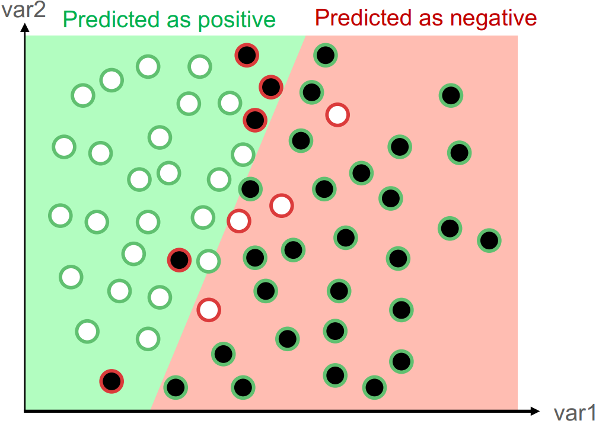
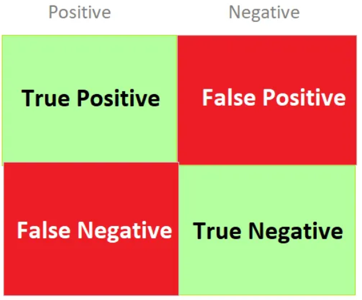
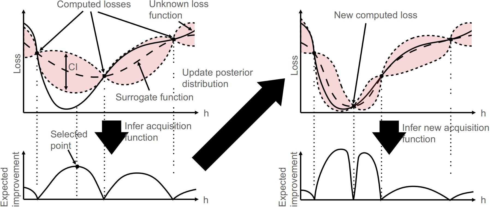
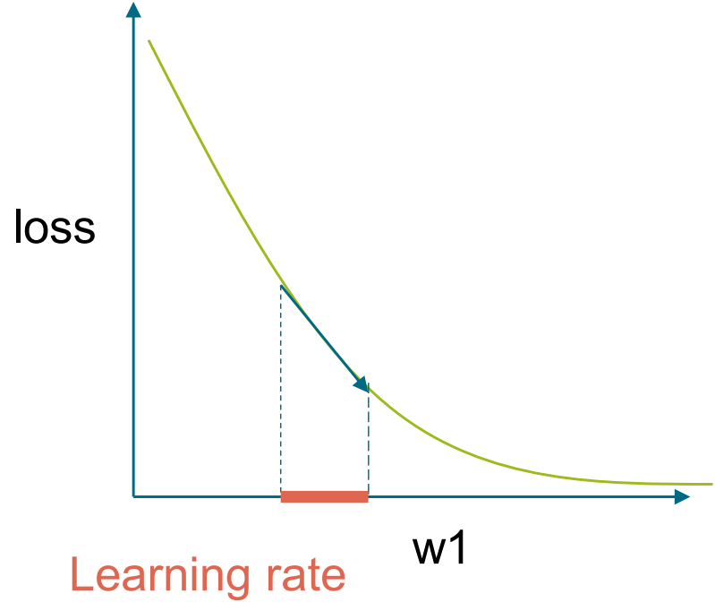
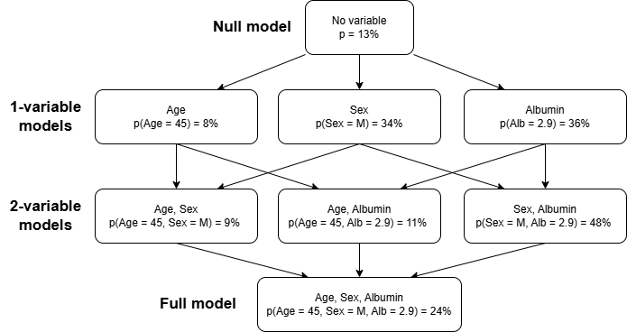
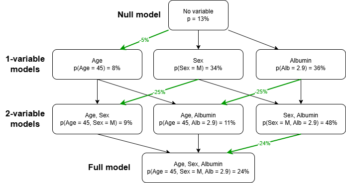

 

:::{.hero-banner}
# Modeling

:::

In this module an introduction to topics regarding training and evaluation of predictive machine learning models will be provided.

Different risk prediction will be introduced, such as logistic regression, ensemble methods, and neural networks. Methods for evaluating model performance will be presented.

Challenges, such as the bias-variance trade-off, will be addressed, and the role of loss functions in guiding model learning will be explored. Also, an introduction to hyperparameter optimization techniques, for model fine-tuning, will be given.

These concepts will then be linked, to the real-world application of models. Their utility, the importance of prediction calibration, and the achievement of explainability for "black-box" models through methods such as SHAP values.

The specific topics of this module is:

- What is predictive modelling
    - Regression vs. Classification
    - Bias-variance trade-off
    - Model performance metrics
    - Loss functions
- Model training
    - Grid search
    - Random search
    - Bayesian optimization
- Predictive models
    - Logistic regression
    - Optimization of logistic regression <!-- vær sikker på at det er i teksten -->
    - Decision Trees
    - Bagging
    - Random Forest
    - Gradient Boosted Trees
    - Neural Networks
- Performance Evaluation
    - Cross-validation
    - Nested Cross-validation
- Utility and explainability
    - Utility
    - Calibration
    - Explainability
- **Exercises**

## What is Predictive Modeling

<!-- Fill this in with some more fundamental like "y = f(x, \Theta)" -->

[Predictive modeling](https://en.wikipedia.org/wiki/Predictive_modelling) involves predicting outcomes through the use of statistical or machine learning methods. These outcomes are typically unknown future events, such as progression of diseases. Further applications in more areas can be explored [here](https://www.geeksforgeeks.org/data-science/what-is-predictive-modeling/).

## Regression vs. Classification
Machine learning models for prediction covering two primary types, either `regression` regarding the prediction of a continuous outcome, or `classification` regarding discrete outcomes.

    <!-- "Kunne der være lopyrglt modeller" Ved ikke hvad det betyder.
 

In regression, predictors are used to predict the value of a target variable. Examples of regression problems include predicting house prices based on house size and area, or predicting blood pressure based on biological predictors. <!-- Kom med bedre eksempler, som er relateret til sundhed -->

<!-- Det her skal forkortes: --> In classification, a target variable's class is predicted using predictors, applicable within either binary or multi-class scenarios.
Essentially, this task involves estimating the class probability of each class.
Examples of these binary events are most often positive/negative or true/false.
These scenarios can be anything from getting approved for a loan to a medical diagnosis [(Hastie et al. 2001:9-11)](http://www.stat.ucla.edu/~ywu/research/documents/BOOKS/ElementsLearningII.pdf).

In healthcare applications, models are trained using large amounts of high-quality data. Patient information (features) is then provided to the trained model, allowing predictions to be made. A spike observed in a patient's values, such as blood pressure or body temperature, might result in an illness being predicted by the model. The **motivational example**, presented in the introduction of this course, concerning the decision on providing palliative SACT for cancer patients, is another illustration of this application.

Assistance could be provided to clinicians by such a model for the decision on whether to provide SACT. Relevant patient values would be provided as input to the model, and a risk score would be generated by the model. The risk score would be a significant consideration for inclusion in the decision-making process.

These predictive models come in many forms and what is most notable of these methods are the degree of complexity. An important distinction to make for these models is the notion about how simple or how flexible these models are. This is a concept know as the bias-variance trade-off. The following section will introduce this concept. <!-- Forkortes hertil. Der skal tilføjes at vi taler om binære outcomes (risk prediction) og vi ser kun på prædiktionen -->

### Bias-variance trade-off
**Bias** is a term referring to the error that stems from using simple models to approximate a more complicated real-life problem.
For example, the linear model is a very simple model and [it is rarely the case that any real-life problem has a completely linear relation between the response variable and the predictors](https://hastie.su.domains/ISLR2/Slides/Ch7_Moving_Beyond_Linearity.pdf).
This means that there is some pattern in the data that a linear model is not able to catch, i.e. the bias.
The term for using too simple a model for the data is generally known as **underfitting**.
Conversely, the variance refers to the error that stems from using too flexible a model.
Here, it is possible to create a model too specific to the training data, known as **overfitting**. <!-- "Det her handler om overfitting" Jeg ved ikke hvad der menes? -->

    <!-- figuren skal forklared bedre -->
 

In the figure above, the left classification is from an underfitted model, whereas the right classification is from an overfitted model.

Ideally, the model should balance the complexity, which results in minimizing the overfitting and underfitting, which is why it is called a trade-off.
 To find this trade-off, a model is trained on some of your data, and test its applicability on new data by using the data left out, as introduced in the data preprocessing part. <!-- #### REF HER #### -->

Achieving this ideal balance, where the model performs optimally on unseen data, requires a way to quantify the model's performance in terms of the predictions. This is where loss functions come into play. But the loss function is dependent on some form of measure, in the form of a performance metric. The following section will introduce some of the most common performance metric and how it is integrated in the loss function.

### Performance Metrics <!-- "Dækker kun kategoriske variable?", "Indsnæver til binær prædiktion i forrige afsnit" -->
Since only supervised learning is being considered in this course, misclassifications can be identified. However, the counting of misclassifications is often misleading. For instance, a model with 10 misclassifications out of 5000 total data points is considered superior to a model with 10 misclassifications out of 100 data points. To ensure comparability across models, performance metrics are introduced. <!-- "I stedet noget generelt om at vi har brug for mål for at evaluere modellernes prædiktive performance (og forskellige aspekter heraf) og til at sammenligne modeller. " -->

In the classification illustrated in the figure below, a simple linear boundary is used to divide the datapoints into two classes. Points with a green outline are correctly predicted, and points with a red outline are incorrectly predicted.

   
 

<!-- "Mangler noget omkring output fra modeller (typisk kontinuerte værdi mellem 0 og 1). Brug for threshold for at prædiktere klassen" -->

This is a typical two-class classification problem, where the task is to draw a line that splits the datapoints most efficiently.
 The linear boundary visualizes the divide in prediction regions, with each class predicted on each side of the boundary.
 This divide motivates the terms: <!-- Det er jo også forklaringen på forrige figur -->

- True Positives (TP): Cases belonging to the positive class, predicted as the positive class.
- True Negatives (TN): Cases belonging to the negative class, predicted as the negative class.
- False Positives (FP): Cases belonging to the negative class, predicted as the positive class. This is also known as the [type I error.](https://en.wikipedia.org/wiki/Type_I_and_type_II_errors)
- False Negatives (FN): Cases belonging to the positive class, predicted as the negative class. This is also known as the [type II error.](https://en.wikipedia.org/wiki/Type_I_and_type_II_errors)

All of this can be aggregated in a [confusion matrix](https://medium.com/@nikitamalviya/confusion-matrix-870739a1ec31), illustrated in the figure below.

   
 

A simple way to measure the performance classification problems is to consider the accuracy of the model, given by:
$$\text{Accuracy} = \frac{TP+TN}{FP+TP+TN+FN}$$
This is relevant when both classes are equally important.
Often, different types of errors are not considered equally critical. This is illustrated by examples such as those in forensic sciences, where another person could be falsely implicated due to Type I errors, and in cancer diagnoses, where people with cancer could be misclassified as healthy due to Type II errors.
For more examples of prioritization of type I and II errors, see  [here](https://baotramduong.medium.com/binary-classification-error-type-i-vs-error-type-ii-6a444fb22676).
As such, it is important to consider the metrics sensitivity, precision, and specificity, given by:

\begin{align}
   \text{Sensitivity} &= \frac{TP}{TP+FN}\\
\end{align}
**Sensitivity**, also known as recall, is calculated based on all instances **belonging to the positive class**.
\begin{align}
   \text{Specificity} &= \frac{TN}{TN+FP}\\
\end{align}
**Specificity**, by contrast, is calculated based on all instances **belonging to the negative class**.
\begin{align}
   \text{Precision}   &= \frac{TP}{TP+FP}
\end{align}
In contrast, the **Precision** metric is calculated based on all instances **predicted as belonging to the positive class**. The choice of metric should be made concerning the context of the problem.

Combining sensitivity and precision gives the $F_1$ score, usable to evaluate the model's correct predictions across the entire data set.
 It is given by
 $$F_1\text{ score} = \frac{2\cdot\text{Precision}\cdot\text{Sensitivity}}{\text{Precision} + \text{Sensitivity}} = \frac{TP}{TP + \frac{1}{2}(FP + FN)}$$

To demonstrate the derivation of various metric values, the data from the classification figure above is utilized as input for the five previously discussed metrics. It can be seen in the figure that the following counts were obtained:

- **TP:** 24
- **FP:** 5
- **TN:** 25
- **FN:** 4

When these numbers are used in the formulas, the following results are achieved:

| Accuracy | Sensitivity | Specificity | Precision | $F_1$ score |
|:---------|:------------|:------------|:----------|:------------|
| 0.85     | 0.86        | 0.84        | 0.83      | 0.84        |

For more on all of these metrics, click [here](https://medium.com/@eren.soykok/model-evaluation-metrics-3b6c4bf91e6b).

The value of the metrics lies between 0 and 1, and the closer to 1, the better the model is at predicting the data. <!-- Denne sætning er for upræcis. ("Kun et bestemt outcome" - ?) lav en mere præcis formulering.

Within the modeling process, two primary roles are served by performance metrics. Model parameters are adjusted through their use as loss functions, and model performance is evaluated by them. Loss functions will be introduced in the following section, while the metrics for performance evaluation will be resumed after the models have been presented.

## Loss functions <!-- "Er det egentlig også bare loss functions" - Fostår ikke hvad der menes her? -->
Before the introduction of models, an understanding of [loss functions](https://medium.com/deep-learning-demystified/loss-functions-explained-3098e8ff2b27) is important, as it is the main component for a model to "learn" the best parameters to make the most accurate predictions. During model training, a metric indicating the difference between the predicted value from the true response variable is required. This metric enables the algorithm to improve the predicted output through minimization. This is the purpose of loss functions, which are also known as cost functions.

In binary classification problems, the default loss function is the binary cross-entropy, also known as the log-loss, given by
$$
H = -\frac{1}{N}\sum_{i=1}^N y_i\log(p_i) + (1-y_i)\log(1-p_i)
$$
For this calculation, the classes are transformed to **0 and 1**, which enables the multiplication within the loss function. <!-- definer yi og pi --> When the true class is 1, only $log(p_i)$ influences the loss function's value. Because of the preceding negative sign, the loss function is minimized as $p_i$ approaches 1.

Alternative evaluation methods are the Area Under Curve (AUC) metrics. AUC consists of two primary types of metrics <!-- kan ikke læse Martins kommentar --> : ROC and Precision-Recall (PR). The computation of these metrics may be more intensive than that of alternative methods, but their utility in certain situations can be significant. <!-- denne del er for upræcis: "These metrics are computed by creating a curve based on the input, and the area beneath the curve is estimated. To understand these curves, the definitions of their axes must be understood." --> <!-- "Hvornår kommer det så? Undgå for mange uargumenterede pointer" -->

<!-- "Noget med at der er forskellige thresholds der skaber kurven" --> Initially, the ROC curve is considered, where the true positive rate (TPR), or sensitivity, is compared to the false positive rate (FPR), which is equivalent to $1-\text{Specificity}$.
 Essentially, the ROC curve indicates the model's discriminative capability between classes. <--1 "AUR-ROC / AUV-PR i performance matriker max er 1" --> The diagnostic ability represented by the ROC curve is visually represented against that of a random classifier, which would yield an AUC value of 0.5. An AUC ROC score significantly above 0.5 indicates superior classification performance. An example of a ROC curve is displayed below.

   
 

<!-- "Gør skapere (hele afsnittet) --> As an alternative to ROC, the precision-recall curve is introduced.
In this case, the precision is the y-axis, and the sensitivity (recall) is the x-axis.
This is better when there is class imbalance in the dataset, as the True Negative class is not considered, meaning the positive class is in focus.
The curve is compared to random classification, which is presented as a horizontal line at 0.5, which is to show that the model is performing better than random. The ideal model would have PR AUC = 1, which means that the model has 1 on both precision and recall.
An example of a PR curve can be seen below.

   
 

The measurement of a model's performance, using loss functions and AUC metrics, is crucial. Although model performance is influenced by the selected loss function, it is also heavily affected by internal settings. Therefore, the optimization of these settings is performed to achieve most optimal predictive accuracy. The following section introduces multiple techniques to optimize hyperparameters.

## Model Training <!-- "Måske det skal komme efter modeller / Er det ikke det samme? "

Most of the models presented in the next section have some hyperparameters, determining the specifics of how the models are built.
 <!-- "Gør skarpere": These parameters can be set to specific values based on what typically works, or they can be estimated in a process called [tuning](https://medium.com/@abelkuriakose/a-guide-to-hyperparameter-tuning-enhancing-machine-learning-models-69dc9e0f02ea). -->
Generally, in tuning, a model is fitted using a specific value of the given hyperparameters, and its predictive abilities are found using the validation set, see data splitting under the data preprocessing part of this course [Hyperlink til den sektion i kurset].
<!-- Does not make sense and should be changed: "Experiments are conducted with a model's hyperparameters and occasionally its underlying machinery (modeling engine) to identify the combination that facilitates the most accurate predictions." -->

Overall, there are three main approaches:

- Gradient descent????
- Grid search
- Random search
- Bayesian optimization

These methods are frequently used, and they are powerful each in their own way and the applications for these methods are based on the given problem.

### Grid search

The first main method for hyperparameter tuning involves the use of [grid search](https://medium.com/@hammad.ai/using-grid-search-for-hyper-parameter-tuning-bad6756324cc). This method systematically evaluates all possible combinations of a predefined set of hyperparameter values. For each hyperparameter, a discrete set of values is specified, and a model is trained and evaluated using every combination generated from these sets. This approach constitutes an exhaustive search. However, the search space should be broad enough to allow for the observation of a diverse range of hyperparameter values, but constrained enough to avoid long computation times.

An example of a grid search on a logistic regression with elastic net is shown below. <!-- vi ved ikke hvad det er endnu -->
In this example, two hyperparameters are searched through: the mixing parameter $\alpha$ and the penalty parameter $\lambda$.
The optimal combination is marked in red.

    <!-- figur skal forklares bedre. Inklusiv akserne -->
 

This method is characterized by significant computational cost, as a new model is fitted for each combination of hyperparameter values. However, the effectiveness is limited by the dimensionality of the hyperparameter space as it increases. Its application is suitable for models such as logistic regression with regularization and certain tree-based methods, provided that only a limited number of hyperparameters are taken into consideration. It is generally not recommended to use grid search for complex models with a lot of hyperparameters, such as neural networks, due to their typically higher dimensionality and the extensive computational resources required for training numerous network configurations. The mentioned models will be addressed in the predictive model section [Hyperlink ref til sektionen].

## Random search
 <!-- gør skapere: In contrast to the rigorous grid search method, the computational complexity can be optimized through random sampling of a predetermined number of hyperparameter combinations, a technique known as [random search](https://medium.com/@hammad.ai/tuning-model-hyperparameters-with-random-search-f4c1cc88f528). --> For this process, a defined sampling space is required for each hyperparameter, and this space can be custom designed. This sampling space comprises a specified range or sets of relevant values for each hyperparameter. From this space, combinations are randomly selected, and a model is then trained and evaluated using each selected combination. <!-- Gentangende: This approach is often more efficient than grid search, particularly when dealing with a high number of hyperparameters or [continuous parameter spaces](https://scikit-learn.org/stable/modules/grid_search.html). -->

This method effectively manages higher dimensionality because the number of models trained is explicitly controlled by the user. While it performs well, it is acknowledged that the optimal set of hyperparameters may not always be identified.
 <!-- hvis der skal være en figur, kan man tage kodeoutput, men nok ikke nødvendig -->

## Bayesian optimization <!-- Det her afsnit skal forbedres væsentligt -->
Unlike random search, sampling from the hyperparameter space is performed through Bayesian optimization, although a more informed approach is utilized. However, the method of sample selection differs. Instead of being selected randomly, samples are chosen based on previously evaluated hyperparameter configurations. This process is undertaken through a Bayesian approach, where rather than optimizing the computationally expensive objective function directly, a computationally cheaper conditional function, $P(y|\text{hyperparameters})$, often referred to as the *surrogate* function, is instead modeled.

The algorithm's operation involves an initial construction of the surrogate function. The optimal hyperparameters are identified, which are then applied to the objective function. The surrogate function is then updated, and this iterative process is repeated. This methodology is exemplified in the figure below.

   
 

A longer duration might be spent selecting hyperparameters with this method, but ultimately, fewer hyperparameters are required to be examined.

Bayesian optimization provides an efficient method for fine-tuning a model's performance by navigating a potentially vast hyperparameter space. However, it is crucial to recognize that this optimization is applied to an already selected underlying model. The choice of models is a central decision within the predictive modeling process. Once appropriate models have been identified, their performance can then be optimized using the methods discussed above. Common models utilized for predictive modeling will be introduced in the following section.

# Predictive models

Predictive models are central to dynamic risk prediction. <!-- intro er generisk --> They are used to learn patterns from historical data, forecast future outcomes, and identify relationships within data. Such models are powerful and can be applied in various contexts. For this course, these models are used to predict events that can assist clinicians in deciding upon potential interventions. <!-- flet afsnit ind i intro -->

A range of models is available, from simple, interpretable algorithms to complex "black-box" systems. The following section will introduce these models, progressing from simpler to more complex approaches.

## Logistic regression
In a classification task, one of the most well-known models is logistic regression. This supervised model is appropriate when the outcome is categorical. A significant advantage of logistic regression is its explainability. <!-- præcisere: "Meaning that the results that are obtained can be readily understood, allowing for a high degree of interpretability. --> Logistic regression is often considered a suitable baseline model when multiple models are being benchmarked to identify the most effective risk prediction model.
Logistic regression is a linear model that outputs a probability score instead of a direct linear combination. To express this mathematically:

$$\hat{p} = \sigma(\theta^T \mathbf{x})$$

Parameters, denoted as $\theta$ (also referred to as beta or weights), are generally utilized to optimize linear models. A probability function, $\sigma$, is employed to transform the linear combination into a probability ranging from 0 to 1. This function is mathematically defined as the sigmoid function:

$$\sigma(t) = \frac{1}{1 + \exp(-t)}$$

As $t$ approaches positive infinity, the sigmoid function approaches 1. In contrast, as $t$ approaches negative infinity, the sigmoid function approaches 0.

For the transformation of linear combinations into probabilities, the logistic function is applied. Through this function, a linear model's output is converted into a probability value, which ranges from 0 to 1. This transformation is based on the concept of the logarithm of the odds ratio, which can be expressed as:

$$ \log \left( \frac{p(x)}{1-p(x)} \right) = \beta_0 + \beta_1 x $$
 <!-- Kunne overveje at lave denne til en theta^T x, ligesom over-->
 <!-- Skal jeg lige overveje JBKS 20052025 -->

Where:

- $p(x)$ is the probability of the outcome.
 - $\log \left( \frac{p(x)}{1-p(x)} \right)$ is the logarithm of odds function (logit).
 - $\beta_0$ is the bias parameter.
 - $\beta_1$ is the weight parameter.
 - $x$ is the feature variable.

An S-shaped curve is created by the sigmoid function, which maps data points to probabilities approaching either 0 or 1, thereby facilitating binary classification. A decision boundary is established by the linear component of the model, which, when combined with a specific threshold, is used to determine whether a data point is assigned to class 0 or class 1. Typically, this threshold is set at 0.5. But adjustments may be made based on the specific task requirements or the emphasis placed on minimizing type I or type II errors. The interplay between the sigmoid function, threshold, and decision boundary is illustrated in the figure provided below.

   
 

 The visualization stems from this [mini course](https://ds100.org/course-notes-su23/logistic_regression_2/logistic_reg_2.html).

In practice, logistic regression models are trained through optimization. This process involves the iterative adjustment of a model's parameters, where predictions generated by the model are continuously compared against the true values. This iterative refinement continues until the optimal parameters are determined. The optimization method employed may range from a straightforward gradient descent to a more advanced algorithm. Further information regarding optimization algorithms for determining optimal parameters in logistic regression can be accessed via the provided [link](https://medium.com/@arnavr/scikit-learn-solvers-explained-780a17bc322d).

As mentioned above, a typical loss function for logistic regression is the log-loss function.
 The goal of the optimizer is to minimize the loss function concerning $\beta$ (implicitly present via $p_i$), and it keeps adjusting the values until the loss no longer improves significantly.

In the prediction of outcomes involving numerous predictor variables, a challenge is presented if the count of these potential predictors (m) surpasses the number of data points within the dataset (n). To address this imbalance effectively, regularization methods may be employed to construct a sparse model, specifically one in which only a select few important features are retained, and others are excluded [(Hastie et al. 2001:649-664)](http://www.stat.ucla.edu/~ywu/research/documents/BOOKS/ElementsLearningII.pdf). Regularization is also essential for mitigating model overfitting, a common issue that has been addressed in the bias-variance trade-off section.

One of the most well-known and used regularization techniques is Ridge regression (L2):
 $$
 \lambda\sum_{j=1}^{m} \beta_{j}^{2}
 $$
The idea is to penalize the weights of the model, and in the case of ridge, it would be with the sum of the squared coefficients, times a tuning parameter $\lambda$ to decide the strength of the regularization.
The benefit of Ridge regression is that it pushes the weights towards zero, relative to the size.
This means that large weights are heavily penalized and small weights rarely hit zero.

Penalization of a model's weights is the fundamental principle of Ridge regression. Specifically, this is achieved by adding a penalty term that consists of the sum of the squared coefficients, which is scaled by a tuning parameter, $\delta$. This parameter determines the strength of the regularization applied. A benefit of Ridge regression is its capacity to shrink the weights towards zero. In contrast, larger weights are subjected to heavier penalization, while smaller weights are reduced towards zero but rarely to become exactly zero.

Alternatively, weight penalization can be performed using the absolute value rather than the squared sum. This approach, known as the Least Absolute Shrinkage and Selection Operator (LASSO) or L1 regularization, is mathematically represented as:
 $$
 \lambda\sum_{j=1}^{m} |\beta_j|
 $$
 This regularization method is highly effective for model regularization and, crucially, for feature selection. Since the weights are penalized proportionally to their absolute value, they are encouraged to shrink to exactly zero. Consequently, small weights that contribute more noise than predictive accuracy can be effectively eliminated from the model.

This means that small weights that cause more noise than accuracy can be removed from the model.

These terms are added to the loss function when minimizing, i.e., with LASSO regularization, the optimization problem becomes
 $$
 \min_{\beta}\sum_{i\mid y_i=1} \log\big(1-p(x_i)\big) + \sum_{i\mid y_i=0} \log\big(p(x_i)\big) + \lambda\sum_{j=1}^{m} |\beta_j|
 $$
LASSO has the added functionality of variable selection, but it also implicitly assumes some parameters are equal to 0, meaning if all predictors truly are relevant to the response variable, it might lead to worse predictions.
Otherwise, the performance of the two regularization types is similar, and which performs best varies from problem to problem [(Hastie et al. 2001:245-247)](http://www.stat.ucla.edu/~ywu/research/documents/BOOKS/ElementsLearningII.pdf).

In certain scenarios, a benefit can be gained by combining the regularization properties of Ridge regression and LASSO. This approach also allows for the adjustment of the weighting of the two methods. To facilitate this flexible methodology, a technique known as [**Elastic Net**](https://en.wikipedia.org/wiki/Elastic_net_regularization) can be employed. The Elastic Net penalty is expressed as:

$$
 \min_{\beta} \frac{1}{N} \sum_{i=1}^{N} l(y_i, \beta, x_i) + \lambda \sum_{j=1}^{p} (\alpha\beta_j^2 + (1 - \alpha)|\beta_j|)
 $$

where $\lambda$ still is the strength hyperparameter and $\alpha$ is the mixture parameter. Alpha lies between 0 and 1, where 0 is a purely LASSO regularization and 1 is purely ridge regression. This method can provide flexibility in the modelling while also test the effect of the two methods combined in different proportions.

In the next part, the **Classification Trees** be presented, which is a more flexible but also powerful model.

## Decision Trees
 [**Decision trees**](https://en.wikipedia.org/wiki/Decision_tree) are non-parametric models, their structure being entirely determined by the data through iterative examination. These machine learning models are versatile, meaning that they apply to both regression and classification problems. Decision regions are continuously split into two, typically using recursive binary splitting, until specific criteria are met.

Initially, all data is contained within a single region, referred to as the **root** node. Next, a predictor and a corresponding value are chosen, for instance, 'age above 65.' This selection results in the formation of two distinct decision regions, which are known as **branches**. The process continues iteratively. A region is selected for further splitting, and a predictor is then identified to facilitate this split. For example, the 'age under 65' region might be chosen for splitting based on 'bodyweight over 100kg', leading to the creation of additional regions. Each time a region is split, new branches are formed. The process of recursive binary splitting is continued until specific criteria are met, such as a maximum depth being reached or a minimum number of samples being present in a node. When the algorithm terminates, the final distinct regions are known as **leaf nodes**.

In classification, the [**Gini index**](https://medium.com/@ompramod9921/decision-trees-91530198a5a5) is the metric utilized to determine which region should be split. This index quantifies the **impurity** of each node based on the distribution of classes within it. If a node is evenly divided between two classes, such as instances of benign or malignant cancer, its Gini index will be 0.5. In contrast, a node consisting entirely of one class, for example, 100% malignant cases, is considered pure, and its Gini index will be 0. The Gini index is given by:
 $$
 \text{Gini index}_i = 1 - \sum_{k=1}^{n} p_{i,k}^2
 $$
where $p_{i,k}$ is the proportion of samples that belong to class $k$ at node $i$.

The maximum depth of the tree, representing the highest permissible number of branches between the root node and the leaves, is considered the most significant hyperparameter. By restricting the depth, the tree is prevented from becoming overly complex and possibly overfitting the data.

However, this represents one of several available regularization hyperparameters exclusive to decision trees. Another regularization method involves establishing a minimum number of data points that must be present in each node. The regularization techniques specifically employed for decision trees are referred to as **pruning**.

This works similarly in regression problems, except [Mean Squared Error (MSE)](https://en.wikipedia.org/wiki/Mean_squared_error) is used instead of the Gini index for evaluating node impurity.
 More information about Classification and Regression Trees can be found [here](https://en.wikipedia.org/wiki/Decision_tree_learning), and an example of a simple classification tree is shown below.

   
   

   **Note**: Decision nodes are <u>Blue</u> and the Leaf nodes are <u>Green</u>.
   

 

While decision trees are inherently powerful models, their utility is limited by instability, as their structures are highly sensitive to variations in the data. Significant differences in tree structures can be produced by minor variations within the training dataset, given that locally optimal decisions are made by the greedy splitting algorithm at each node. Complex structures that capture noise rather than underlying patterns may be generated by decision trees due to this high variance.

To address these issues, **[ensemble methods](https://en.wikipedia.org/wiki/Ensemble_learning)** can be employed and are what powers methods like **Random forest** and **Gradient boosting**.

## Ensemble learning methods
Ensemble methods combine multiple models to solve problems better than any single model could. They work by merging several weak learners into one strong predictor. This is also known as *wisdom of the crowd*. The most popular methods combining ensembling and decision trees are Bagging, Random Forest, and Gradient Boosted Trees.
 
### Bagging
[**Bagging (Bootstrap Aggregating)**](https://en.wikipedia.org/wiki/Bootstrap_aggregating) is a technique where numerous independent models are built from random data samples, and their predictions are averaged. In regression problems, this aggregation is commonly achieved through the computation of the mean or median. For classification problems, the aggregation function most frequently employed is the statistical mode, representing the most common prediction. Each model is trained on distinct data subsets, which are created through random sampling with replacement. When sampling is performed without replacement, the technique is referred to as **pasting**.

Both variance reduction and the prevention of overfitting are achieved by this approach. The basic bootstrap ensemble serves as a classic example, in which predictions are made by multiple decision trees and combined through voting (for classification) or averaging (for regression). This method is crucial for decision trees, given that individual decision trees are characterized by low bias and high variance.

In addition to the typical hyperparameters associated with decision trees, the bagging method has a hyperparameter determining the number of trees used in the aggregation.

As opposed to trees, the variable importance is not immediately interpretable, as it is a combination of a large number of trees, possibly built using different variables at different times.
However, the decrease in the Gini index for each predictor can be averaged over all trees to get an estimate of the variable importance.

### Random Forest
A limitation associated with bagging is that the decision trees utilized in the aggregation may be similar. This situation arises when a single predictor has significant importance that its selection for the initial split is consistently ensured. An example is the predictor age in a mortality prediction study.

To address this issue, Random Forests extend the bagging methodology by incorporating an additional layer of randomness. Not only are data points sampled, but features are also sampled during the construction of each tree.
 Typically, for a dataset with $p$ predictors, the number of features is chosen as $\sqrt{p}$, but it is also possible to include this as a hyperparameter.

When growing trees, Random Forests consider only a random subset of features at each split point.
 This makes the trees more diverse and helps them capture different patterns in the data, leading to better overall performance and robustness against noise.

### Gradient Boosted Trees
Unlike bagging methods, where independent models are built, boosting methods involve the sequential construction of models. Each subsequent model is developed to address the errors of previously combined models, with residuals from the overall model being utilized as the response variable. Among the various boosting methods, [Gradient Boosting](https://en.wikipedia.org/wiki/Gradient_boosting) is recognized as being particularly popular.

In Gradient Boosted Trees, new weak learners (typically shallow decision trees) are introduced to address the errors generated by existing trees. At each step, the gradient of the loss function is minimized, which is the origin of the term 'gradient' in its name.

For iteration $i + 1$, this process can be expressed as:
 $$ F_{i+1}=F_i+\delta f_i $$

Where $F_i$ represents the cumulative model constructed from trees up to iteration $i, f_i$ denotes the tree fitted to the residuals of $F_i$, and $\delta$  is a hyperparameter that determines the shrinkage applied. This shrinkage parameter is sometimes referred to as the learning rate.

Highly accurate models are generated through this sequential improvement process. However, careful hyperparameter adjustment is necessary to prevent overfitting. Specifically, the occurrence of severe overfitting can result from shrinkage parameter values approaching 1.

## Neural Networks
The human brain is composed of numerous interconnected neurons, forming an extensive network characterized by a vast number of neural cells and an even greater multitude of connections. Information is transmitted across this network through the propagation of minute electrical charges by these neurons. Learning new information is facilitated as these neural pathways are strengthened through repeated activation. This description, while a simplification of biological reality, serves to provide the foundational concept behind the naming of [**neural networks**](https://medium.com/deep-learning-demystified/introduction-to-neural-networks-part-1-e13f132c6d7e).

Functionally, neural networks are composed of nodes, often referred to as neurons, organized into a specific number of layers. Within this structure, each node in a preceding layer is connected to the nodes of the subsequent layer by assigned weights.

The initial layer is designated as the input layer, and its node count corresponds to the number of predictors. Following this are the hidden layers, which constitute a variable number of layers containing a customizable quantity of nodes. Per definition are two or more hidden layers are necessary for what is termed deep learning or deep neural networks.

Finally, an output layer is present, typically comprising a single node for regression or two-class classification problems, and K nodes for K-class classification problems.

An illustration of a neural network is provided below ([image source](https://medium.com/@sukmaanindita/artificial-neural-network-using-r-studio-3eb538fa39fb)).

In addition to the depicted weights, each neuron typically incorporates a bias. This bias is an independent constant value that is added to the weighted sum of inputs.

   
 

Each node contains some value from the previous layer, or the input for the input layer.
The value in the first node in layer $h_1$ is given by
$$
h_{1,1} = f(w_{1,1,0} + w_{1,1,1}x_1 + \cdots + w_{1,1,n}x_n)
$$
And the first node in layer $h_2$ is given by
$$
h_{2,1} = f(w_{2,1,0} + w_{2,1,1}h_{1,1} + \cdots + w_{2,1,n}h_{1,n})
$$
Where $f$ is a function determining the relationship between layers, called the activation function.
The activation function introduces non-linearity in the model, and allows the model to capture complex patterns in the data.
Typical choices of activation function are the ReLU function, $\max(0,x)$, i.e., linear for all positive values, or the sigmoid function introduced in the logistic regression section.

For binary risk classification, the logistic function can be employed to determine the output variable, thereby allowing the results to be interpreted as risk scores.

It should be recognized that each weight within the model constitutes a parameter, which can lead to overfitting if an insufficient quantity of data is available. Furthermore, significant computational resources are required for the calculation of these weights in more complex models. The number of parameters in neural networks is known to expand rapidly, as the incorporation of a single node introduces several weights equivalent to the sum of nodes in both the preceding and subsequent layers.

To exemplify the vast number of parameters that can be present in neural networks, consider OpenAI's GPT-4 model, which is estimated to possess  [1.8 trillion parameters](https://explodingtopics.com/blog/gpt-parameters), a considerable increase when compared to the 175 billion parameters of its predecessor, [GPT-3](https://en.wikipedia.org/wiki/GPT-3).

### Training a neural network
Parameter estimation is required for all model parameters. Similar to previously discussed methods, a loss function, such as log-loss, is required to be minimized. Evaluation metrics like accuracy or AUC are also employed, though they are not typically used as direct loss functions during optimization. Initial values are required for the weights, these can be randomly assigned, though [more complex initialization methods](https://machinelearningmastery.com/weight-initialization-for-deep-learning-neural-networks/) are available, but will not be discussed in this course.

Parameter estimation is performed using [backpropagation](https://medium.com/deep-learning-demystified/introduction-to-neural-networks-part-2-c261a99f4138).
It is motivated by the fact that every single weight affects the output variable, meaning that directly estimating the parameters is nearly impossible.

Initially, data are fed into the network, and a predicted outcome is calculated using the initialized weights. The loss function is minimized concerning the network's parameters (weights and biases). This minimization is achieved through the gradient descent algorithm, wherein the partial derivatives of the loss function concerning each parameter are utilized. As the weights directly connected to the output layer are most proximate to the error, their adjustments are computed first. The weights in preceding layers, such as those between the second-to-last and last hidden layers, are similarly updated in sequence. This process is termed backpropagation because the algorithm first propagates information forward to compute the predicted outcome, and then propagates error gradients backward to adjust the weights.

The gradient descent algorithm uses the derivatives and takes a step in the direction that minimizes the loss function.
The length of this step is called the learning rate, and can be seen marked red in the figure below.

   
 

Learning rate is one of multiple hyperparameters in neural networks that control how the neural network is trained.
 The key hyperparameters for neural networks are:

- Learning rate: Controls how much the weights change with each update

- Network structure: How many layers and nodes to use

- Batch size: How many examples to process before updating weights

- Regularization strength: How strongly to prevent overfitting

- Activation functions: Which mathematical operations transform data between layers

Systematic testing is required for the identification of optimal hyperparameters. Performance can be significantly improved or degraded by minor adjustments. Given the time-consuming nature of the tuning process, automated hyperparameter search algorithms can be employed to explore a wide range of hyperparameter combinations. Careful consideration of hyperparameter selection is paramount, as the network's learning capabilities and generalization performance on unseen data are determined by it.

## Evaluation of Model Performance

Evaluating a machine learning model's performance is a crucial step in its development and deployment. It involves assessing how well the model generalizes to new, unseen data and how reliable its predictions are in real-world scenarios. The statistical metrics introduced is also an important part of evaluation. However, a comprehensive evaluation also considers the practical utility and interpretability of the model, ensuring it can be effectively understood and utilized by its intended users. This section introduces various techniques and considerations for evaluating model performance, from robust validation strategies to understanding the practical implications of the model's predictions.

### Cross Validation
When predictive models are developed, it is crucial to ensure their performance on unseen data. A common initial approach, as introduced in the data preprocessing section of this course, is the data split process. While simple, a single train-test split can lead to an evaluation that's highly dependent on that specific division of data. To overcome this limitation and obtain a more robust and reliable estimate of a model's generalization performance, cross-validation is used.

[Cross-validation](https://www.geeksforgeeks.org/machine-learning/cross-validation-machine-learning/) is a technique employed to assess how a model performs on unseen data. The model is trained on a portion of the data and tested on other portions. This process is repeated multiple times, with different parts of the data allocated for training and testing. After a number of repetitions, the performance from each validation step is averaged to estimate the model's overall performance. Cross-validation is an effective measure against overfitting, which occurs when a model perfectly fits the training data but performs poorly on new data.

In other words, an unbiased estimate of how a model will perform in production can be provided by a held-out set. The generalization of the model will be tested by multiple splits (or multiple scenarios). These splits are also known as "folds," and the method used for testing these different splits of the data is known as K-fold cross-validation. In practice, [k=5 is enough, but some suggest k=10 (James et al. 2013:206](https://www.statlearning.com/).

  

### Nested Cross Validation

Although K-fold cross-validation provides a more robust performance estimate than a single train-test split, a potential for bias exists if hyperparameter tuning is performed incorrectly within the cross-validation procedure. If the test fold in each iteration of K-fold cross-validation is used to evaluate different hyperparameter settings, information from the test fold influences the selection of the best hyperparameters. This can lead to an overly optimistic performance estimate.

To address this potential bias, [Nested Cross-Validation](https://machinelearningmastery.com/nested-cross-validation-for-machine-learning-with-python/) can be employed. This technique uses two levels of cross-validation loops. An outer loop and an inner loop. The outer loop divides the data into 'k' folds, with folds for training and testing in each iteration, similar to standard K-fold cross-validation. But, within each iteration of the outer loop, an inner K-fold cross-validation is performed using only the training data portion from the outer loop. This inner loop's purpose is hyperparameter optimization. The best hyperparameters identified by the inner loop are then used to train a model on the outer loop's training data. Finally, this model's performance is evaluated on the outer loop's test fold. This process is repeated for all outer loop folds.

  

As only a subset of the dataset, one fold at a time (outer loop), is evaluated with an additional k-fold cross-validation (inner loop), the risk of the models overfitting the data is greatly reduced.

After a robust and unbiased estimate of a model's performance is achieved through cross-validation, the practical implications of deployment are considered.  There is a still a long process ahead from having a well-performing model in a closed lab to a full deployment in production. In the following section, deployment concepts will be introduced, focusing on the themes of utility and explainability.

## Utility and explainability

Beyond the statistical methods used for measuring and improving models through optimization is the implementation of predictive models. To ensure the models quality when deployed, there are some tools which can be included for measuring and understanding performance, hence the utility and explainability. For stakeholders, especially in fields like healthcare, there is a need to understand why models predict as they do and evidence of the practical advantages. This section explores how to evaluate a model's real-world impact and the methods available to interpret the produced results.

### Utility
 First, consider the utility of the model.
 This involves evaluating the clinical impact that would come from implementing the model in the real world.

Model performance is evaluated using statistical metrics. These may include ROC AUC or PR AUC, but the value of the metrics is probably unusable to most clinicians.
It is important to remember who decides whether the model is used in practice.
Clinicians might be presented the model as a prediction tool, but if they do not understand the predictions and how it works, it would never actually get used.
This is why it is necessary to illustrate the usage in a clinical context, which could be using a clinical scenario.

To setup the clinical scenario, you start by stating the **objective**, which should be something the model is capable of achieving.
Then the **usage** is described, i.e. when and how the model is used in a practical problem, considering the clinicians limited time, their accessibility of the data, and availability of the patient.
This should be combined with a **rule** clarifying how the results of the model should be interpreted.
It is important to state the **adverse consequences** that would come if the model made a false positive prediction.
Finally, the model should have a **measurable impact**, such as optimizing resource usage and lowering mortality.

In the context of the **motivational example** from the introduction of the course, the objective is to limit the amount of late SACT treatments, i.e. those administered within 30 days of death.
The model is used before each treatment cycle to aid in clinicians' evaluation of whether the patient is fit to receive the treatment, with the rule that if the model predicts 30-day mortality to be above 50% likely, the treatment should not be given.
As for adverse consequences, the treatment would be stopped early, or perhaps just delayed to a later point.
The measurable impact of the model is that it prevents suffering from the late SACT treatments, and lessens the amount of chemotherapy given.

The utility of the 30-day mortality model is illustrated below, where the curly bracket denotes the counterproductive administrations.
Note the "acceptable" class, which belongs to neither the positive or the negative class.
This is added because the improvement in life quality after the SACT treatments would be short-lived, and it is debatable if it is worth it, considering the decrease in life quality under the treatment.

   
 

### Calibration
For classification problems, when the models make their predictions, they output risk scores in the form of probabilities for each class.
Upon seeing these probabilities, one would assume they correspond to reality if made over a large number of instances.
This is important, as for example if a model predicts a 40% chance of mortality in the next 30 days, there is more cause for concern compared to a 10% chance.
It is, not always the case that these probabilities align with reality, which is possible if the model is not calibrated.
Note that calibration is not related to the accuracy of the model, and it is possible to have an accurate model without it being calibrated and vice versa.

This subsection introduces methods for ensuring [model calibration](https://medium.com/@sahilbansal480/understanding-model-calibration-in-machine-learning-6701814dbb3a).

The first method for testing calibration, is by using calibration plots, that compare the predicted risk scores with the actual class.
An example of a calibration plot can be seen below ([image source](https://scikit-learn.org/stable/auto_examples/calibration/plot_compare_calibration.html)).

   
 

In this type of plot, the ideally calibrated model follows the dashed line, and points above the line indicate overconfidence, i.e., the prediction is larger than expected, and vice versa for points below the line.

Alternatively, the Brier score can be inspected, a model evaluation metric particularly useful for evaluating the calibration of two-class classification models, but is also versatile in that it is usable in multi-class classification problems as well.
 It does so by quantifying the closeness of the predictions ($\hat{p}_i$) to the reality ($y_i$) by
 $$
 \text{Brier score} = \frac{1}{N} \sum_{i=1}^N (p_i-y_i)^2
 $$
 Where $N$ is the number of predictions.
 It is useful because it combines calibration and confidence, since a score equal to 0 would only happen for perfectly predicted probabilities, i.e. 0% for class 0 observations and 100% for class 1 observations.

If the model is not calibrated, it is possible to adress this by using either **Platt Scaling** or **Isotonic regression**.

In [Platt scaling](https://medium.com/@ChandraPrakash-Bathula/machine-learning-concept-68-platts-scaling-b8245421739e), the risk scores are extracted from the model, and then a logistic regression model is fitted to these, with the true labels as the response variable.
 The predictions from this model would then correspond to calibrated probabilities.
 For a given risk score $r(x)$ achieved from the fitted model with $x$ being the predictors, Platt scaling transforms the probabilities using.
 $$
 \hat{p} = \frac{1}{1 + \exp\Big(- (\beta_1 r(x) + \beta_0)\Big)}
 $$
 This method is efficient, as it is adapted to smaller data sets, but it is built on some strong assumptions, such as assuming the relationship between the risk scores and the probabilities is [sigmoidal](https://en.wikipedia.org/wiki/Sigmoid_function), which is why its performance is often compromised when handling imbalanced datasets.

As an alternative to Platt scaling, [isotonic regression](https://en.wikipedia.org/wiki/Isotonic_regression) can be employed. This is a non-parametric method that involves fitting an isotonic (non-decreasing) function to the data. The isotonic function utilized is typically a piecewise constant function, which ensures that probabilities are increasing. Fewer assumptions are made by this method than by the previous one, making it more generalizable to complex models and capable of handling imbalanced datasets. However, it is more prone to overfitting. Meaning, a larger volume of data is required to mitigate this risk, and predictions generated by the piecewise constant function may exhibit reduced smoothness.

Following model calibration, verification of their calibration can be checked using a calibration plot and the Brier score.

Note that because Platt scaling utilizes a strictly monotone function, the AUC metrics (ROC and PR) are not affected, as [these are based on the probabilities' rank](https://scikit-learn.org/stable/modules/calibration.html).
The isotonic regression, is not strictly monotone and can introduce "ties" in the predicted probabilities, meaning multiple data points might end up with the exact same calibrated probability value. Because AUC metrics like ROC AUC and PR AUC rely on the ranking of these probabilities to determine their values, introducing these ties can alter that ranking and can change the calculated AUC scores.

### Explainability
 Models applied in the real world should have a good [explainability](https://medium.com/@rohanmistry231/model-interpretability-explainability-in-machine-learning-af2b0deaa3ea).
It should be possible to gain insight into why it predicts the way it does and identify the most important predictors.
For example, when predicting mortality, this could help identify possible causes and effects to target treatment towards (keeping in mind that correlation does not equal causation).

Some models are inherently explainable, such as logistic regression, where all parameter values are calculated, and can be compared (assuming the data has been normalized), and decision trees, where the splits are made on specific predictors based on impurity.
These models are known as [white-box models](https://medium.com/data-science/machine-learning-interpretability-techniques-662c723454f3), as everything is illuminated and visible.

In contrast, the only obvious thing for [black-box models](https://medium.com/data-science/machine-learning-interpretability-techniques-662c723454f3) is the input and output.
These are complex models such as the ensemble methods (e.g., random forests) and neural networks.
However, just because they are not inherently explainable does not mean that some information can not be extracted using external methods.

The industry standard for explainability of black-box models is called [Shapley Additive explanation](https://medium.com/biased-algorithms/shap-values-explained-08764ab16466) (SHAP) values, and is based on game theory.
It is based on the concept that in a cooperative game, each individual contributes to the result, and should get their fair share of the outcome, based on their contribution.
In terms of modelling, every predictor gives a positive or negative effect on the prediction, for example, if a house is predicted to be worth 1.000.000, maybe +500.000 is from the location, the size adds another +600.000, but the age of the house detracts -200.000 and so on.
This can be visualized in a waterfall plot inspecting a specific prediction, an example of which is seen below, visualizing the effect of being a 45 year old man with an albumin level of 2.9 g/dL on 30-day mortality rate.

   
 

Practically, the SHAP values can be calculated by considering the model for each combination of predictors, including a null model, as seen below.

   
 

The null model determines the mean (13% in this example).
 Then, to analyze the effect of a predictor value, all models without the given predictor are compared to a corresponding model with the predictor added.
For example, considering the age, the prediction for the null model is compared to the 1-variable model containing only age.
Additionally, the model containing only the sex predictor is compared to the 2-variable model containing age and sex, and so on.
Adding these changes together, weighted with the total amount of model changes gives the SHAP value for this predictor value.
An example using age is seen below.

   
 

In this case, the contribution of age is
 $$\text{Age contribution} = \frac{-5\%}{3} + \frac{-25\%}{6} + \frac{-25\%}{6} + \frac{-24\%}{3} = -18\%$$
 Correspondingly, the contribution of the other predictors can be calculated, giving the waterfall plot shown further up.

It should be noted, that this only gives an idea of the predictor importance, but not necessarily the whole truth.

# Exercises

In this workshop you will train and test at least one prediction model based on the data sets you prepared in Workshop 1 (in case you did not succeed with Workshop 1, a prepared data set is available on PhD Moodle under Day 2/Workshop 2. In this dataset there is a variable called split, indicating which split the observation belongs to). You will have a data set for training the model parameters (“training set”), one for evaluating a model fit on the training data while tuning hyper parameters (“validation set”), one to train a calibration model (“calibration set”), and one for final test of model performance (“test set”).
 Go through the following steps:

1)  Choose a performance metric for final test of model performance (is there class imbalance in your data?)
2)  Choose a model to train (e.g. logistic regression with elastic net or random forest). What parameters and hyperparameters does the model have?
3)  Train model and tune hyperparameters.
4)  How is the predictive performance of your trained model in the test set? Have a look at the confusion matrix – did you predict both positive and negative outcomes well?
5)  Train a calibration model. How well is the model calibrated, considering the test set?

## Reference
 Introduction to statistical learning (2001), Trevor Hastie, Gareth James, Daniela Witten and Robert Tibshirani, [https://www.statlearning.com/](https://www.statlearning.com/)

[^1]: https://dev.to/petercour/machine-learning-classification-vs-regression-1gn