 <style>
 body {
 text-align: justify}
 </style>

:::{.hero-banner}
# Modelling

:::

This module introduces the concepts of training, validating, and testing predictive models. Various risk prediction methods will be explored, including logistic regression, neural networks, and ensemble learning methods.

Foundational challenges, such as overfitting, will be addressed, along with an introduction to how loss functions guide model training. An introduction to hyperparameter optimisation techniques for fine-tuning models to achieve optimal performance will also be provided.

These concepts will then be linked to practical, real-world applications, covering model utility, the importance of prediction calibration, and methods for achieving explainability of "black-box" models, such as using SHAP values.


The specific topics of this module are:

- Introduction to predictive modelling
    - Regression vs. classification
    - Underfitting and overfitting
- Performance metrics
    - Loss functions
- Predictive modelling
    - Logistic regression
    - Decision trees
    - Neural networks
- Ensemble learning methods
   - Bagging
   - Random forest
   - Gradient boosted trees
- Model training
   - Grid search
   - Random search
   - Bayesian optimisation
- Performance evaluation
   - Cross-validation
   - Nested cross-validation
- Utility and explainability
   - Utility
   - Calibration
   - Explainability
- **Exercises**


## Introduction to predictive modelling


Predictive modelling uses statistical or machine learning models to identify patterns in historical data and apply them to predict future events or outcomes. For this course, these models are used to estimate the changing risk of a binary clinical event over time to assist clinicians in deciding upon potential interventions. In mathematical terms, predictive modelling involves finding a function $f$ that accurately maps one or more predictor variables $x$ (also called independent/explanatory variables or features) to an outcome $y$ (also called a dependent variable), such that $y=f(x)$. Estimating an arbitrary functional relation $f$ is a complex, high-dimensional problem. Therefore, the function is typically parametrised by a parameter vector $\beta$. This relationship can be expressed as:


$$y=f(x,\beta).$$

The parameter vector $\beta$ determines how the predictor variables $x$ are combined to make predictions. During model training, the algorithm “learns” the values of $\beta$ that make $f(x, \beta)$ best fit the observed data. In addition to the model parameters described by $\beta$, many models have *hyperparameters*, which control the model’s structure or learning process. Hyperparameters are typically chosen by assessing model performance on a validation set.

For example, in a simple linear regression model, the relationship between $x$ and $y$ is described by

$$y = \beta_0 + \beta_1 x,$$

where $\beta_0$ is the intercept and $\beta_1$ is the slope indicating how much $y$ changes when $x$ increases by one unit. Together, these parameters form the vector $\beta = (\beta_0, \beta_1)$.

## Regression vs. classification
The distinction between regression and classification can be stated simply as: If $y$ is a continuous, real-valued variable, the prediction problem is a regression problem, and if $y$ is a categorical variable, it is a classification problem. The distinction is illustrated in Figure 1.

In regression, one or more predictor variables are used to predict the value of a continuous outcome. For example, predicting blood glucose levels based on predictors such as body mass index, blood pressure, and intake of insulin and carbohydrates.

In classification, predictor variables are used to assign an observation to a category or class. This applies to both binary classification problems and multi-class problems. For example, predicting the presence of type 2 diabetes (binary outcome) based on lifestyle factors or predicting a patient’s blood type (multi-class outcome) based on genetic markers and clinical variables. In the following, we focus on binary classification problems, where the two possible outcomes are labelled *positive* and *negative*.

<div style="text-align: center;">
   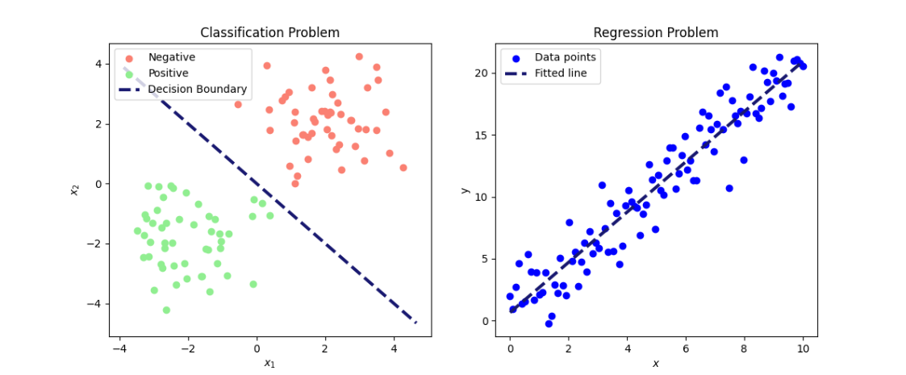
 </div>

Figure 1: Illustration of a classification (left) and a regression (right) problem. On the left, data is separated into two classes (positive and negative) based on the predictors $x_1$ and $x_2$. On the right, a fitted line shows the relationship between the predictor $x$ and the outcome $y$.

&nbsp;

In healthcare applications, prediction models are typically trained using large datasets containing clinical information, lifestyle factors, genetic data, or medical imaging. The model learns patterns between predictors and outcome by estimating its parameters and can then be employed to predict outcomes, such as the risk of a binary event, for new patients.


For further reading on classification and regression problems, see: [James et al. 2024:15-27](https://www.statlearning.com/)

### Underfitting and overfitting
*Underfitting* and *overfitting* are fundamental concepts in predictive modelling that describe how well a model learns from data. Underfitting happens when a model is too simple to capture the underlying patterns, resulting in poor performance on both the training set and unseen data. For example, a linear model is simple, and it is often unlikely for a real-world problem to have a perfectly linear relationship. This means that the model misses important relations among the features and the target. Overfitting, on the other hand, occurs when a model is very flexible and (almost) perfectly fits the training data, capturing the noise rather than the underlying general pattern, which leads to poor performance on new unseen data. The goal is to find a balance that allows the model to generalise well to new data.

Figure 2 illustrates the model performance of three different models with varying complexity for binary prediction. Model performance is visualised for the training set (top row) and for new unseen data (bottom row). The "Simple fit" model (first column) is a straight line separating the two classes, but it is too simplistic to effectively separate the classes, illustrating underfitting. In contrast, the "Overfit" model (third column) is overly complex and fits the training data perfectly, but performs poorly on unseen data. The “Better fit” model strikes a balance, capturing the underlying pattern while generalising well to new data.

<div style="overflow: hidden;">
   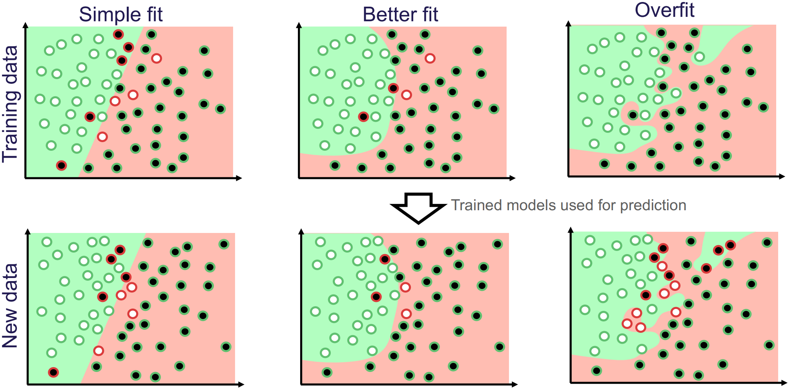
 </div>

Figure 2: Illustration of how model flexibility affects performance. White and black dots represent the true classes. Green and red backgrounds indicate predicted classes, while green-circled dots are correctly classified and red-circled dots are mis-classified. Image credit [Vesteghem, C. (2022)]( https://vbn.aau.dk/ws/portalfiles/portal/549539126/phd_CPEV_e_pdf.pdf)

&nbsp;

To achieve the right balance between underfitting and overfitting, a model is trained on the training set to learn its parameters $\beta$. Its performance is then evaluated on a validation set, which is used to tune hyperparameters. After the final model and hyperparameters are chosen its generalization performance is assessed on a separate test set that was not used in any part of the training or tuning process.
Ref: [James et al. 2014:31-34](https://www.statlearning.com/)


# Performance metrics


Performance metrics are used to evaluate how well a model makes predictions. A wide range of performance metrics exists, and the choice of metric(s) depends on the prediction task and whether the dataset has class imbalance, meaning that one class is much more frequent than the other. Below several commonly used metrics are introduced, each capturing different aspects of a model’s performance.

A binary classification model typically outputs not a class label directly but a *risk score*, which is a continuous value between 0 and 1 representing the likelihood of the outcome occurring for a given individual, based on their predictors. To obtain a definitive class prediction, a threshold $c$ is applied: scores above $c$ are assigned to the positive class and those below to the negative. The larger the threshold $c$, the more cases are predicted as negative, and conversely, the smaller $c$, the more cases are predicted as positive. The threshold $c$ should not be chosen arbitrarily. It reflects a trade-off between competing objectives, such as minimising errors, managing costs, or optimising for fairness, and should be selected in accordance with the model’s intended application and context.


After having obtained a predicted class for each case, the results can be categorised into four basic outcomes, depending on the true class and the predicted class:

- True Positives (TP): Positive cases that are correctly predicted as positive.
- True Negatives (TN): Negative cases that are correctly predicted as negative.
- False Positives (FP): Negative cases that are incorrectly predicted as positive (type I errors).
- False Negatives (FN): Positive cases that are incorrectly predicted as negative (type II errors).

This can be aggregated in a so-called *confusion matrix*:

<div style="overflow: auto; text-align: center;">
   
 </div>

 Figure 3: A visual representation of a confusion matrix. The green boxes represent the correct predictions, and the red boxes represent the incorrect predictions.

&nbsp;

The relative importance of different types of errors depends on the specific use-case. For example, in genetic testing, a type I error, i.e., incorrectly labelling a healthy person as ill, can cause unnecessary anxiety and interventions. In contrast, in cancer diagnosis, a type II error, that is, failing to detect disease in a patient who has cancer, may be considered more serious, as it delays treatment.

A common and intuitive measure of predictive performance is *accuracy*, defined as the proportion of cases the model predicts correctly. That is,
\begin{align}
\text{Accuracy} = \frac{TP+TN}{FP+TP+TN+FN}.\\

\end{align}


While accuracy gives an overall measure for model performance, it can be misleading for datasets with imbalanced classes. For example, consider a dataset of 5,000 observations with 4,900 positive cases and 100 negative cases. A model that always predicts observations as positive, would then achieve an accuracy of 98%, despite being entirely uninformative.

Other aspects of model performance are reflected by metrics such as *sensitivity*, *precision*, and *specificity*. **Sensitivity**, also known as recall, measures the proportion of positive cases correctly classified:
\begin{align}
   \text{Sensitivity} &= \frac{TP}{TP+FN}.\\
\end{align}


**Specificity**, by contrast, measures the proportion of negative cases correctly classified:
\begin{align}
   \text{Specificity} &= \frac{TN}{TN+FP}.\\
\end{align}


**Precision** measures the proportion of the predicted positives that were positive cases:

\begin{align}
   \text{Precision}   &= \frac{TP}{TP+FP}.\\
\end{align}


The $F_1$ score is a single measure that combines sensitivity and precision, that is particularly useful when there is a trade-off between catching positive cases (sensitivity) and avoiding false positives (precision) and when class imbalance is present. It is given by:

\begin{align}

      F_1\text{ score} = \frac{2\cdot\text{Precision}\cdot\text{Sensitivity}}{\text{Precision} + \text{Sensitivity}} = \frac{TP}{TP + \frac{1}{2}(FP + FN)}.

\end{align}


The values of all these metrics are bounded between 0 and 1. A value closer to 1 indicates better performance for the specific metric. In the modelling process, performance metrics can serve two primary roles. Either to optimise model parameters through their use in loss functions (for more detail see below) and their role in evaluating model performance.


Note, the performance metrics introduced above are all threshold-dependent, meaning that their values depend on the choice of $c$. Changing the threshold alters the balance of true/false positives/negatives and therefore affects the resulting metrics.


**Example**

Consider the following distribution of false/true positives/negatives:

- **TP:** 10
- **FP:** 20
- **TN:** 75
- **FN:** 4


Then the metrics described above can be calculated, obtaining:


| Accuracy | Sensitivity | Specificity | Precision | $F_1$ score |
|:------------|:--------------|:-------------|:------------|:---------------|
| 0.78           | 0.71              | 0.79              | 0.33           | 0.45                 |

#### QUIZ

In the above example, it has been demonstrated how to compute a range of well-known performance metrics. An efficient way of understanding the dynamics of these metrics is to try to compute them yourself. To do this, a new distribution of TP, FP, TN, and FN is provided:

- **TP:** 90

- **FP:** 10

- **TN:** 85

- **FN:** 15

Compute the following metrics:

```{=html}
<style>
  .quiz-container { font-family: sans-serif; max-width: 850px; margin: 20px 0; }
  .q-card {
    background: #ffffff;
    border: 1px solid #e1e4e8;
    border-radius: 8px;
    padding: 20px;
    margin-bottom: 25px;
    box-shadow: 0 2px 4px rgba(0,0,0,0.05);
  }
  .q-header { font-weight: bold; font-size: 1.1em; color: #2c3e50; margin-bottom: 10px; display: block; }
  .metric-input {
    width: 100%;
    max-width: 200px;
    padding: 10px;
    border: 2px solid #d1d5da;
    border-radius: 6px;
    font-size: 1em;
    outline: none;
    transition: all 0.2s;
  }
  .ans-correct { background-color: #d4edda !important; border-color: #28a745 !important; }
  .ans-wrong { background-color: #f8d7da !important; border-color: #dc3545 !important; }

  .feedback { font-size: 0.9em; margin-top: 8px; font-weight: bold; min-height: 1.2em; }
  .text-correct { color: #155724; }
  .text-wrong { color: #721c24; }
</style>

<div class="quiz-container">
  <div class="q-card">
    <span class="q-header">Accuracy</span>
    <input type="number" step="0.001" class="metric-input" placeholder="0.000" onchange="checkNumeric(this, 0.875)">
    <div class="feedback"></div>
  </div>

  <div class="q-card">
    <span class="q-header">Sensitivity (Recall)</span>
    <input type="number" step="0.001" class="metric-input" placeholder="0.000" onchange="checkNumeric(this, 0.857)">
    <div class="feedback"></div>
  </div>

  <div class="q-card">
    <span class="q-header">Specificity</span>
    <input type="number" step="0.001" class="metric-input" placeholder="0.000" onchange="checkNumeric(this, 0.895)">
    <div class="feedback"></div>
  </div>

  <div class="q-card">
    <span class="q-header">Precision</span>
    <input type="number" step="0.001" class="metric-input" placeholder="0.000" onchange="checkNumeric(this, 0.900)">
    <div class="feedback"></div>
  </div>

  <div class="q-card">
    <span class="q-header">F1 Score</span>
    <input type="number" step="0.001" class="metric-input" placeholder="0.000" onchange="checkNumeric(this, 0.878)">
    <div class="feedback"></div>
  </div>
</div>

<script>
  function checkNumeric(el, correctVal) {
    const val = parseFloat(el.value);
    const feedback = el.nextElementSibling;

    if (isNaN(val)) {
      el.classList.remove('ans-correct', 'ans-wrong');
      feedback.innerHTML = "";
      return;
    }

    const isCorrect = Math.abs(val - correctVal) < 0.01;

    if (isCorrect) {
      el.classList.add('ans-correct');
      el.classList.remove('ans-wrong');
      feedback.innerHTML = "Correct!";
      feedback.className = "feedback text-correct";
    } else {
      el.classList.add('ans-wrong');
      el.classList.remove('ans-correct');
      feedback.innerHTML = "Incorrect. Try again.";
      feedback.className = "feedback text-wrong";
    }
  }
</script>
```


To learn more about confusion metrics and performance metrics, see this ref: [James et al. 2014:150-156](https://www.statlearning.com/)


## Loss functions


During model training, a metric indicating the difference between the predicted value and the true outcome variable is required. This metric, often called the *loss functions*, enables the algorithm to improve the predicted output by adjusting model parameters to minimise the difference [(James et al 2014:300-301)](https://www.statlearning.com/). Loss functions are thus the main component to "learn" the best model parameters to make the most optimal predictions.

Let $(x_1, y_1),…,(x_n,y_n)$, denote a series of corresponding predictor ($x_i$) and outcome  ($y_i$) variables. A general loss function for continuous outcome variables $y_i$ to be minimised as function of the tuneable parameter $\beta$ can be expressed as the average distance between the outcome variables $y_i$ and the predicted outcome $f(x_i, \beta)$ given the predictors $x_i$ and the parameter $\beta$:

$$
L(\beta) =  \sum_{i=1}^n (y_i – f(x_i,\beta)) ^2.
$$


However, other loss functions can also be formulated. In binary classification problems (0 if negative and 1 if positive), the default loss function is the binary cross-entropy, also known as the log-loss, given by
$$
L(\beta) = -\sum_{i=1}^n \left[ y_i\log(p(x_i,\beta)) + (1-y_i)\log(1-p(x_i,\beta)) \right],
$$

where $p(x_i,\beta)$ is the model's predicted probability that the $i^{th}$ observation belongs to the positive class given model parameters $\beta$ and predictors $x_i$. When the true class is positive ($y_i = 1$), only the first term, $y_i \log(p(x_i,\beta))$ contributes to the loss function, as the second term, $(1-y_i)log(1-p(x_i,\beta))$, becomes 0, and vice versa when the true class $y_i$ is 0.

Alternative evaluation methods are Area Under the Curve (AUC) metrics, which are threshold-independent performance metrics. These metrics summarises the information given by, e.g., the Receiver Operating Characteristic (ROC) curve or the Precision-Recall (PR) curve. These curves are generated by evaluating a model's performance across various classification thresholds, $c$. Each threshold produces a single point on the curve, and the area under this resulting curve is then estimated.

The ROC curve provides a visual representation of a model's ability to discriminate classes by plotting the true positive rate (TPR), or sensitivity, against the false positive rate (FPR), which is equivalent to $1−Specificity$, as the classification threshold $c$ varies from 0 to 1 (Figure 4) . The ROC curve illustrates the trade-off between TPR and FPR: increasing the classification threshold reduces FPR but also lowers TPR. The maximum possible value for ROC AUC is 1.0, which represents a perfect classifier, while a random classifier follows the diagonal and yields a ROC AUC of 0.5 (Figure 4). Thus, a ROC AUC significantly above 0.5 indicates superior classification performance.

<div style="overflow: auto; text-align: center;">
   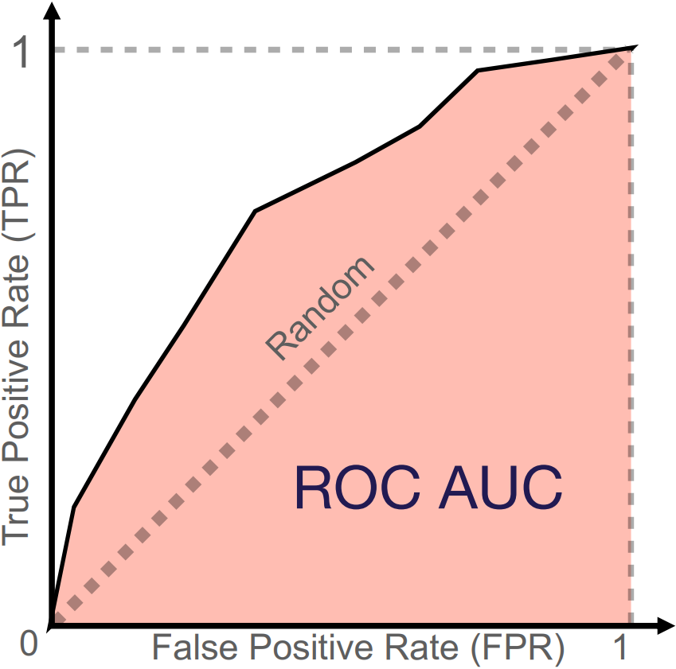
 </div>

Figure 4: Illustration of a ROC curve and its corresponding ROC AUC. The diagonal line represents the performance of a random classifier. The red area is the AUC performance of a given classifier. Image credit [Vesteghem, C. (2022)](https://vbn.aau.dk/ws/portalfiles/portal/549539126/phd_CPEV_e_pdf.pdf)

&nbsp;

The PR curve plots precision against sensitivity, also known as recall (Figure 5). It shows the trade-off between precision and recall: a higher classification threshold $c$ increases precision by reducing false positives but decreases recall by reducing false positives. The PR curve is particularly useful when a dataset contains class imbalance, where the positive class is significantly smaller than the negative class. It emphasises the model’s performance on identifying positive cases by using precision and recall. True negatives are not part of these calculations, which makes the PR curve more informative than the ROC curve when the negative class dominates. The PR curve for a model is often compared to that of a random classifier represented by a horizontal line (Figure 5). This baseline value of the PR AUC (often approximated by *average precision*) is the proportion of positive cases in the dataset. An ideal model would have a PR AUC of 1, which indicates a perfect score on both precision and recall.

<div style="overflow: auto; text-align: center;">
   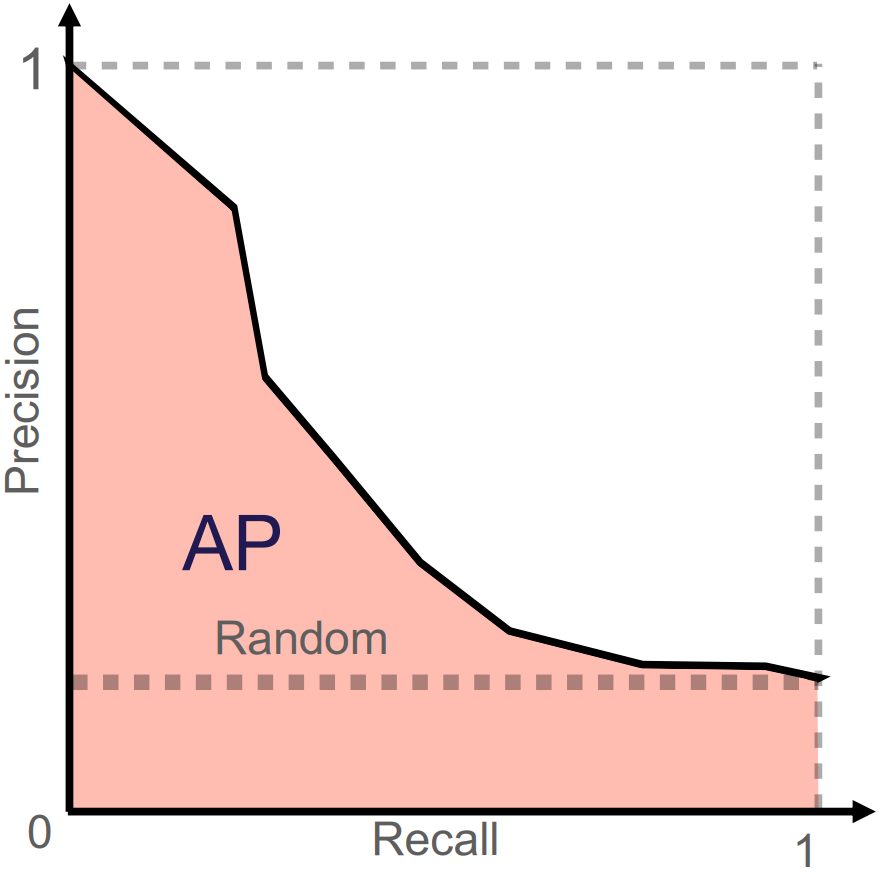
 </div>
Figure 5: Illustration of PR curve and its corresponding PR AUC (here AP = average precision). The horizontal line illustrates the performance of a random classifier. Image credit [Vesteghem, C. (2022)]( https://vbn.aau.dk/ws/portalfiles/portal/549539126/phd_CPEV_e_pdf.pdf)

Ref: [James et al. 2014:300-301](https://www.statlearning.com/)

# Predictive modelling

This section introduces popular models for dynamic risk prediction. The models are presented from simple, interpretable algorithms to complex, "black-box" algorithms.

## Logistic regression
One of the most well-known models is logistic regression. This model is appropriate when the outcome is binary.
A significant advantage of logistic regression is its explainability. This means that the model's coefficients can be directly interpreted to understand the relationship between each predictor and the outcome. This allows for a high degree of interpretability, as the impact of each predictor on the predicted probability can be readily understood. Because of this and its inherent simplicity, logistic regression is often considered a suitable baseline model when multiple models are benchmarked to identify the most effective risk prediction model.
Logistic regression is a linear model that outputs a probability score instead of a direct linear combination. This can be expressed formally as:

$$p (x,\beta) = \sigma(\beta^T x)$$

where $\sigma$ is the logistic function that transforms the linear combination of predictor variables into a probability ranging from 0 to 1 (Figure 6). It is given by

$$\sigma(t) = \frac{1}{1 + \exp(-t)}.$$

As $t$ approaches infinity, the logistic function approaches 1. In contrast, as $t$ approaches minus infinity, the logistic function approaches 0.


The relationship between the logistic function, a threshold (typically $c = 0.5$), and the decision boundary are illustrated in Figure 6 in case of a single predictor.

<div style="text-align: center;">
   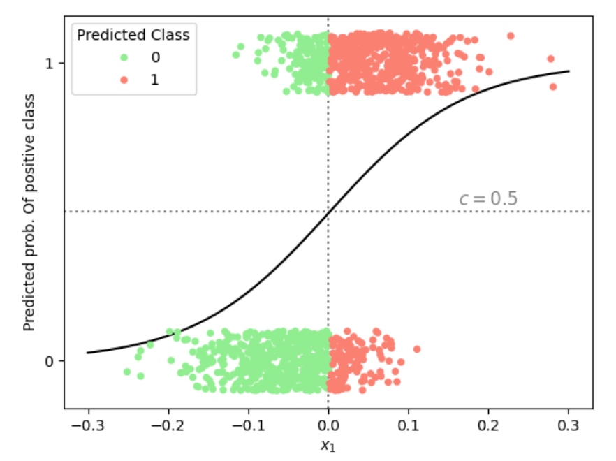
 </div>
Figure 6: Illustration of the predicted probability of belonging to the positive class in a logistic regression with a single predictor $x_1$. Using a classification threshold of $c = 0.5$ (horizontal dotted line), the vertical dotted line marks the corresponding decision boundary in $x_1$-space, separating datapoints into predicted negative (green) and positive (red) classes.

&nbsp;

In practice, logistic regression models are trained by minimising a loss function in $\beta$, such as the binary cross-entropy computed from the predicted probabilities given by the logistic function. The optimisation method may range from a straightforward gradient descent to more advanced algorithms.

In prediction problems involving numerous predictors, a challenge is presented if the number of potential predictors ($m$) surpasses the number of data points within the dataset ($n$). To address this imbalance effectively, regularization methods may be employed to construct a sparse model, specifically one in which only a select few important features are retained, and others are excluded [(Hastie et al. 2001:649-664)](http://www.stat.ucla.edu/~ywu/research/documents/BOOKS/ElementsLearningII.pdf). Regularization is also used for mitigating model overfitting, a common issue that has been addressed in the underfitting and overfitting section.


One of the most well-known and used regularization techniques is *ridge regression* (aka L2-regularization), in which a regularization term is added to the loss function:

$$
L(\beta) = \sum_{i : y_i=1} \log\big(1-p(\beta,  x_i)\big) + \sum_{i : y_i=0} \log\big(p(\beta, x_i)\big) + \lambda\sum_{j=1}^{m} \beta_j^2,
$$

where $\lambda$ is a tunable parameter controlling the amount of regularization.

A benefit of ridge regression is its capacity to shrink the coefficients ($\beta$) towards zero. In contrast, larger coefficients are subjected to heavier penalization, while smaller coefficients are reduced towards zero (but rarely exactly zero).

Alternatively, penalization can be performed using the absolute value rather than the squared sum. This approach, known as the *Least Absolute Shrinkage and Selection Operator (LASSO)* (aka L1-regularization):

$$
L(\beta) = \sum_{i: y_i=1} \log\big(1-p(\beta, x_i)\big) + \sum_{i: y_i=0} \log\big(p(\beta, x_i)\big) + \lambda\sum_{j=1}^{m} |\beta_j|.
$$

This regularization method is highly effective for controlling model complexity and performing feature selection. By penalising coefficients proportionally to their absolute value, it encourages some coefficients to shrink to exactly zero. Consequently, predictors that contribute more noise than predictive signal can be effectively removed from the model.

Compared to ridge regression, LASSO additionally performs variable selection by allowing some coefficients to be equal to 0. However, if all predictors are truly relevant, this might lead to worse predictions.
Otherwise, the performance of the two regularization types is similar, and which method performs best varies from problem to problem.

In certain scenarios, a benefit can be gained by combining the regularization properties of ridge regression and LASSO. This can be obtained by using [elastic net regularization](https://en.wikipedia.org/wiki/Elastic_net_regularization) that also allows for the adjustment of the weighting of the two methods. The elastic net penalty is expressed as:

$$
L(\beta) = \sum_{i: y_i=1} \log\big(1-p(\beta, x_i)\big) + \sum_{i: y_i=0} \log\big(p(\beta, x_i)\big) + \lambda \sum_{j=1}^{m} (\alpha\beta_j^2 + (1 - \alpha)|\beta_j|),
$$

where $\lambda$ is still the regularization strength hyperparameter and $\alpha$ is a parameter between 0 and 1 that controls the weighting between ridge and LASSO penalties. When $\alpha = 0$ it is a pure LASSO regularization and $\alpha = 1$ is pure ridge regression. This method can provide flexibility in the modelling while also testing the effect of the two methods combined in different proportions.

For further reading regarding the topics of this section, see ref: [James et al. 2014:138-144;237-250](https://www.statlearning.com/)

## Decision trees
Decision trees are intuitive algorithms that can be applied to both regression and classification problems. They recursively split the data, asking simple yes/no questions about the predictors, until specific criteria are met.

Initially, all observations are contained within a single region called the root node. Next, a predictor and a threshold are chosen (e.g., 'age above 65') to split the data into two distinct decision regions called branches. This recursive binary splitting process continues: a region is selected for further splitting, a predictor and a threshold is selected and new branches are created (e.g., splitting the 'age under 65' region by 'bodyweight over 100kg') (Figure 7). The splitting process continues until a stopping criteria is met, such as reaching a maximum tree depth or a minimum number of samples in a node. The final regions at the end of the branches are called leaf nodes, which provide the predicted class or value for observations within that region. The goal is to make the subgroups as "pure" as possible, meaning that each subgroup ideally only have observations from one class. If the subgroup have a mix of class, the degree of the mix is known as "impurity".

Loss is often measured by the Gini index, which is used as the metric to determine which region should be split. This index quantifies the impurity of each node based on the distribution of classes within it. If a node is evenly divided between two classes, such as instances of benign or malignant cancer, its Gini index will be 0.5. In contrast, a node consisting entirely of one class, for example, 100% malignant cases, is considered pure, and its Gini index will be 0. The Gini index for the $i$th node is given by:

$$
\text{Gini index}_i = 1 - \sum_{k=1}^{n} r_{i,k}^2,
$$

where $r_{i,k}$ is the proportion of samples that belong to class $k$ (among $n$ possible classes) at node $i$. For binary prediction, this reduces to

$$
\text{Gini index}_i = 2*r_i (1 \; – \; r_i),
$$

where $r_i$ is the proportion of observations of one class in node $i$. To illustrate: if a node is evenly divided between two classes, such as benign and malignant cancer, then $R_i = 0.5$, which are the maximum degree of impurity. The algorithm chooses the split that minimizes the Gini index across the "nodes" in the three structure.


<div style="text-align: center;">
   
</div>

Figure 7: Example of a decision tree for binary classification (green/red). Starting at the root node, the data is split by age > 65, then further by weight and height, until four leaf nodes are reached. The black boxes, illustrating the leaf nodes, show the proportion of green observations in the specific node.

&nbsp;

While decision trees are powerful models, they can be unstable as their structures are highly sensitive to small changes in the data. This sensitivity can lead to overly complex structures that capture noise rather than true patterns, and as a result, their predictive accuracy may be lower than that of other methods.

To address these issues, ensemble learning methods can be employed.

## Ensemble learning methods
In general, *ensemble learning methods* combine multiple models to solve problems better than any single model could, thus merging several weak learners into one (hopefully) strong predictor. This is also known as ‘wisdom of the crowd’. The most popular ensemble learning method for decision trees are bagging, random forest, and gradient boosted decision trees.

 For further reading, see: [James et al. 2014:331-341](https://www.statlearning.com/)


### Bagging
*Bagging* (short for bootstrap aggregating) is an ensemble technique that helps prevent overfitting. In bagging, numerous independent models are trained on different subsets of the data, created through random sampling with replacement. Their predictions are then aggregated: in regression, typically taking the mean or median, and in classification, by taking the most common prediction (corresponding to the mode).


In addition to the typical hyperparameters associated with decision trees, the bagging method has hyperparameters determining the number of trees used in the aggregation and the size of the sampled subsets.

As opposed to trees, the variable importance is not immediately interpretable, as it is a combination of many trees with (possibly) different structures.
However, variable importance can still be estimated. Each split in a decision tree is chosen to reduce the Gini index as much as possible. The total reduction in Gini index due to to a given predictor across all splits in a single tree measures how much that predictor contributes to the model. In bagging, this quantity is averaged over all trees in the ensemble, providing an overall estimate of each predictor's importance.


### Random Forest
A limitation of bagging is that the decision trees utilised in the aggregation may be similar. This situation arises when a single predictor has significant importance, so that its selection for the initial split is consistently ensured.


To address this issue, *random forests* extend the bagging method by incorporating an additional layer of randomness. In addition to sampling data points, a random subset of predictors is considered at each split within a tree. This makes the trees more diverse and helps them capture different patterns in the data, leading to better overall performance and robustness against noise. For a dataset with $m$ predictors, it is common to use $\sqrt{m}$ predictors per split (for classification), though this number can be treated as a tunable hyperparameter.


### Gradient boosted trees
Unlike bagging methods, where independent models are built, boosting methods construct models sequentially, where each new model is developed to address the errors of the models built so far. Among the various boosting methods, *gradient boosting* is particularly popular.

The core idea of this method is that after an initial model is fitted, the differences between the true values and the model's predictions, also known as the residuals, are computed. In each iteration, a new decision tree is fitted to the negative gradients of the specified loss function with respect to the current predictions. Practically, this means the new tree uses the original input features to predict these errors rather than the original target variable. The remaining mistakes of the model built are specifically targeted and corrected by each new tree. The principle behind the way where trees are sequentially fitted to the negative gradients of a loss function is the reason for the name 'gradient boosted trees'.

For iteration $i + 1$, the update can be expressed as:

$$
F_{i+1}=F_i+\delta f_i,
$$

where $F_i$ represents the predictions, the actual output values and not the model parameters, of the current current ensemble model after $i$ iterations. $f_i$ denotes the tree fitted to the residuals of $F_i$ so that its predictions can be added to the ensemble to directly correct the remaining mistakes, and $\delta$  is a shrinkage hyperparameter (also called learning rate) that determines how much influence the new tree has on the updated model.

Highly accurate models are generated through this sequential improvement process. However, careful hyperparameter adjustment is necessary to prevent overfitting. Specifically, the occurrence of severe overfitting can result from shrinkage parameter values approaching 1.
Ref: [James et al. 2014:343-362](https://www.statlearning.com/)


## Neural networks
*Neural networks* are composed of interconnected nodes (or neurons) arranged in layers, each containing a customizable number of nodes. The structure consists of an input layer, one or more hidden layers, and an output layer. A network with two or more hidden layers is termed a *deep neural network*. An illustration of a neural network with three hidden layers is provided in Figure 8.

The prediction process is initiated at the input layer, which consists of $m$ nodes that represents the $m$ input features $x_{i1}, \dots, x_{im}$ associated with the $i$th sample. The connections between nodes are defined by weights, which together with *bias terms* constitute the tuneable parameters of the network. The weights determine how strongly the output of one node influences nodes in the subsequent layer. In each node, a weighted sum of the inputs is calculated and a bias term added before applying a non-linear activation function. The activation function allows the model to capture complex patterns in the data. Formally, we assume for the $p$th node in the $q$th hidden layer with activation $A_p^{(q)}$, we can write this process as

$$
A_p^{(q)} = g(B_{q,p,0} + \sum_{j=1}^{k_{q-1}} B_{q,p,j}A_j^{(q-1)}),
$$

where $B_{q,p,0}$ is the bias of node $p$ in layer $q$ and $B_{q,p,j}$ (for $j\geq 1$) is the weight connecting node $j$ in layer $q-1$ to node $p$ in layer $q$. Further, $g$ is the activation function, often the ReLU function, $\max(0,x)$ or the logistic function.

Assuming the $q$th hidden layer contains  $k_q$ nodes, the activation of the first node in the first hidden layer, $A_1^{(1)}$, is then given by

$$
A_1^{(1)} = g(B_{1,1,0} + \sum_{j=1}^m B_{1,1,j}x_j),
$$

where $B_{1, 1, 0}$ is the bias term and $B_{0,1,j}$ is the weight for the $j$th feature $x_j$ given in the input layer. Further, $g$ is the activation function, often the ReLU function, $\max(0,x)$ or the logistic function.

We can continue this process, calculating the activation of the first node in the second layer, $A_1^{(2)}$, using the $k_1$ output values $A_1^{(1)}, \dots, A_{k_1}^{(1)}$ from the first hidden layer:

$$
A_1^{(2)} = g(B_{2,1,0} + \sum_{j=1}^kB_{2,1,j}A_j^{(1)}).
$$

The activations from the last hidden layer are passed to the output layer. There, a final weighted sum of the outputs from the $q$th hidden layer is computed and then passed through an output activation function, such as the logistic function $\sigma$ in the case of a binary outcome, to produce the final prediction (denoted $Y_i$ in Figure 8).

<div style="text-align: center;">
   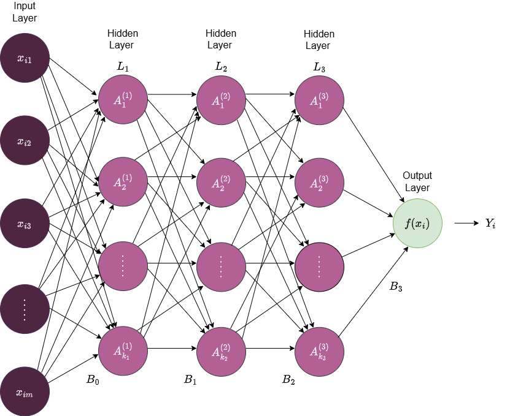
 </div>
Figure 8: An illustration of a deep feedforward neural network with three hidden layers ($L_1$, $L_2$, and $L_3$). The input layer consists of the data points $x_{ij}$ with $m$ features. The $q$th layer consists of $k_q$ nodes which are fully connected to all the nodes in the next layer. $B_1$, $B_2$, $B_3$, and $B_4$ denote the weight/bias matrices that defines the layer-to-layer transformations, $f$ the output activation function, and $Y_i$ the final prediction.

&nbsp;

Note, the number of parameters in neural networks can grow rapidly, as adding a single node to a layer introduces one weight for each node in the subsequent layer, and an additional bias parameter.


### Training a neural network
To estimate model parameters, a loss function $L$ is minimised as previously discussed:

$$
L(\beta) = \sum_{i=1}^n(y_i-f(x_i, \beta))^2,
$$

where $\beta$ is now the weights and bias terms of the neural network.

First, the weights of the network are initialised. Data is then passed through the network to produce predicted outcomes based on the initialised weights. The prediction error is then computed at the output layer, and during a process called *backpropagation* the derivative of this error is propagated backward through the hidden layers by partial derivatives to calculate the gradients of the loss function with respect to each parameter. Finally, the parameters are then updated in the direction of the gradient.

The size of the update step taking in the direction of the gradient is called the learning rate. The learning rate is one of multiple hyperparameters in neural networks that control how training is performed.


Key hyperparameters for neural networks are:

- Learning rate: step size for updating parameters during gradient descent

- Network structure: number of layers and nodes

- Batch size: number of samples processed before updating model parameters

- Regularization strength: degree to which the model penalises large weights to prevent overfitting

- Activation functions: non-linear function applied to a nodes output to introduce non-linearity

To learn more about this topic, see this ref: [James et al. 2014:399-406](https://www.statlearning.com/)

## Model training

In the training process, the objective is to find values of the model’s parameters and hyperparameters that minimise the difference between the predictions and the observed outcome, as measured by the loss function. The goal for the model is to capture the underlying patterns in the data, enabling accurate predictions on unseen data. In this section, we will address  the subject of model training.

The foundational algorithm for training a model is *gradient descent*. Gradient descent is an iterative process that updates the model parameters in the direction that minimizes the loss function. It is an automated process in the training, with the *learning rate* as the only adjustable factor. The learning rate controls the size of the step taken in the direction of decreasing the loss. There are many versions of gradient descent and alternatives.

Most of the models presented in the previous section are controlled by several hyperparameters, which define how the models are constructed. These hyperparameter values are set before the training process begins. The hyperparameters are then adjusted based on the performance of the models.

These values can be chosen based on common practice or, more systematically, through a process called tuning. During this process, different combinations of hyperparameter values are used to fit a model. Each model's predictive ability is then evaluated on a separate validation set, a concept that was covered in the data [preprocessing part of this course](data_preprocessing.qmd). This process is repeated until the combination of hyperparameters that results in the best predictive performance is identified based on a stopping criterion.

There are three popular approaches for hyperparameter search:

- Grid search
- Random search
- Bayesian optimisation

### Grid search

*Grid search* is a method for hyperparameter tuning that systematically evaluates all possible combinations of a predefined set of hyperparameter values. For each hyperparameter, a discrete set of values is specified, and a model is trained and evaluated using every combination generated from these sets. The combination that yields the best performance on a validation set is then selected. Figure 9 illustrates the result of a grid search considering two hyperparameters.

This approach constitutes an exhaustive search. The search space should be broad enough to explore a diverse range of hyperparameter values yet constrained to keep computation time manageable.

<div style="text-align: center;">
   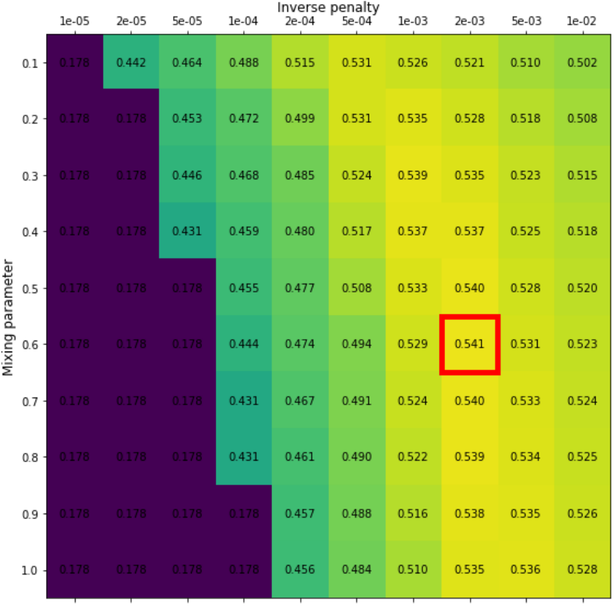
 </div>

Figure 9: Results from a grid search for an elastic net model with the two hyperparameters:  $\alpha$ (mixing parameter) and $\lambda$ (penalty parameter). Grid values are the average precision. The red box indicates the combination of hyperparameters which produces the highest average precision (mixing parameter = 0.6 and inverse penalty of 0.002). Image credit [Vesteghem, C. (2022)]( https://vbn.aau.dk/ws/portalfiles/portal/549539126/phd_CPEV_e_pdf.pdf)

&nbsp;

Grid search can be computationally expensive, as a new model is fitted for each combination of hyperparameters. Its effectiveness is also limited by the dimensionality of the hyperparameter. Grid search is most suitable for models such as regularised logistic regression and certain tree-based methods, provided that only a limited number of hyperparameters are involved. It is generally not recommended for complex models with many hyperparameters, such as neural networks, due to their high dimensionality and the extensive computational resources required to train numerous network configurations.


## Random search
In contrast to the rigorous grid search method, computational complexity can be optimised through a technique known as *random search*. This approach involves the random sampling of a predetermined number of hyperparameter combinations.

For this process, a defined sampling space is required for each hyperparameter. Unlike grid search, it does not evaluate every possible combination, but instead randomly sample hyperparameters to evaluate. This is repeated until a predefined stopping criteria is met.

Random search effectively manages higher dimensionality because the number of models trained is explicitly controlled. While it performs well, it is acknowledged that the optimal set of hyperparameters may not always be identified.

## Bayesian Optimisation

[Bayesian optimisation](https://medium.com/data-science/a-conceptual-explanation-of-bayesian-model-based-hyperparameter-optimization-for-machine-learning-b8172278050f) is a method for finding the best hyperparameters efficiently. Instead of trying every combination, it builds a probabilistic 'surrogate' model that predicts how well different hyperparameters will perform while also quantifying the uncertainty of those predictions. The algorithm then chooses new hyperparameters to test based on a mathematical strategy that balances the exploration of unknown regions and exploitation of promising areas, also known as the 'acquisition function'. After each evaluation, the surrogate model is updated with the results to form new probability distributions, gradually improving its predictions and decreasing uncertainty. This approach often finds good hyperparameters with fewer experiments than grid or random search.

For further reading, see [Shahriari et al. (2015)](https://ieeexplore.ieee.org/document/7352306)

##  Performance evaluation

Evaluating a dynamic prediction model's performance involves assessing how well the model generalises to new, unseen data and how reliable its predictions are in real-world scenarios.

### Cross-validation
A common approach for evaluating model performance on unseen data, as discussed in [Data Preprocessing](data_preprocessing.qmd), is to split data into separate subsets: a training set for fitting model parameters, a validation set for tuning hyperparameters, and a test set for assessing performance on unseen data – sometimes with an additional calibration set. While simple, performing these splits only once can lead to an evaluation that's highly dependent on that specific division of the data. To address this limitation and obtain a more robust and reliable estimate of a model's generalization performance, *cross-validation* is commonly used.

Cross-validation is a technique employed to assess how a model performs on unseen data that produces an unbiased estimate of model performance. Instead of only splitting the data once and evaluating model performance on a single test set, the entire dataset is divided into $K$ subsets, called *folds* (Figure 11). In turn, each fold is left out of the total dataset, and the model is trained, validated, and calibrated on all the remaining data, and finally tested on the left-out fold. Based on the model's test performance across these $K$ folds, its overall performance is evaluated. This specific process is known as $K$-fold cross-validation.

The number of folds is widely discussed, but often a value between 5 and 10 is used [(James et al. 2013:206)](https://www.statlearning.com/).

<div style="overflow: auto; text-align: center;">
  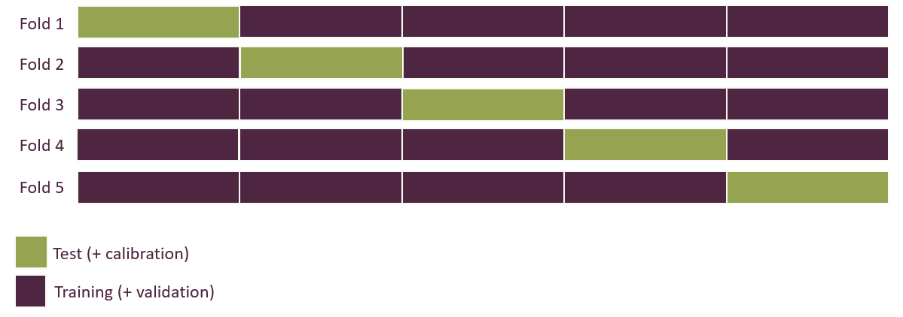
</div>
Figure 11: Illustration of 5-fold cross-validation. Visualise the process of using different parts of the dataset for test set across 5 splits of the dataset.

&nbsp;

If the cross-validation confirms an acceptable generalizability, a final model can be fitted using a train/validation split on the entire dataset.

Ref: [James et al. 2014:202-212](https://www.statlearning.com/)


### Nested cross-validation

Although $K$-fold cross-validation provides a more robust performance estimate than a single data split, a potential for bias exists if hyperparameter tuning is performed incorrectly within the cross-validation procedure. If the test set in each fold is used to evaluate different hyperparameter settings, information from the test set influences the selection of the best hyperparameters. This can lead to an overly optimistic estimate of model performance.

To address this potential bias, *nested cross-validation* can be employed.

This technique introduces an additional level of folding: First, the dataset is divided data into $K$ *outer* folds, with each fold providing a portion of data for constructing training and validation sets, similar to standard $K$-fold cross-validation. Within each outer fold, an inner $L$-fold cross-validation is performed using only the training/validation portion (Figure 12). The purpose of this “inner layer” is hyperparameter optimisation. The best hyperparameters identified by the inner $L$-fold cross-validation are then used to train a model on the combined training/validation set of the outer fold. Finally, model performance is evaluated on the outer fold's test set. This process is repeated for all outer folds.

<div style="overflow: auto; text-align: center;">
  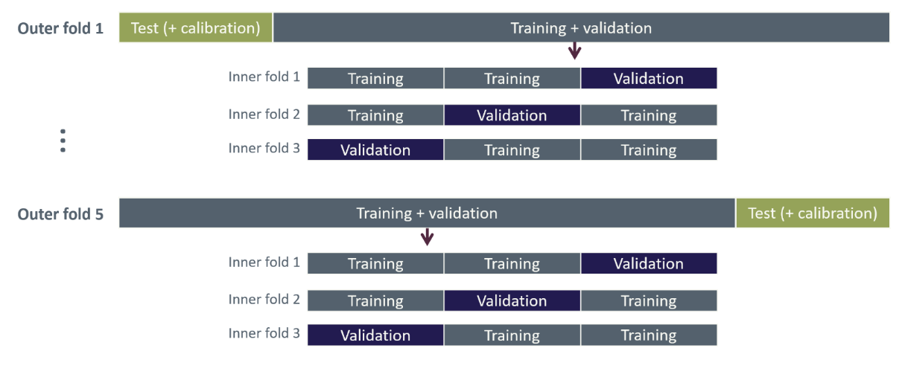
</div>

Figure 12: Illustration of nested cross-validation with five outer folds and three inner folds.

&nbsp;

Because each outer fold is evaluated using an additional $L$-fold cross-validation, the risk of overfitting is greatly reduced, and the estimated model performance is more reliable.

When the nested cross-validation process has provided a reliable estimate of performance, a final round of hyperparameter tuning is performed on the entire dataset. The resulting 'best' hyperparameters are then used to train the final model on the available data to produce a single final model for deployment.

For further reading, see [Colins, G. (2024).](https://www.bmj.com/content/384/bmj-2023-074819)

## Utility and explainability

Below, we explore the **utility** and **explainability** of prediction models, examining not only how well they perform but also how their predictions can be interpreted and trusted by stakeholders. In fields such as healthcare, it is crucial to understand why models predict as they do and to see evidence of their practical benefits.


### Utility

Model performance can be evaluated by statistical metrics such ROC AUC or PR AUC, as described in the section about performance metrics, but these metrics are probably not of much use for clinicians as the primary users of the prediction model.

Clinicians might be presented with the model as a prediction tool, but if they do not understand the predictions and how it works, they may be reluctant to use it. Therefore, its usage should be demonstrated within the specific clinical context for which the model is intended, e.g. by considering a clinical scenario.
To set up a clinical scenario, you

1. State an objective, which should be something the model can achieve.

2. Describe its intended use in practice, considering the clinicians' limited time, their accessibility to the data, and the availability of the patient.

3. Describe how model results should be interpreted.

4. Disclose possible adverse consequences and how to mitigate them in case of false positive or negative prediction.

5. Describe the measurable impact on employing the prediction model, such as optimising resource usage and lowering mortality.


The course’s motivational example is to limit the amount of late Systematic Anti-Cancer Treatment (SACT) treatments, i.e., those administered within 30 days of death.
In this context, a dynamic risk prediction model is applied before each treatment cycle to aid in clinicians in evaluating whether the patient is fit to receive the treatment, with the rule that treatment should generally be withheld if the model predicts a 30-day mortality risk above 50%.

The believed measurable impact of the model is that it prevents suffering from the late SACT treatments and lessens the amount of chemotherapy given. Regarding adverse consequences, a false positive (i.e., predicting death within 30 days when the patient does not die within 30 days) could lead to the treatment would be stopped early, or perhaps just delayed to a later point.


The utility of the 30-day mortality model is illustrated in Figure 13 where the predicted probability of dying within 30 days of a SACT administration is shown for each of the four outcomes from the confusion matrix (true positive, false positive, true negative, false negative) using a classification threshold of 50%. Here we consider 30 days before death as the appropriate time for cessation as opposed to continuing treatment when entering the last 30 days before death. Thus, the true negatives correspond to what we deem as “appropriate administrations”, while the true positives correspond to “appropriate stoppage”. Among the false positives, which are the cases where the model predicted death within 30 days incorrectly, the utility assessment here discriminates between “early stoppage” (died > 90 days after SACT administration) and “acceptable stoppage” (died within 90 days after SACT administration). This division was included because the improvement in life quality after the SACT treatments would be short-lived, and it is debatable if it is worth it, considering the decrease in life quality under the treatment. In the study of [Vesteghem et al. (2022)](https://pubmed.ncbi.nlm.nih.gov/36379004/) the authors conclude that by applying this simple threshold, 40% of late SACT administrations could have been prevented, at the cost of only 2% of patients stopping their treatment more than 90 days before death.

<div style="text-align: center;">
   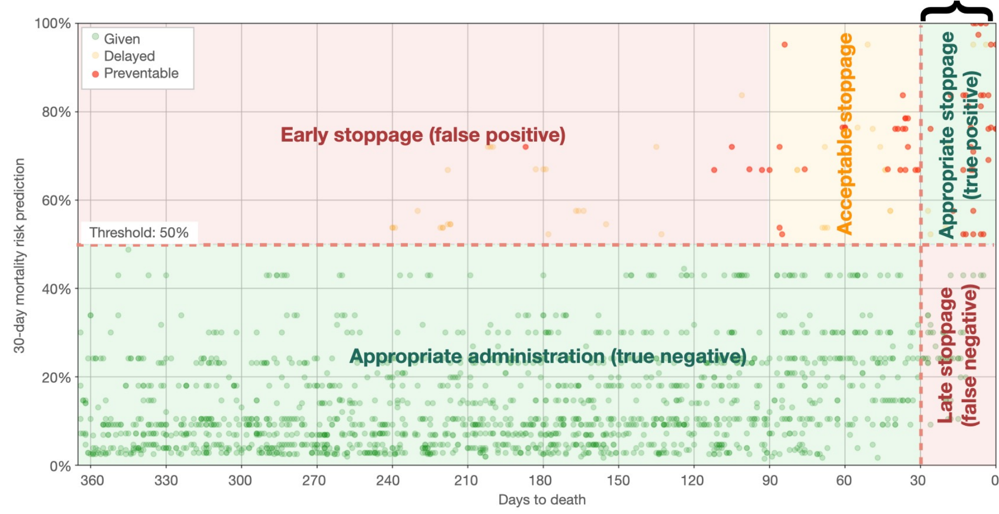
 </div>

Figure 13: A practical example of a confusion matrix related to 30-day mortality prediction in lung cancer. The scatter plot shows the predicted risk of dying within 30 days from a SACT administration versus days to actual death. The plot is divided into two zones on the horizontal line, which is the 50% mortality risk threshold. A vertical line indicates when the patient is within the last 30 days before death. The curly bracket denotes the counterproductive administrations.Image credit: [Vesteghem et al. (2022)](https://ascopubs.org/doi/pdf/10.1200/CCI.22.00054)


### Calibration
For classification problems, the prediction model outputs risk scores, which are often scaled to values between 0 and 1 by a sigmoid function and often interpreted as class probabilities.
It is often assumed that these “probabilities” accurately reflect real-world outcomes when based on a large dataset. However, this assumption dos not always holds, especially if the model is not properly *calibrated*. Calibration refers to the agreement between predicted probabilities and observed outcomes: a well-calibrated model produces predictions that match the true likelihood of events, so that, for example, among instances predicted with a probability of 0.7, roughly 70% belong to the positive class. When a model is mis calibrated, post-hoc techniques can be applied to adjust the predicted probabilities.

Model calibration can be assessed by comparing predicted risk scores with observed outcomes. This can for example be done by calibration plots, where predicted risk scores are averaged over a suitable bin and then plotted against the observed frequency of the positive class (for binary prediction); an example of a calibration plot can be seen in Figure 14. In this type of plot, the ideally calibrated model follows the identity line, while points above the line indicate the predicted risk score is smaller than the observed probability and vice versa for points below the line.

<div style="text-align: center;">
   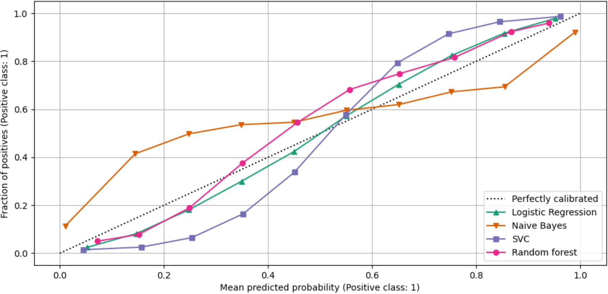
 </div>

Figure 14: Example of a calibration plot for four different models. Image credit: [Scikit-learn.org](https://scikit-learn.org/stable/auto_examples/calibration/plot_compare_calibration.html)

&nbsp;

Alternatively, the [Brier score](https://en.wikipedia.org/wiki/Brier_score) provides a useful measure of calibration in binary classification, but can also be used in multi-class problems.
The Brier score quantifies the closeness of the predicted risk scores ($\hat{p}_i(\hat{\beta},x_i)$) to the observed outcome ($y_i$) by

 $$
\text{Brier score} = \frac{1}{n} \sum_{i=1}^n (p_i (\hat{\beta},x_i) -y_i)^2,
$$

where $n$ is the number of predictions. A lower the Brier score indicates that the model provides more accurate probability estimates.
Note, the Brier score reflects both how well the predicted probabilities align with actual outcomes (calibration) and the confidence of the predictions. A score of 0 indicates perfect predictions, where every probability exactly corresponds to the true outcome.

If the model is not well calibrated, post-hoc calibration techniques can be applied to improve the agreement between predicted probabilities and observed outcomes. A common method is [isotonic regression](https://en.wikipedia.org/wiki/Isotonic_regression), which fits a non-parametric monotonic function to adjust the predicted probabilities. The isotonic function is typically a piecewise constant function, which ensures that probabilities are increasing.

Following model calibration, calibration can again be checked using a calibration plot and the Brier score.


For further reading, see [Riley, R. (2024).](https://www.bmj.com/content/384/bmj-2023-074820)

### Explainability
Ideally, it should be possible to gain insight into why a dynamic risk prediction model predicts the way it does and to identify the most important predictors. This property is known as *explainability*.
For example, in a model predicting mortality risk, explainability allows clinicians to see which patient features most strongly drive the predicted risk, supporting more informed decision-making.


Some models are inherently explainable, such as logistic regression, where the effect of all predictors is visible through the model parameters, and decision trees, where the splits are made on specific predictors based on impurity.
In contrast, in black-box models, such as ensemble methods (random forest, etc.) and neural networks, the relation between input and output is highly complex and not directly “visible”. Even though these models are not inherently explainable some information can be extracted using external methods.

The standard for explainability of black-box models is called *Shapley Additive explanation SHAP* values and is based on game theory. SHAP values assign a contribution to each feature, showing how much, it increases or decreases the predicted risk compared to the average prediction.

SHAP can be visualised in a waterfall plot inspecting a specific prediction; an example is shown in Figure 15, visualizing the effect of being a 45-year-old man with an albumin level of 2.9 g/dL on the 30-day mortality rate.

<div style="text-align: center;">
   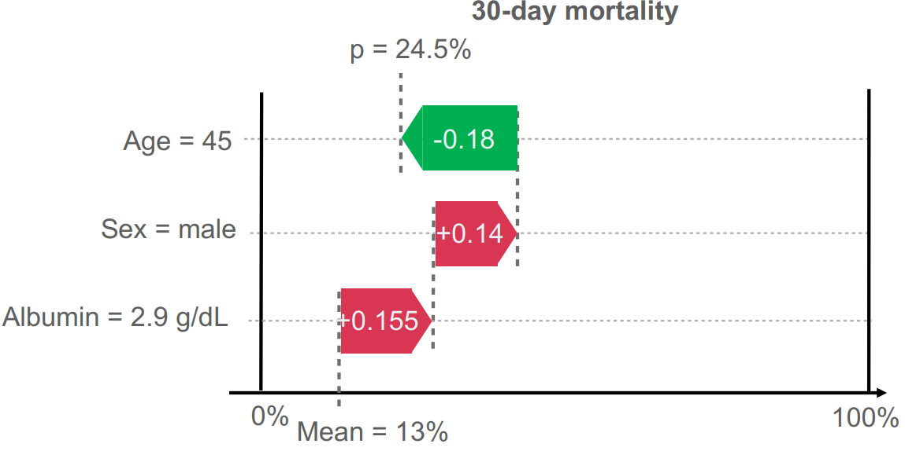
 </div>

Figure 15: Waterfall plot of individual feature importance in prediction of 30-day mortality. It shows how features adjust the prediction from the average risk (Mean = 13%) to the final calculated probability (p = 24.5%). The red arrows denote variables which increase the risk while the green arrow shows variables which decrease the risk. [Vesteghem, C. (2022)](https://vbn.aau.dk/ws/portalfiles/portal/549539126/phd_CPEV_e_pdf.pdf).

# Exercises

In this exercise you will train and test at least one prediction model based on the data sets you prepared in Exercise 1 (in case you did not succeed with Exercise 2, a prepared data set is available [here](https://github.com/hds-sandbox/Dyn_Risk_Pred_Course/tree/webpage-quarto/exercise_data/formatted_data). In this dataset there is a variable called split, indicating which split the observation belongs to). You will have a data set for training the model parameters (“training set”), one for evaluating a model fit on the training data while tuning hyper parameters (“validation set”), one to train a calibration model (“calibration set”), and one for final test of model performance (“test set”). Go through the following steps:

1. Choose a performance metric for final test of model performance (is there class imbalance in your data?)
2. Choose a model to train (e.g. logistic regression with elastic net or random forest). What parameters and hyperparameters does the model have?
3. Train model and tune hyperparameters.
4. How is the predictive performance of your trained model in the test set? Have a look at the confusion matrix – did you predict both positive and negative outcomes well?
5. Train a calibration model. How well is the model calibrated, considering the test set?

To proceed to the next section of the course, please click the button below.

&nbsp;

 <p align="center">
  <a href="implementation.html" style="background-color: #4266A1; color: #FFFFFF; padding: 30px 20px; text-decoration: none; border-radius: 5px;">
    Continue to
    Implementation
  </a>
</p>

&nbsp;
